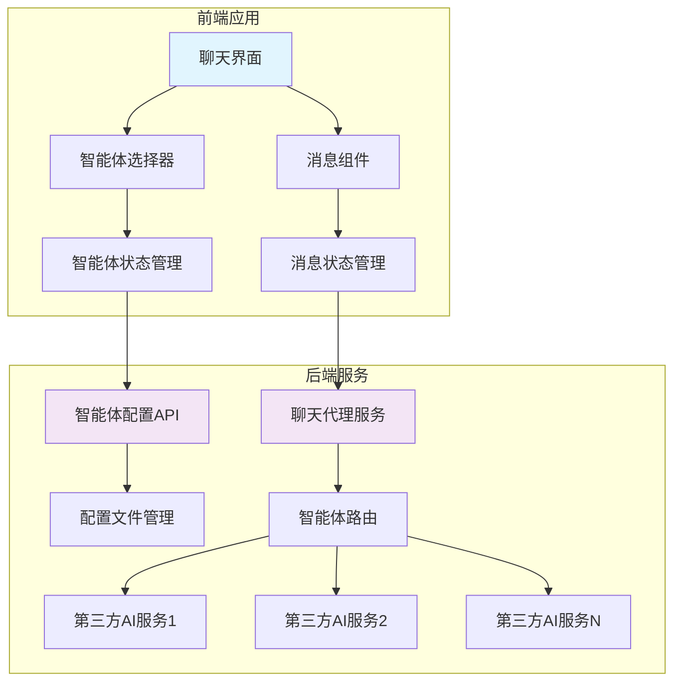
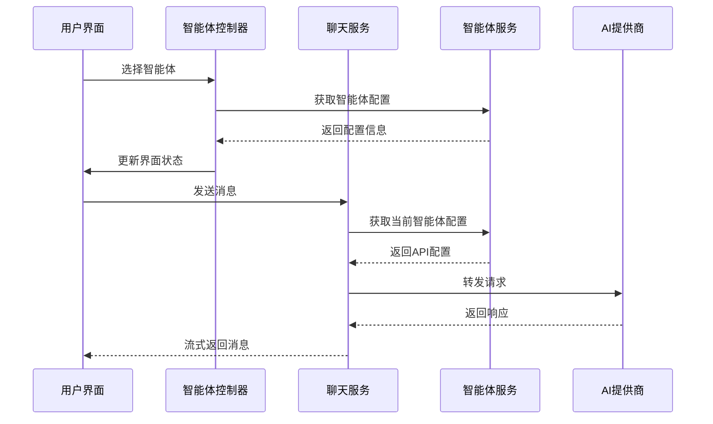
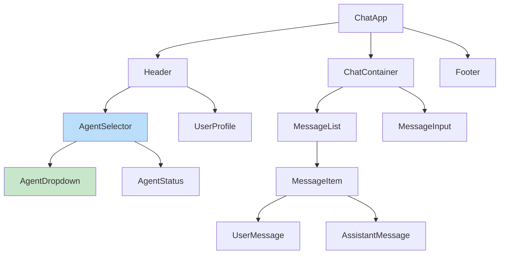
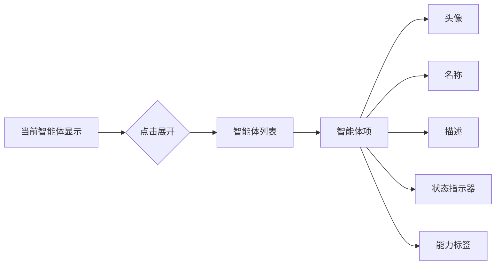
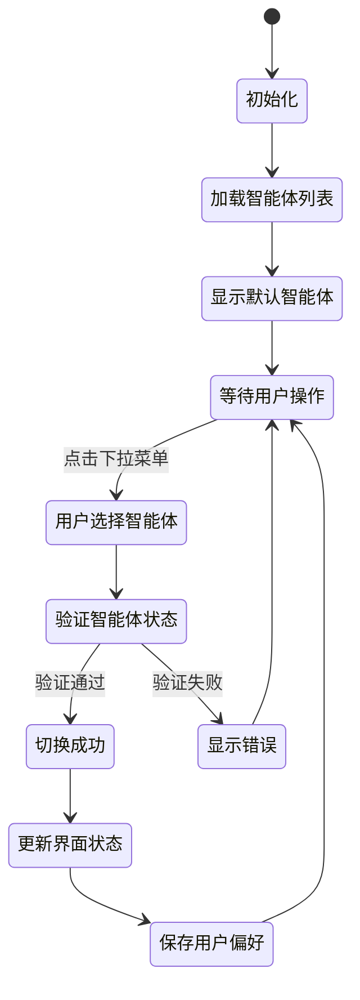

# 智能体切换功能设计文档

## 概述

本设计文档描述了一个仿照 ChatGPT 官网的智能体切换功能，使用 TypeScript 开发。该功能允许用户在聊天界面中动态切换不同的智能体，每个智能体都有独立的服务端配置，包括接口地址、API Key 和模型名称等信息。

### 核心目标
- 提供类似 ChatGPT 官网的用户体验
- 支持多智能体动态切换
- 服务端统一管理智能体配置
- 保持对话连续性和上下文管理

## 技术栈

- **前端**: TypeScript, React/Vue.js, Tailwind CSS
- **后端**: Node.js/Express, TypeScript
- **API 标准**: 兼容 OpenAI Chat Completions API
- **状态管理**: Redux/Zustand (React) 或 Pinia (Vue)
- **网络请求**: Axios/Fetch API

## 架构设计

### 系统架构图



### 数据流设计



## 前端组件架构

### 组件层次结构



### 核心组件设计

#### AgentSelector 组件

```typescript
interface Agent {
  id: string;
  name: string;
  description: string;
  avatar?: string;
  model: string;
  status: 'active' | 'inactive' | 'error';
  capabilities: string[];
}

interface AgentSelectorProps {
  agents: Agent[];
  currentAgent: Agent;
  onAgentChange: (agent: Agent) => void;
  loading?: boolean;
}
```

#### AgentDropdown 组件

```typescript
interface AgentDropdownProps {
  agents: Agent[];
  selectedAgent: Agent;
  onSelect: (agent: Agent) => void;
  open: boolean;
  onToggle: () => void;
}
```

#### 状态管理接口

```typescript
interface ChatState {
  currentAgent: Agent | null;
  availableAgents: Agent[];
  messages: Message[];
  loading: boolean;
  error: string | null;
}

interface AgentState {
  agents: Agent[];
  currentAgentId: string | null;
  loading: boolean;
  error: string | null;
}
```

## 后端服务设计

### 智能体配置管理

#### 配置文件结构

```typescript
interface AgentConfig {
  id: string;
  name: string;
  description: string;
  endpoint: string;
  apiKey: string;
  model: string;
  maxTokens?: number;
  temperature?: number;
  systemPrompt?: string;
  capabilities: string[];
  rateLimit?: {
    requestsPerMinute: number;
    tokensPerMinute: number;
  };
  isActive: boolean;
  createdAt: string;
  updatedAt: string;
}
```

#### 配置文件示例 (agents.json)

```json
{
  "agents": [
    {
      "id": "gpt-4-assistant",
      "name": "GPT-4 助手",
      "description": "基于 GPT-4 的通用智能助手",
      "endpoint": "https://api.openai.com/v1/chat/completions",
      "apiKey": "sk-xxxxxxxxxx",
      "model": "gpt-4-turbo-preview",
      "maxTokens": 4096,
      "temperature": 0.7,
      "systemPrompt": "你是一个有用的AI助手。",
      "capabilities": ["text", "analysis", "coding"],
      "rateLimit": {
        "requestsPerMinute": 60,
        "tokensPerMinute": 40000
      },
      "isActive": true,
      "createdAt": "2024-01-01T00:00:00Z",
      "updatedAt": "2024-01-01T00:00:00Z"
    },
    {
      "id": "claude-assistant",
      "name": "Claude 助手",
      "description": "基于 Claude 的智能助手",
      "endpoint": "https://api.anthropic.com/v1/messages",
      "apiKey": "sk-ant-xxxxxxxxxx",
      "model": "claude-3-sonnet-20240229",
      "maxTokens": 4096,
      "temperature": 0.7,
      "capabilities": ["text", "analysis", "reasoning"],
      "isActive": true,
      "createdAt": "2024-01-01T00:00:00Z",
      "updatedAt": "2024-01-01T00:00:00Z"
    }
  ]
}
```

### API 端点设计

#### 智能体管理 API

| 端点 | 方法 | 描述 | 参数 |
|------|------|------|------|
| `/api/agents` | GET | 获取可用智能体列表 | - |
| `/api/agents/:id` | GET | 获取特定智能体信息 | id: 智能体ID |
| `/api/agents/:id/status` | GET | 检查智能体状态 | id: 智能体ID |

#### 聊天代理 API

| 端点 | 方法 | 描述 | 参数 |
|------|------|------|------|
| `/api/chat/completions` | POST | 发送聊天请求 | agentId, messages, options |
| `/api/chat/stream` | POST | 流式聊天请求 | agentId, messages, options |

### 服务层架构

#### AgentConfigService

```typescript
class AgentConfigService {
  private configPath: string;
  private agents: Map<string, AgentConfig>;

  async loadAgents(): Promise<AgentConfig[]>;
  async getAgent(id: string): Promise<AgentConfig | null>;
  async updateAgent(id: string, config: Partial<AgentConfig>): Promise<void>;
  async validateAgent(config: AgentConfig): Promise<boolean>;
  async checkAgentHealth(id: string): Promise<boolean>;
}
```

#### ChatProxyService

```typescript
class ChatProxyService {
  private agentService: AgentConfigService;
  private httpClient: AxiosInstance;

  async sendMessage(
    agentId: string,
    messages: ChatMessage[],
    options?: ChatOptions
  ): Promise<ChatResponse>;

  async sendStreamMessage(
    agentId: string,
    messages: ChatMessage[],
    options?: ChatOptions
  ): Promise<ReadableStream>;

  private async transformRequest(
    config: AgentConfig,
    messages: ChatMessage[],
    options?: ChatOptions
  ): Promise<any>;

  private async transformResponse(
    config: AgentConfig,
    response: any
  ): Promise<ChatResponse>;
}
```

## 用户界面设计

### 智能体选择器界面

#### 下拉选择器设计



#### 状态指示器

| 状态 | 颜色 | 图标 | 描述 |
|------|------|------|------|
| active | 绿色 | ● | 智能体可用 |
| inactive | 灰色 | ○ | 智能体不可用 |
| error | 红色 | ⚠ | 智能体错误 |
| loading | 蓝色 | ⟳ | 检查状态中 |

### 聊天界面增强

#### 智能体切换提示

```typescript
interface AgentSwitchNotification {
  type: 'agent_switch';
  fromAgent: Agent;
  toAgent: Agent;
  timestamp: Date;
  message: string;
}
```

#### 消息来源标识

```typescript
interface MessageWithAgent extends Message {
  agentId: string;
  agentName: string;
  agentAvatar?: string;
}
```

## 数据模型

### 核心数据结构

#### Message 接口

```typescript
interface Message {
  id: string;
  role: 'user' | 'assistant' | 'system';
  content: string;
  agentId?: string;
  timestamp: Date;
  metadata?: {
    model?: string;
    tokens?: number;
    duration?: number;
  };
}
```

#### ChatSession 接口

```typescript
interface ChatSession {
  id: string;
  title: string;
  agentId: string;
  messages: Message[];
  createdAt: Date;
  updatedAt: Date;
  metadata?: {
    totalTokens: number;
    messageCount: number;
  };
}
```

### 状态持久化

#### 本地存储策略

```typescript
interface ChatStorage {
  currentSession: ChatSession | null;
  recentAgents: Agent[];
  userPreferences: {
    defaultAgentId?: string;
    theme: 'light' | 'dark';
    streamingEnabled: boolean;
  };
}
```

## API 集成设计

### 统一适配器模式

```typescript
interface AIProvider {
  name: string;
  transformRequest(messages: Message[], config: AgentConfig): any;
  transformResponse(response: any): Message;
  transformStreamResponse(chunk: any): string;
  validateConfig(config: AgentConfig): boolean;
}

class OpenAIProvider implements AIProvider {
  name = 'OpenAI';
  
  transformRequest(messages: Message[], config: AgentConfig) {
    return {
      model: config.model,
      messages: messages.map(msg => ({
        role: msg.role,
        content: msg.content
      })),
      max_tokens: config.maxTokens,
      temperature: config.temperature,
      stream: true
    };
  }
  
  transformResponse(response: any): Message {
    return {
      id: generateId(),
      role: 'assistant',
      content: response.choices[0].message.content,
      timestamp: new Date()
    };
  }
}
```

### 错误处理机制

```typescript
interface APIError {
  code: string;
  message: string;
  agentId: string;
  timestamp: Date;
  details?: any;
}

class ErrorHandler {
  static handleAgentError(error: APIError): UserFriendlyError {
    switch (error.code) {
      case 'AGENT_UNAVAILABLE':
        return {
          message: '智能体暂时不可用，请选择其他智能体',
          suggestion: '尝试切换到其他可用的智能体'
        };
      case 'API_QUOTA_EXCEEDED':
        return {
          message: '智能体使用量已达上限',
          suggestion: '请稍后再试或联系管理员'
        };
      case 'INVALID_API_KEY':
        return {
          message: '智能体配置错误',
          suggestion: '请联系管理员检查配置'
        };
      default:
        return {
          message: '发生未知错误',
          suggestion: '请刷新页面重试'
        };
    }
  }
}
```

## 实现细节

### 智能体切换流程



### 消息路由机制

```typescript
class MessageRouter {
  private currentAgent: AgentConfig;
  private providers: Map<string, AIProvider>;

  async routeMessage(message: Message): Promise<Message> {
    const provider = this.getProvider(this.currentAgent);
    const request = provider.transformRequest([message], this.currentAgent);
    
    try {
      const response = await this.sendRequest(this.currentAgent.endpoint, request, {
        'Authorization': `Bearer ${this.currentAgent.apiKey}`,
        'Content-Type': 'application/json'
      });
      
      return provider.transformResponse(response);
    } catch (error) {
      throw new APIError({
        code: 'REQUEST_FAILED',
        message: error.message,
        agentId: this.currentAgent.id,
        timestamp: new Date()
      });
    }
  }

  private getProvider(config: AgentConfig): AIProvider {
    if (config.endpoint.includes('openai.com')) {
      return new OpenAIProvider();
    } else if (config.endpoint.includes('anthropic.com')) {
      return new AnthropicProvider();
    } else {
      return new GenericProvider();
    }
  }
}
```

### 性能优化策略

#### 智能体状态缓存

```typescript
class AgentStatusCache {
  private cache: Map<string, { status: string; timestamp: Date }>;
  private readonly CACHE_TTL = 5 * 60 * 1000; // 5分钟

  async getStatus(agentId: string): Promise<string> {
    const cached = this.cache.get(agentId);
    
    if (cached && Date.now() - cached.timestamp.getTime() < this.CACHE_TTL) {
      return cached.status;
    }

    const status = await this.checkAgentStatus(agentId);
    this.cache.set(agentId, { status, timestamp: new Date() });
    return status;
  }

  private async checkAgentStatus(agentId: string): Promise<string> {
    // 实现状态检查逻辑
    try {
      const config = await this.agentService.getAgent(agentId);
      const response = await fetch(config.endpoint, {
        method: 'OPTIONS',
        timeout: 5000
      });
      return response.ok ? 'active' : 'error';
    } catch {
      return 'error';
    }
  }
}
```

#### 预加载机制

```typescript
class AgentPreloader {
  async preloadPopularAgents(): Promise<void> {
    const popularAgents = await this.getPopularAgents();
    
    const preloadPromises = popularAgents.map(async (agent) => {
      try {
        await this.warmupAgent(agent.id);
      } catch (error) {
        console.warn(`Failed to preload agent ${agent.id}:`, error);
      }
    });

    await Promise.allSettled(preloadPromises);
  }

  private async warmupAgent(agentId: string): Promise<void> {
    const testMessage = { role: 'user', content: 'Hello' };
    await this.messageRouter.routeMessage(testMessage);
  }
}
```

## 安全考虑

### API Key 保护

```typescript
class SecureConfigManager {
  private encryptionKey: string;

  encryptApiKey(apiKey: string): string {
    return crypto.encrypt(apiKey, this.encryptionKey);
  }

  decryptApiKey(encryptedKey: string): string {
    return crypto.decrypt(encryptedKey, this.encryptionKey);
  }

  maskApiKey(apiKey: string): string {
    return apiKey.substring(0, 8) + '***' + apiKey.substring(apiKey.length - 4);
  }
}
```

### 访问控制

```typescript
interface UserPermissions {
  allowedAgents: string[];
  rateLimit: {
    requestsPerHour: number;
    maxConcurrentRequests: number;
  };
  features: {
    canSwitchAgents: boolean;
    canViewAgentDetails: boolean;
  };
}

class AccessController {
  async checkAgentAccess(userId: string, agentId: string): Promise<boolean> {
    const permissions = await this.getUserPermissions(userId);
    return permissions.allowedAgents.includes(agentId);
  }

  async checkRateLimit(userId: string): Promise<boolean> {
    const usage = await this.getUserUsage(userId);
    const permissions = await this.getUserPermissions(userId);
    return usage.requestsInLastHour < permissions.rateLimit.requestsPerHour;
  }
}
```

## 监控和日志

### 使用情况跟踪

```typescript
interface AgentUsageMetrics {
  agentId: string;
  requestCount: number;
  totalTokens: number;
  averageResponseTime: number;
  errorRate: number;
  lastUsed: Date;
}

class UsageTracker {
  async trackRequest(agentId: string, tokens: number, responseTime: number): Promise<void> {
    await this.database.agents_usage.upsert({
      agent_id: agentId,
      date: new Date().toDateString(),
      request_count: { increment: 1 },
      total_tokens: { increment: tokens },
      total_response_time: { increment: responseTime }
    });
  }

  async getAgentMetrics(agentId: string, period: 'day' | 'week' | 'month'): Promise<AgentUsageMetrics> {
    // 实现指标查询逻辑
  }
}
```

### 错误日志

```typescript
class ErrorLogger {
  async logError(error: APIError, context: any): Promise<void> {
    const logEntry = {
      timestamp: new Date(),
      level: 'error',
      agentId: error.agentId,
      errorCode: error.code,
      message: error.message,
      context: JSON.stringify(context),
      stackTrace: error.stack
    };

    await this.writeLog(logEntry);
    
    if (this.isCriticalError(error)) {
      await this.sendAlert(logEntry);
    }
  }

  private isCriticalError(error: APIError): boolean {
    const criticalCodes = ['AGENT_UNAVAILABLE', 'INVALID_API_KEY', 'QUOTA_EXCEEDED'];
    return criticalCodes.includes(error.code);
  }
}
```