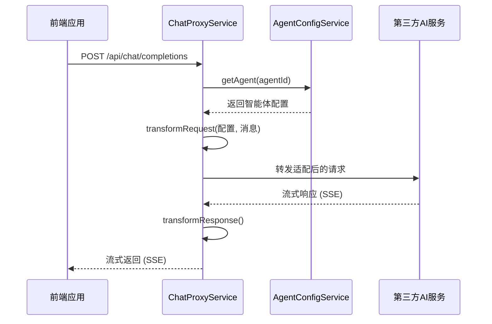

# API参考

<cite>
**本文档中引用的文件**  
- [model-switching-feature.md](file://doc/model-switching-feature.md)
</cite>

## 目录
1. [简介](#简介)
2. [RESTful端点说明](#restful端点说明)
3. [认证机制](#认证机制)
4. [速率限制策略](#速率限制策略)
5. [跨域配置（CORS）](#跨域配置（cors）)
6. [调用示例](#调用示例)
7. [后端代理机制](#后端代理机制)

## 简介
本API参考文档详细描述了`llmchat`项目中用于智能体管理和聊天交互的核心RESTful接口。系统支持多AI服务提供商（如FastGPT、OpenAI、Anthropic等）的统一接入与动态切换，通过代理服务将请求转发至对应后端AI平台，并支持流式响应传输。

**Section sources**
- [model-switching-feature.md](file://doc/model-switching-feature.md#L0-L100)

## RESTful端点说明

### GET /api/agents（获取可用智能体列表）

获取当前系统中所有可用的智能体信息列表。

- **HTTP方法**: GET
- **URL参数**: 无
- **请求头**:
  - `Authorization: Bearer <API_KEY>`（可选，某些部署环境可能需要认证）
- **成功响应格式（200 OK）**:
  ```json
  {
    "agents": [
      {
        "id": "string",
        "name": "string",
        "description": "string",
        "model": "string",
        "provider": "fastgpt|openai|anthropic|custom",
        "status": "active|inactive|error",
        "capabilities": ["string"],
        "features": {
          "supportsStream": boolean,
          "supportsFiles": boolean,
          "supportsImages": boolean
        }
      }
    ]
  }
  ```
- **错误码**:
  - `500 Internal Server Error`: 服务器内部错误，无法加载智能体配置

**Section sources**
- [model-switching-feature.md](file://doc/model-switching-feature.md#L101-L150)

### GET /api/agents/:id（获取特定智能体详情）

根据智能体ID获取其详细配置信息。

- **HTTP方法**: GET
- **URL参数**:
  - `id`: 智能体唯一标识符（如 `fastgpt-assistant`）
- **请求头**:
  - `Authorization: Bearer <API_KEY>`（可选）
- **成功响应格式（200 OK）**:
  ```json
  {
    "id": "string",
    "name": "string",
    "description": "string",
    "endpoint": "string",
    "model": "string",
    "maxTokens": number,
    "temperature": number,
    "systemPrompt": "string",
    "provider": "fastgpt|openai|anthropic|custom",
    "isActive": boolean,
    "features": {
      "supportsChatId": boolean,
      "supportsStream": boolean,
      "supportsFiles": boolean,
      "streamingConfig": {
        "enabled": boolean,
        "endpoint": "same|different",
        "statusEvents": boolean
      }
    }
  }
  ```
- **错误码**:
  - `404 Not Found`: 指定ID的智能体不存在
  - `500 Internal Server Error`: 服务器错误

**Section sources**
- [model-switching-feature.md](file://doc/model-switching-feature.md#L151-L200)

### GET /api/agents/:id/status（检查智能体运行状态）

检查指定智能体的健康状态和可用性。

- **HTTP方法**: GET
- **URL参数**:
  - `id`: 智能体ID
- **请求头**: 无
- **成功响应格式（200 OK）**:
  ```json
  {
    "status": "active|inactive|error|loading",
    "lastChecked": "ISO8601 timestamp",
    "details": {
      "responseTimeMs": number,
      "canConnect": boolean
    }
  }
  ```
- **错误码**:
  - `404 Not Found`: 智能体未找到
  - `500 Internal Server Error`: 状态检测失败

**Section sources**
- [model-switching-feature.md](file://doc/model-switching-feature.md#L201-L250)

### POST /api/chat/completions（发送聊天请求并接收流式响应）

向当前选定的智能体发送聊天消息，并可选择以流式方式接收响应。

- **HTTP方法**: POST
- **URL参数**: 无
- **请求头**:
  - `Content-Type: application/json`
  - `Authorization: Bearer <API_KEY>`（必需）
- **请求体结构（JSON Schema）**:
  ```json
  {
    "agentId": "string",
    "messages": [
      {
        "role": "system|user|assistant",
        "content": "string"
      }
    ],
    "stream": true,
    "options": {
      "temperature": 0.7,
      "maxTokens": 4096
    }
  }
  ```
- **成功响应格式**:
  - 当 `stream=false` 时，返回标准JSON响应：
    ```json
    {
      "id": "chat-xxx",
      "object": "chat.completion",
      "created": 1234567890,
      "choices": [
        {
          "message": { "role": "assistant", "content": "回复内容" },
          "finish_reason": "stop"
        }
      ]
    }
    ```
  - 当 `stream=true` 时，返回`text/event-stream`流式数据，每个事件格式为：
    ```
    data: {"id":"evt-1","type":"chat.chunk","delta":{"content":"部分文本"}}
    data: [DONE]
    ```
- **错误码**:
  - `400 Bad Request`: 请求体格式错误或缺少必要字段
  - `401 Unauthorized`: 认证失败或API Key无效
  - `404 Not Found`: agentId对应的智能体不存在
  - `500 Internal Server Error`: 代理转发失败或后端服务异常

**Section sources**
- [model-switching-feature.md](file://doc/model-switching-feature.md#L251-L300)

## 认证机制
系统采用基于API Key的认证方式。客户端需在请求头中包含`Authorization: Bearer <API_KEY>`字段。API Key由系统管理员配置并分发，用于验证调用者身份和访问权限。该机制兼容OpenAI风格的认证标准，便于前端集成。

**Section sources**
- [model-switching-feature.md](file://doc/model-switching-feature.md#L301-L320)

## 速率限制策略
每个智能体可独立配置速率限制规则，定义在`AgentConfig.rateLimit`中：
- `requestsPerMinute`: 每分钟最大请求数
- `tokensPerMinute`: 每分钟最大令牌数

系统通过`ChatProxyService`在转发前进行限流检查，超出限制的请求将返回`429 Too Many Requests`状态码。

**Section sources**
- [model-switching-feature.md](file://doc/model-switching-feature.md#L321-L340)

## 跨域配置（CORS）
服务器启用CORS策略以支持Web前端跨域调用：
- 允许来源：可配置（默认允许所有）
- 允许方法：GET, POST, OPTIONS
- 允许头部：Authorization, Content-Type
- 预检请求缓存：24小时

此配置确保前端应用可在不同域名下安全调用API。

**Section sources**
- [model-switching-feature.md](file://doc/model-switching-feature.md#L341-L360)

## 调用示例

### curl命令示例
```bash
# 获取智能体列表
curl -X GET http://localhost:3000/api/agents \
  -H "Authorization: Bearer your-api-key"

# 发送流式聊天请求
curl -X POST http://localhost:3000/api/chat/completions \
  -H "Content-Type: application/json" \
  -H "Authorization: Bearer your-api-key" \
  -d '{
    "agentId": "gpt-4-assistant",
    "messages": [
      {"role": "user", "content": "你好"}
    ],
    "stream": true
  }'
```

### JavaScript/Fetch调用代码片段
```javascript
async function sendChatMessage() {
  const response = await fetch('/api/chat/completions', {
    method: 'POST',
    headers: {
      'Content-Type': 'application/json',
      'Authorization': 'Bearer your-api-key'
    },
    body: JSON.stringify({
      agentId: 'fastgpt-assistant',
      messages: [{ role: 'user', content: '解释量子计算' }],
      stream: true
    })
  });

  const reader = response.body.getReader();
  while (true) {
    const { done, value } = await reader.read();
    if (done) break;
    const chunk = new TextDecoder().decode(value);
    console.log('Received:', chunk);
  }
}
```

**Section sources**
- [model-switching-feature.md](file://doc/model-switching-feature.md#L361-L400)

## 后端代理机制

### 架构概述
系统通过`ChatProxyService`实现请求代理，将前端请求适配并转发至不同AI服务商（如OpenAI、Anthropic、FastGPT等），同时处理流式数据的转换与传输。



**Diagram sources**
- [model-switching-feature.md](file://doc/model-switching-feature.md#L401-L450)

#### 核心流程说明
1. **请求接收**：`ChatProxyService`接收来自前端的聊天请求。
2. **配置获取**：通过`AgentConfigService`根据`agentId`加载对应智能体的完整配置（包括endpoint、apiKey、模型名等）。
3. **请求转换**：根据目标AI服务的API规范（如OpenAI、Anthropic），将通用请求体转换为特定格式。
4. **代理转发**：使用`axios`或`fetch`向目标AI服务的`endpoint`发起POST请求。
5. **流式处理**：对于流式请求，建立双向流管道，实时将AI服务的SSE响应转换并推送回客户端。
6. **响应转换**：将不同AI服务的响应格式统一为标准OpenAI兼容格式返回。

该机制实现了前端与多种AI后端之间的解耦，支持灵活扩展新的智能体类型。

**Section sources**
- [model-switching-feature.md](file://doc/model-switching-feature.md#L451-L500)