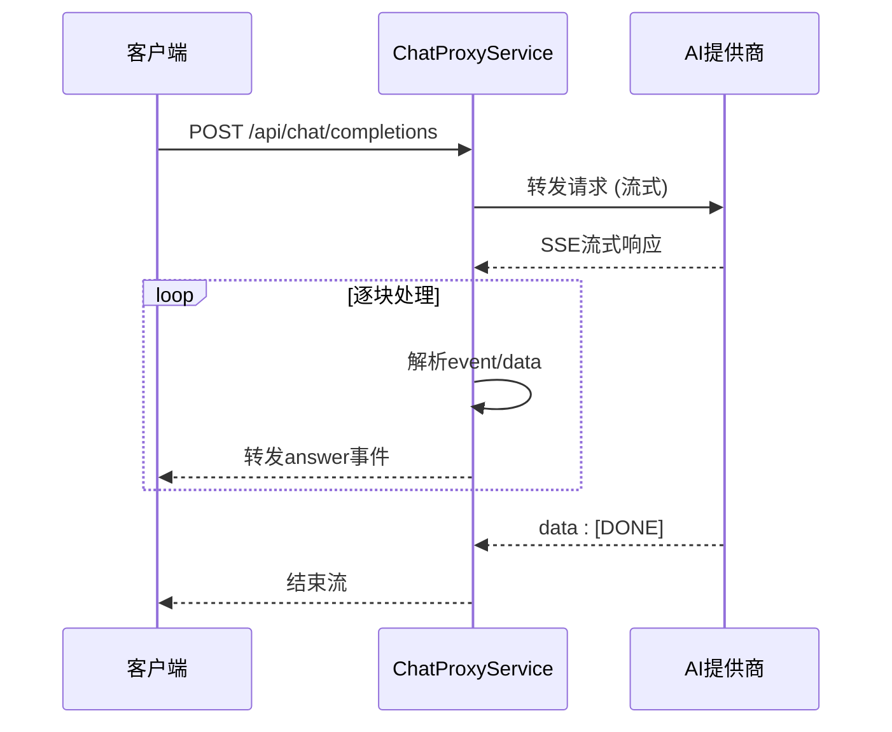
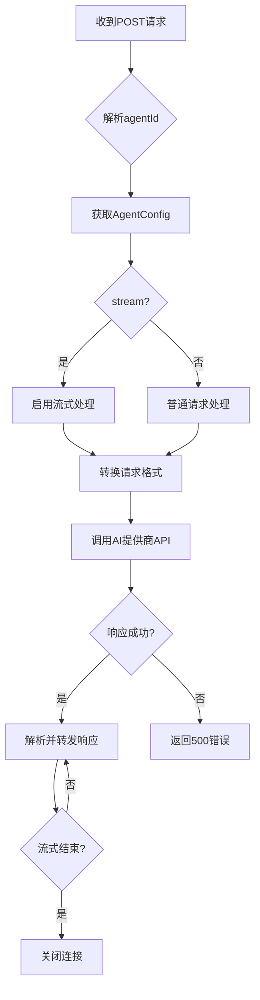

# 发送聊天请求 (POST /api/chat/completions)

<cite>
**本文档引用的文件**   
- [model-switching-feature.md](file://doc/model-switching-feature.md)
</cite>

## 目录
1. [请求说明](#请求说明)
2. [请求体结构](#请求体结构)
3. [响应格式](#响应格式)
4. [错误码说明](#错误码说明)
5. [客户端示例代码](#客户端示例代码)
6. [ChatProxyService处理流程](#chatproxyservice处理流程)

## 请求说明

`POST /api/chat/completions` 端点用于向当前选中的AI智能体发送聊天消息并接收流式响应。该接口作为聊天代理服务的核心，负责解析智能体配置、路由请求至对应的AI提供商，并处理流式数据的转换与传输。

该端点要求客户端在请求头中包含有效的 `Authorization` 令牌，并将 `Content-Type` 设置为 `application/json`。请求体需包含消息内容、目标智能体ID以及是否启用流式响应的标志。

**Section sources**
- [model-switching-feature.md](file://doc/model-switching-feature.md#L369-L421)

## 请求体结构

请求体必须为JSON格式，包含以下字段：

- **message**: 聊天消息内容数组，每个消息对象包含 `role`（角色，如"user"或"assistant"）和 `content`（消息文本）。
- **agentId**: 指定目标AI智能体的唯一标识符，用于从配置中查找对应的提供商、API端点和密钥。
- **stream**: 布尔值，指示是否启用流式响应。若为 `true`，服务器将以 `text/event-stream` 格式逐块返回AI生成内容。

示例请求体：
```json
{
  "messages": [
    {
      "role": "user",
      "content": "你好，介绍一下你自己"
    }
  ],
  "agentId": "fastgpt-assistant",
  "stream": true
}
```

**Section sources**
- [model-switching-feature.md](file://doc/model-switching-feature.md#L369-L421)

## 响应格式

当 `stream` 参数为 `true` 时，成功响应的 `Content-Type` 为 `text/event-stream`，服务器将通过SSE（Server-Sent Events）协议逐块推送AI生成的内容。

流式响应包含多种事件类型：
- **event: answer**: 表示AI生成的文本内容，通过 `data:` 字段传输。
- **event: flowNodeStatus**: （仅FastGPT）表示执行流程中各节点的状态变化，如“运行中”、“已完成”。
- **data: [DONE]**: 表示流式响应结束。

每个数据块以 `\n\n` 分隔，客户端需按行解析并处理不同类型的事件。



**Diagram sources**
- [model-switching-feature.md](file://doc/model-switching-feature.md#L1520-L1749)
- [model-switching-feature.md](file://doc/model-switching-feature.md#L369-L421)

## 错误码说明

| 错误码 | 说明 | 可能原因 |
|--------|------|----------|
| 400 | 请求格式错误 | `agentId` 缺失或无效，`messages` 格式不正确 |
| 429 | 速率限制 | 请求频率超过智能体配置的 `rateLimit` 限制 |
| 500 | 代理错误 | 后端服务内部错误，或与AI提供商通信失败 |

**Section sources**
- [model-switching-feature.md](file://doc/model-switching-feature.md#L369-L421)

## 客户端示例代码

### 使用curl读取流式响应
```bash
curl -X POST https://your-api.com/api/chat/completions \
  -H "Authorization: Bearer your-api-key" \
  -H "Content-Type: application/json" \
  -d '{
    "messages": [{"role": "user", "content": "你好"}],
    "agentId": "gpt-4-assistant",
    "stream": true
  }' | while read line; do
    if [[ $line == data:* ]]; then
      echo -n "${line#data: }"
    fi
  done
```

### 使用前端EventSource
```javascript
const eventSource = new EventSource('/api/chat/completions', {
  method: 'POST',
  headers: {
    'Content-Type': 'application/json',
    'Authorization': 'Bearer your-api-key'
  },
  body: JSON.stringify({
    messages: [{ role: 'user', content: '你好' }],
    agentId: 'fastgpt-assistant',
    stream: true
  })
});

eventSource.onmessage = (event) => {
  if (event.data !== '[DONE]') {
    const chunk = JSON.parse(event.data);
    // 处理文本块
    console.log(chunk.choices[0].delta.content);
  } else {
    eventSource.close();
  }
};
```

### 使用Fetch API
```javascript
const response = await fetch('/api/chat/completions', {
  method: 'POST',
  headers: {
    'Content-Type': 'application/json',
    'Authorization': 'Bearer your-api-key'
  },
  body: JSON.stringify({
    messages: [{ role: 'user', content: '你好' }],
    agentId: 'gpt-4-assistant',
    stream: true
  })
});

const reader = response.body.getReader();
const decoder = new TextDecoder();

while (true) {
  const { done, value } = await reader.read();
  if (done) break;
  const chunk = decoder.decode(value);
  // 按行解析SSE数据
  chunk.split('\n').forEach(line => {
    if (line.startsWith('data:')) {
      const data = line.slice(5).trim();
      if (data !== '[DONE]') {
        console.log(JSON.parse(data));
      }
    }
  });
}
```

**Section sources**
- [model-switching-feature.md](file://doc/model-switching-feature.md#L1196-L1425)

## ChatProxyService处理流程

`ChatProxyService` 是处理聊天请求的核心服务，其工作流程如下：

1. **解析agentId**: 接收请求后，根据 `agentId` 从 `AgentConfigService` 中获取对应的智能体配置，包括API端点、密钥、提供商类型等。
2. **请求转换**: 根据目标提供商（如FastGPT、OpenAI、Anthropic）的API规范，将标准化的请求体转换为对应格式。例如，FastGPT需要 `chatId` 和 `detail` 字段，而OpenAI需要 `model` 字段。
3. **路由请求**: 使用 `httpClient` 向目标AI提供商的API端点发起POST请求，并附带正确的认证头（如 `Authorization: Bearer <apiKey>`）。
4. **流式处理**: 对于流式请求，服务会创建一个可读流，实时接收并解析来自AI提供商的SSE响应。它能识别不同事件类型（如 `answer`、`flowNodeStatus`），并将其重新打包后转发给客户端。
5. **错误回退**: 在请求过程中发生网络错误或超时，服务会捕获异常，记录错误日志，并向客户端返回500错误。同时，可根据配置实现重试机制或降级策略。
6. **响应转换**: 将AI提供商的原始响应转换为统一的内部消息格式，确保前端接收的数据结构一致。

该服务通过统一适配器模式（`AIProvider` 接口）实现了对多种AI提供商的兼容，保证了系统的可扩展性和维护性。



**Diagram sources**
- [model-switching-feature.md](file://doc/model-switching-feature.md#L369-L421)
- [model-switching-feature.md](file://doc/model-switching-feature.md#L895-L1132)