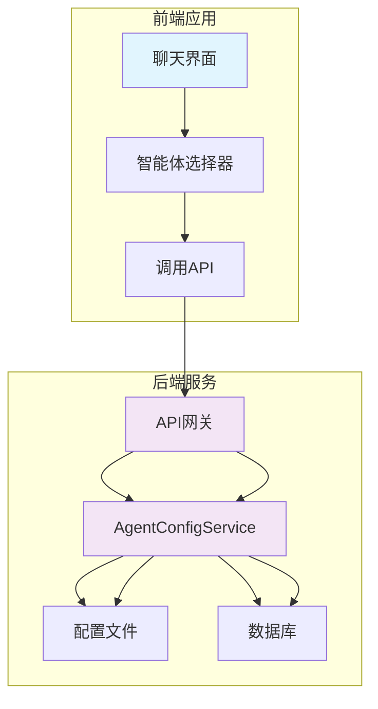
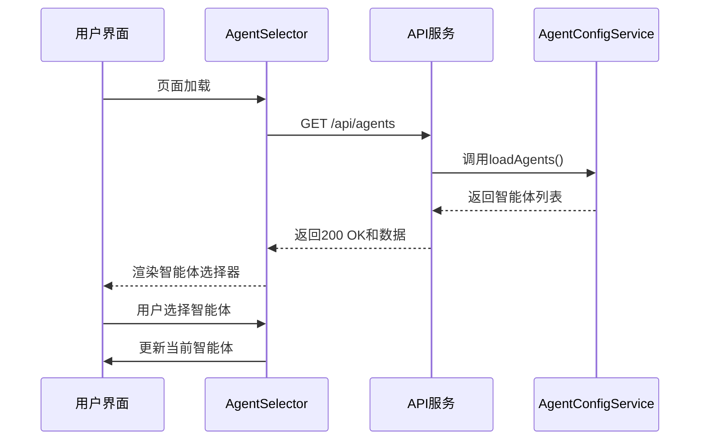

# 获取智能体列表 (GET /api/agents)

<cite>
**本文档引用的文件**   
- [model-switching-feature.md](file://doc\model-switching-feature.md)
</cite>

## 目录
1. [简介](#简介)
2. [API 端点详情](#api-端点详情)
3. [请求示例](#请求示例)
4. [响应示例](#响应示例)
5. [错误情况](#错误情况)
6. [后端实现](#后端实现)
7. [前端集成](#前端集成)
8. [系统架构](#系统架构)

## 简介
`GET /api/agents` 端点用于获取系统中所有可用AI智能体的列表。该接口是智能体切换功能的核心，为前端智能体选择器组件提供数据支持，使用户能够在不同AI模型之间进行切换。此文档详细说明了该API的使用方法、响应结构、错误处理以及其在整个系统中的作用。

## API 端点详情

**请求方法**: GET  
**端点路径**: `/api/agents`  
**URL 参数**: 无  
**请求头**:  
- `Authorization`: Bearer token (可选，用于访问控制)

**成功响应**:  
- **状态码**: 200 OK
- **响应体**: JSON数组，包含所有可用智能体的配置信息

**响应体结构**:
```json
{
  "agents": [
    {
      "id": "string",
      "name": "string",
      "description": "string",
      "model": "string",
      "status": "active|inactive|error",
      "endpoint": "string",
      "provider": "fastgpt|openai|anthropic|custom",
      "isActive": "boolean",
      "features": {
        "supportsStream": "boolean",
        "supportsFiles": "boolean",
        "supportsImages": "boolean"
      },
      "capabilities": ["string"],
      "rateLimit": {
        "requestsPerMinute": "number",
        "tokensPerMinute": "number"
      }
    }
  ]
}
```

**字段说明**:
- `id`: 智能体的唯一标识符
- `name`: 智能体的显示名称
- `description`: 智能体的描述信息
- `model`: 使用的AI模型名称
- `status`: 智能体的当前状态
- `endpoint`: 智能体API的端点地址
- `provider`: AI服务提供商
- `isActive`: 智能体是否激活
- `features`: 智能体支持的特性
- `capabilities`: 智能体的能力列表
- `rateLimit`: 速率限制配置

**Section sources**
- [model-switching-feature.md](file://doc\model-switching-feature.md#L369-L421)

## 请求示例

### 使用 curl 命令
```bash
curl -X GET "http://localhost:3000/api/agents" \
  -H "Authorization: Bearer your-access-token"
```

### 使用 JavaScript Fetch
```javascript
fetch('/api/agents', {
  method: 'GET',
  headers: {
    'Authorization': 'Bearer your-access-token',
    'Content-Type': 'application/json'
  }
})
.then(response => response.json())
.then(data => {
  console.log('可用智能体:', data.agents);
})
.catch(error => {
  console.error('获取智能体列表失败:', error);
});
```

**Section sources**
- [model-switching-feature.md](file://doc\model-switching-feature.md#L369-L421)

## 响应示例

### 成功响应 (200 OK)
```json
{
  "agents": [
    {
      "id": "fastgpt-assistant",
      "name": "FastGPT 智能助手",
      "description": "基于 FastGPT 的知识库问答助手",
      "model": "FastAI-4k",
      "status": "active",
      "endpoint": "http://localhost:3000/api/v1/chat/completions",
      "provider": "fastgpt",
      "isActive": true,
      "features": {
        "supportsChatId": true,
        "supportsStream": true,
        "supportsDetail": true,
        "supportsFiles": true,
        "supportsImages": true
      },
      "capabilities": ["knowledge_base", "context_memory", "file_upload"],
      "rateLimit": {
        "requestsPerMinute": 60,
        "tokensPerMinute": 40000
      }
    },
    {
      "id": "gpt-4-assistant",
      "name": "GPT-4 助手",
      "description": "基于 GPT-4 的通用智能助手",
      "model": "gpt-4-turbo-preview",
      "status": "active",
      "endpoint": "https://api.openai.com/v1/chat/completions",
      "provider": "openai",
      "isActive": true,
      "features": {
        "supportsChatId": false,
        "supportsStream": true,
        "supportsDetail": false,
        "supportsFiles": false,
        "supportsImages": true
      },
      "capabilities": ["text", "analysis", "coding"],
      "rateLimit": {
        "requestsPerMinute": 60,
        "tokensPerMinute": 40000
      }
    }
  ]
}
```

**Section sources**
- [model-switching-feature.md](file://doc\model-switching-feature.md#L235-L368)

## 错误情况

### 500 服务器内部错误
当服务器在处理请求时发生内部错误时返回。

**响应示例**:
```json
{
  "error": "Internal Server Error",
  "message": "Failed to load agent configurations",
  "timestamp": "2024-01-01T00:00:00Z"
}
```

**可能原因**:
- 配置文件读取失败
- 数据库连接问题
- 内部服务异常

**Section sources**
- [model-switching-feature.md](file://doc\model-switching-feature.md#L369-L421)

## 后端实现

`GET /api/agents` 端点由 `AgentConfigService` 驱动，该服务负责管理所有智能体的配置信息。

### AgentConfigService 核心功能
```typescript
class AgentConfigService {
  private configPath: string;
  private agents: Map<string, AgentConfig>;

  async loadAgents(): Promise<AgentConfig[]>;
  async getAgent(id: string): Promise<AgentConfig | null>;
  async updateAgent(id: string, config: Partial<AgentConfig>): Promise<void>;
  async validateAgent(config: AgentConfig): Promise<boolean>;
  async checkAgentHealth(id: string): Promise<boolean>;
}
```

该服务从配置文件中加载智能体信息，缓存到内存中，并提供各种操作接口。`loadAgents()` 方法被API端点调用以获取所有可用智能体的列表。

**Section sources**
- [model-switching-feature.md](file://doc\model-switching-feature.md#L369-L421)

## 前端集成

### AgentSelector 组件
前端的 `AgentSelector` 组件依赖此API获取的数据进行初始化，为用户提供智能体选择界面。

```typescript
interface Agent {
  id: string;
  name: string;
  description: string;
  model: string;
  status: 'active' | 'inactive' | 'error';
  capabilities: string[];
}

interface AgentSelectorProps {
  agents: Agent[];
  currentAgent: Agent;
  onAgentChange: (agent: Agent) => void;
  loading?: boolean;
}
```

### 智能体切换流程
1. 页面加载时调用 `GET /api/agents`
2. 将返回的智能体列表传递给 `AgentSelector` 组件
3. 用户选择新的智能体
4. 更新当前会话的智能体配置
5. 后续聊天请求使用新智能体的配置

**Section sources**
- [model-switching-feature.md](file://doc\model-switching-feature.md#L50-L140)

## 系统架构



**Diagram sources**
- [model-switching-feature.md](file://doc\model-switching-feature.md#L50-L140)



**Diagram sources**
- [model-switching-feature.md](file://doc\model-switching-feature.md#L50-L140)

**Section sources**
- [model-switching-feature.md](file://doc\model-switching-feature.md#L50-L140)