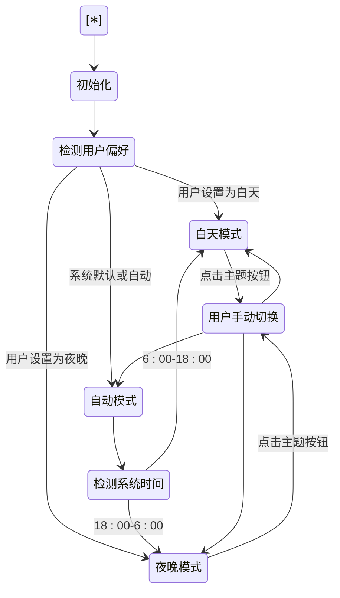

# 主题系统

<cite>
**本文档中引用的文件**
- [model-switching-feature.md](file://doc/model-switching-feature.md)
</cite>

## 目录
1. [主题系统实现机制](#主题系统实现机制)
2. [CSS变量定义示例](#css变量定义示例)
3. [前端组件订阅与重新渲染](#前端组件订阅与重新渲染)
4. [可访问性考虑](#可访问性考虑)
5. [主题状态持久化方案](#主题状态持久化方案)
6. [扩展支持更多自定义主题](#扩展支持更多自定义主题)

## 主题系统实现机制

llmchat项目中的主题系统通过`ThemeManager`类实现，该类负责管理白天模式、夜晚模式和自动模式的切换逻辑。系统首先从`localStorage`中读取用户的主题偏好设置，默认为"auto"（自动模式）。当用户选择"auto"时，系统会根据当前时间（6:00-18:00为白天模式，18:00-6:00为夜晚模式）自动切换主题。

主题切换的核心机制基于CSS自定义属性（CSS Variables），通过修改`:root`元素的`data-theme`属性来动态更新全局视觉样式。`ThemeProvider`组件作为主题系统的上下文提供者，使用React的Context API来管理主题状态，并在主题变化时通知所有订阅的组件。

用户可以通过点击主题切换按钮手动更改主题，每次切换都会循环经历白天模式→夜晚模式→自动模式→白天模式的流程。系统还支持自定义时间表的自动主题切换，允许用户配置白天模式和夜晚模式的开始时间。



**Diagram sources**
- [model-switching-feature.md](file://doc/model-switching-feature.md#L498-L518)

**Section sources**
- [model-switching-feature.md](file://doc/model-switching-feature.md#L895-L937)
- [model-switching-feature.md](file://doc/model-switching-feature.md#L519-L575)

## CSS变量定义示例

主题系统使用CSS自定义属性来定义不同主题下的视觉样式。这些变量定义在`:root`选择器中，并通过`data-theme`属性来区分不同主题。

白天主题的CSS变量定义如下：

```css
:root[data-theme="light"] {
  /* 背景色 */
  --bg-primary: #ffffff;
  --bg-secondary: #f8fafc;
  --bg-tertiary: #f1f5f9;
  --bg-overlay: rgba(255, 255, 255, 0.95);
  
  /* 文本颜色 */
  --text-primary: #1e293b;
  --text-secondary: #475569;
  --text-tertiary: #64748b;
  --text-inverse: #ffffff;
  
  /* 边框颜色 */
  --border-primary: #e2e8f0;
  --border-secondary: #cbd5e1;
  --border-focus: #3b82f6;
  
  /* 突出颜色 */
  --accent-primary: #3b82f6;
  --accent-secondary: #1d4ed8;
  --accent-success: #10b981;
  --accent-warning: #f59e0b;
  --accent-error: #ef4444;
  
  /* 阴影 */
  --shadow-sm: 0 1px 2px 0 rgba(0, 0, 0, 0.05);
  --shadow-md: 0 4px 6px -1px rgba(0, 0, 0, 0.1);
  --shadow-lg: 0 10px 15px -3px rgba(0, 0, 0, 0.1);
}
```

夜晚主题的CSS变量定义如下：

```css
:root[data-theme="dark"] {
  /* 背景色 */
  --bg-primary: #0f172a;
  --bg-secondary: #1e293b;
  --bg-tertiary: #334155;
  --bg-overlay: rgba(15, 23, 42, 0.95);
  
  /* 文本颜色 */
  --text-primary: #f8fafc;
  --text-secondary: #e2e8f0;
  --text-tertiary: #cbd5e1;
  --text-inverse: #1e293b;
  
  /* 边框颜色 */
  --border-primary: #475569;
  --border-secondary: #64748b;
  --border-focus: #60a5fa;
  
  /* 突出颜色 */
  --accent-primary: #60a5fa;
  --accent-secondary: #3b82f6;
  --accent-success: #34d399;
  --accent-warning: #fbbf24;
  --accent-error: #f87171;
  
  /* 阴影 */
  --shadow-sm: 0 1px 2px 0 rgba(0, 0, 0, 0.3);
  --shadow-md: 0 4px 6px -1px rgba(0, 0, 0, 0.4);
  --shadow-lg: 0 10px 15px -3px rgba(0, 0, 0, 0.4);
}
```

**Section sources**
- [model-switching-feature.md](file://doc/model-switching-feature.md#L422-L497)

## 前端组件订阅与重新渲染

前端组件通过`useTheme` Hook订阅主题变化事件。`ThemeProvider`组件使用React Context API创建了一个主题上下文，包含当前主题、用户偏好和切换主题的方法。任何需要响应主题变化的组件都可以通过`useTheme` Hook来访问这些值。

当主题发生变化时，`ThemeProvider`中的`useEffect`钩子会更新`documentElement`的`data-theme`属性，触发CSS变量的重新计算。由于CSS变量是继承的，所有使用这些变量的元素都会自动应用新的样式，无需手动重新渲染。

对于需要在主题切换时执行特定逻辑的组件，可以直接使用`theme`状态值，React的响应式系统会确保组件在主题变化时正确重新渲染。此外，系统还实现了平滑过渡效果，通过添加CSS过渡动画使主题切换更加自然。

```typescript
const ChatContainer = styled.div<{ theme: 'light' | 'dark' }>`
  background: var(--bg-primary);
  color: var(--text-primary);
  border: 1px solid var(--border-primary);
  transition: all 0.3s ease;
  
  /* 聊天消息样式 */
  .message-user {
    background: ${props => props.theme === 'light' ? '#3b82f6' : '#60a5fa'};
    color: var(--text-inverse);
    border-radius: 18px 18px 4px 18px;
  }
  
  .message-assistant {
    background: var(--bg-secondary);
    color: var(--text-primary);
    border: 1px solid var(--border-primary);
    border-radius: 18px 18px 18px 4px;
  }
`;
```

**Section sources**
- [model-switching-feature.md](file://doc/model-switching-feature.md#L1853-L1940)
- [model-switching-feature.md](file://doc/model-switching-feature.md#L519-L575)

## 可访问性考虑

主题系统充分考虑了可访问性需求，确保不同视觉能力的用户都能舒适地使用应用。系统支持高对比度模式，通过`@media (prefers-contrast: high)`媒体查询为使用高对比度设置的用户提供更强的色彩对比。

对于动画敏感的用户，系统支持减少动画模式，通过`@media (prefers-reduced-motion: reduce)`媒体查询禁用所有过渡动画。移动端还进行了特殊优化，白天模式使用更深的文本颜色以增加对比度，夜晚模式则降低背景亮度以减少眼疲劳。

系统还实现了性能优化策略，包括预加载主题资源和智能过渡效果管理，确保主题切换既流畅又不影响应用性能。`ThemeOptimizer`类负责这些优化，包括监听系统主题变化、预加载主题资源和管理过渡动画。

```css
/* 高对比度模式支持 */
@media (prefers-contrast: high) {
  :root[data-theme="light"] {
    --text-primary: #000000;
    --border-primary: #000000;
  }
  
  :root[data-theme="dark"] {
    --text-primary: #ffffff;
    --border-primary: #ffffff;
  }
}

/* 减少动画模式支持 */
@media (prefers-reduced-motion: reduce) {
  * {
    transition: none !important;
    animation: none !important;
  }
}
```

**Section sources**
- [model-switching-feature.md](file://doc/model-switching-feature.md#L1811-L1851)
- [model-switching-feature.md](file://doc/model-switching-feature.md#L1749-L1809)

## 主题状态持久化方案

主题状态通过`localStorage`进行持久化存储，确保用户在重新打开应用时能恢复之前的主题设置。`ThemeManager`类提供了`saveThemePreference`和`getThemePreference`静态方法来管理主题偏好。

系统使用一个名为`chat-theme-preferences`的键来存储完整的用户偏好对象，包括主题设置、流式传输启用状态和自动主题时间表。这种结构化的存储方式便于未来扩展更多的用户偏好设置。

持久化数据采用JSON格式存储，包含完整的用户偏好对象：

```typescript
interface ChatStorage {
  currentSession: ChatSession | null;
  recentAgents: Agent[];
  userPreferences: {
    defaultAgentId?: string;
    theme: 'light' | 'dark' | 'auto';
    streamingEnabled: boolean;
    autoThemeSchedule: {
      enabled: boolean;
      lightModeStart: string; // "06:00"
      darkModeStart: string;  // "18:00"
    };
  };
}
```

**Section sources**
- [model-switching-feature.md](file://doc/model-switching-feature.md#L895-L937)
- [model-switching-feature.md](file://doc/model-switching-feature.md#L936-L953)

## 扩展支持更多自定义主题

系统设计具有良好的扩展性，可以轻松添加更多自定义主题。通过扩展`ThemeConfig`接口，可以定义新的主题配置，包括名称、图标和颜色方案。

```typescript
interface ThemeConfig {
  name: string;
  icon: string;
  colors: {
    primary: string;
    background: string;
    surface: string;
    text: string;
    border: string;
    accent: string;
  };
}
```

要添加新主题，只需在CSS中定义相应的`:root[data-theme="theme-name"]`规则，并在主题管理代码中注册新主题。系统还支持主题使用情况分析，通过`ThemeAnalytics`类跟踪主题切换次数、各主题使用时间等指标，为优化主题系统提供数据支持。

```typescript
class ThemeAnalytics {
  private startTime: number = Date.now();
  private currentTheme: 'light' | 'dark' = 'light';
  private themeStartTime: number = Date.now();
  
  trackThemeSwitch(newTheme: 'light' | 'dark', userTriggered: boolean): void {
    const now = Date.now();
    const duration = now - this.themeStartTime;
    
    // 记录主题使用时间
    this.updateThemeUsageTime(this.currentTheme, duration);
    
    // 记录切换事件
    this.logThemeEvent({
      type: 'theme_switch',
      fromTheme: this.currentTheme,
      toTheme: newTheme,
      userTriggered,
      timestamp: new Date(),
      sessionDuration: now - this.startTime
    });
    
    this.currentTheme = newTheme;
    this.themeStartTime = now;
  }
}
```

**Section sources**
- [model-switching-feature.md](file://doc/model-switching-feature.md#L141-L190)
- [model-switching-feature.md](file://doc/model-switching-feature.md#L1971-L2032)