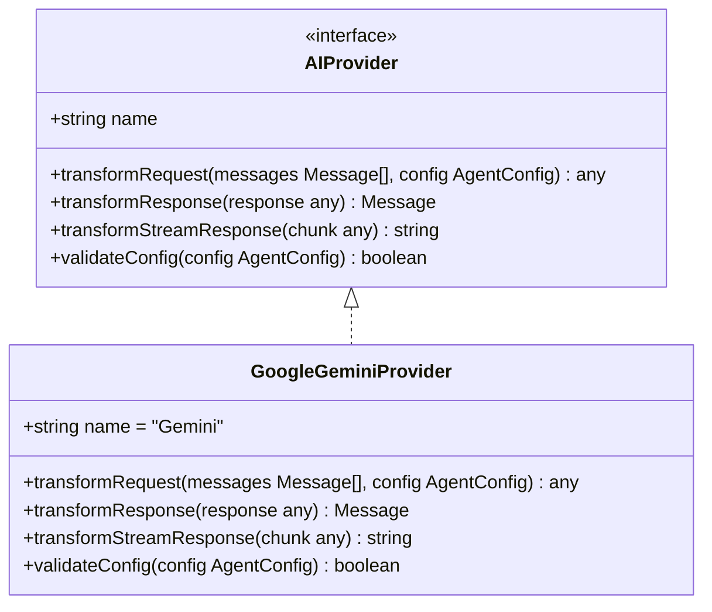
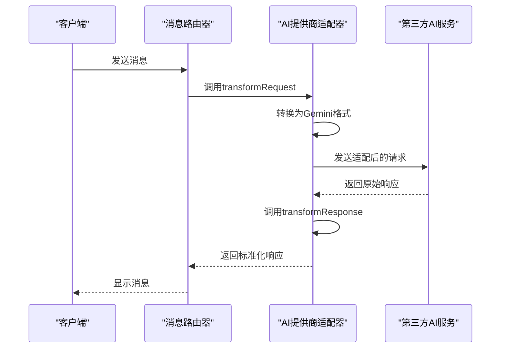
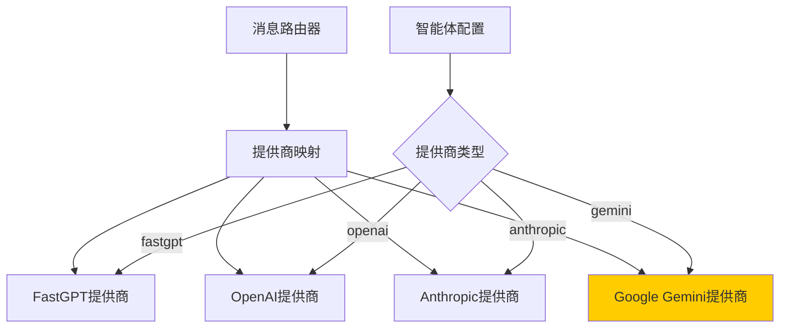
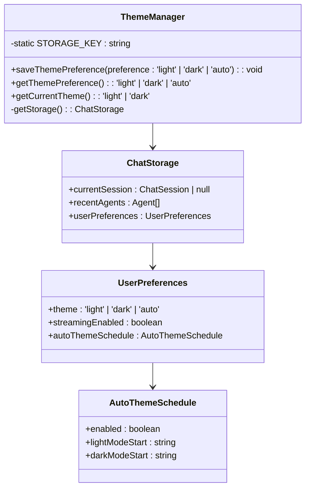
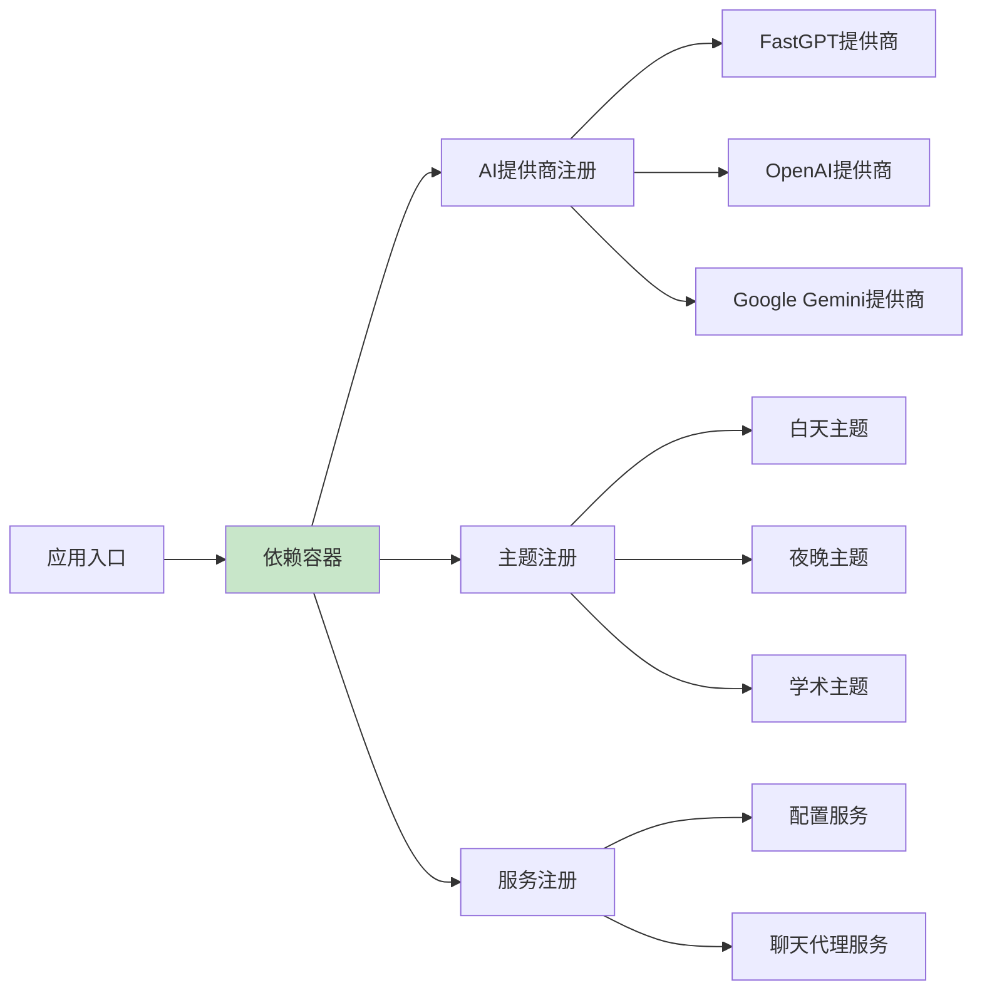
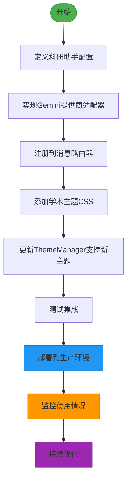

# 扩展指南

<cite>
**本文档中引用的文件**   
- [model-switching-feature.md](file://doc/model-switching-feature.md)
</cite>

## 目录
1. [添加新的AI服务提供商](#添加新的ai服务提供商)
2. [实现AIProvider接口](#实现aiprovider接口)
3. [注册新提供商](#注册新提供商)
4. [扩展主题支持](#扩展主题支持)
5. [插件化架构建议](#插件化架构建议)
6. [新增科研助手智能体示例](#新增科研助手智能体示例)

## 添加新的AI服务提供商

本节介绍如何向llmchat项目添加新的AI服务提供商，如Google Gemini。通过实现统一的适配器模式，系统可以灵活集成各种第三方AI服务。

### AIProvider接口设计



**Diagram sources**
- [model-switching-feature.md](file://doc/model-switching-feature.md#L895-L1132)

**Section sources**
- [model-switching-feature.md](file://doc/model-switching-feature.md#L895-L1132)

## 实现AIProvider接口

要添加新的AI服务提供商，需要实现`AIProvider`接口，完成请求格式转换、响应解析和错误映射。

### 请求格式转换

不同AI服务提供商的API请求格式存在差异，需要进行适配：



**Diagram sources**
- [model-switching-feature.md](file://doc/model-switching-feature.md#L1196-L1425)

**Section sources**
- [model-switching-feature.md](file://doc/model-switching-feature.md#L1196-L1425)

### Google Gemini适配器实现

```typescript
class GoogleGeminiProvider implements AIProvider {
  name = 'Gemini';
  
  transformRequest(messages: Message[], config: AgentConfig, stream: boolean = false) {
    return {
      contents: messages.map(msg => ({
        role: msg.role === 'user' ? 'user' : 'model',
        parts: [{ text: msg.content }]
      })),
      generationConfig: {
        temperature: config.temperature,
        maxOutputTokens: config.maxTokens,
        stopSequences: ['\n\n'],
        candidateCount: 1
      },
      safetySettings: [
        {
          category: 'HARM_CATEGORY_HARASSMENT',
          threshold: 'BLOCK_MEDIUM_AND_ABOVE'
        },
        {
          category: 'HARM_CATEGORY_HATE_SPEECH',
          threshold: 'BLOCK_MEDIUM_AND_ABOVE'
        }
      ],
      stream: stream && config.features.streamingConfig.enabled
    };
  }
  
  transformResponse(response: any): Message {
    return {
      id: generateId(),
      role: 'assistant',
      content: response.candidates[0].content.parts[0].text,
      timestamp: new Date(),
      metadata: {
        model: response.modelVersion,
        tokens: this.calculateTokens(response),
        safetyAttributes: response.candidates[0].safetyRatings
      }
    };
  }
  
  transformStreamResponse(chunk: any): string {
    if (chunk.candidates && chunk.candidates[0]?.content?.parts) {
      return chunk.candidates[0].content.parts[0].text || '';
    }
    return '';
  }
  
  validateConfig(config: AgentConfig): boolean {
    return (
      config.endpoint.includes('generativelanguage.googleapis.com') &&
      config.apiKey.startsWith('AIza') &&
      config.provider === 'gemini'
    );
  }
  
  private calculateTokens(response: any): number {
    // 实现token计算逻辑
    return response.usageMetadata?.totalTokenCount || 0;
  }
}
```

**Section sources**
- [model-switching-feature.md](file://doc/model-switching-feature.md#L895-L1132)

## 注册新提供商

新实现的AI提供商需要注册到`AgentConfigService`中，以便系统能够识别和使用。

### 消息路由器配置



**Diagram sources**
- [model-switching-feature.md](file://doc/model-switching-feature.md#L1196-L1425)

**Section sources**
- [model-switching-feature.md](file://doc/model-switching-feature.md#L1196-L1425)

### 提供商注册流程

```typescript
class MessageRouter {
  private providers: Map<string, AIProvider>;

  constructor() {
    this.providers = new Map([
      ['fastgpt', new FastGPTProvider()],
      ['openai', new OpenAIProvider()],
      ['anthropic', new AnthropicProvider()],
      ['gemini', new GoogleGeminiProvider()] // 注册新的Gemini提供商
    ]);
  }

  private getProvider(config: AgentConfig): AIProvider {
    const provider = this.providers.get(config.provider);
    if (!provider) {
      throw new Error(`不支持的提供商: ${config.provider}`);
    }
    return provider;
  }
}
```

**Section sources**
- [model-switching-feature.md](file://doc/model-switching-feature.md#L1196-L1425)

## 扩展主题支持

本节介绍如何通过扩展`ThemeManager`支持新的主题方案。

### 主题管理器设计



**Diagram sources**
- [model-switching-feature.md](file://doc/model-switching-feature.md#L895-L944)

**Section sources**
- [model-switching-feature.md](file://doc/model-switching-feature.md#L895-L944)

### 新主题方案实现

```typescript
// 学术主题CSS变量定义
:root[data-theme="academic"] {
  /* 背景色 */
  --bg-primary: #ffffff;
  --bg-secondary: #f8f9fa;
  --bg-tertiary: #e9ecef;
  
  /* 文本颜色 */
  --text-primary: #212529;
  --text-secondary: #495057;
  --text-tertiary: #6c757d;
  --text-inverse: #ffffff;
  
  /* 边框颜色 */
  --border-primary: #dee2e6;
  --border-secondary: #ced4da;
  --border-focus: #0d6efd;
  
  /* 突出颜色 */
  --accent-primary: #0d6efd;
  --accent-secondary: #6f42c1;
  --accent-success: #198754;
  --accent-warning: #ffc107;
  --accent-error: #dc3545;
  
  /* 阴影 */
  --shadow-sm: 0 0.125rem 0.25rem rgba(0, 0, 0, 0.075);
  --shadow-md: 0 0.5rem 1rem rgba(0, 0, 0, 0.15);
  --shadow-lg: 0 1rem 3rem rgba(0, 0, 0, 0.175);
}

// 主题切换逻辑更新
class ThemeManager {
  static getCurrentTheme(): 'light' | 'dark' | 'academic' {
    const preference = this.getThemePreference();
    
    if (preference === 'auto') {
      const hour = new Date().getHours();
      return hour >= 8 && hour < 20 ? 'light' : 'dark';
    }
    
    return preference;
  }
}
```

**Section sources**
- [model-switching-feature.md](file://doc/model-switching-feature.md#L422-L497)

## 插件化架构建议

为提高系统的可扩展性和维护性，建议采用插件化架构。

### 依赖注入模式



**Diagram sources**
- [model-switching-feature.md](file://doc/model-switching-feature.md#L1196-L1425)

**Section sources**
- [model-switching-feature.md](file://doc/model-switching-feature.md#L1196-L1425)

### 配置驱动加载机制

```typescript
// providers.config.json
{
  "providers": [
    {
      "name": "fastgpt",
      "enabled": true,
      "configPath": "./providers/fastgpt.config.ts",
      "implementation": "./providers/FastGPTProvider.ts"
    },
    {
      "name": "openai",
      "enabled": true,
      "configPath": "./providers/openai.config.ts",
      "implementation": "./providers/OpenAIProvider.ts"
    },
    {
      "name": "gemini",
      "enabled": true,
      "configPath": "./providers/gemini.config.ts",
      "implementation": "./providers/GoogleGeminiProvider.ts"
    }
  ],
  "themes": [
    {
      "name": "academic",
      "cssFile": "./themes/academic.css",
      "default": false
    }
  ]
}

// 动态加载实现
class PluginLoader {
  async loadProviders(): Promise<void> {
    const config = await this.loadConfig('providers.config.json');
    
    for (const provider of config.providers) {
      if (provider.enabled) {
        await this.loadProvider(provider);
      }
    }
  }
  
  private async loadProvider(config: ProviderConfig): Promise<void> {
    const implementation = await import(config.implementation);
    const provider = new implementation[config.name + 'Provider']();
    MessageRouter.registerProvider(config.name, provider);
  }
}
```

**Section sources**
- [model-switching-feature.md](file://doc/model-switching-feature.md#L1196-L1425)

## 新增科研助手智能体示例

本节提供完整代码示例，展示如何新增"科研助手"智能体。

### 智能体配置定义

```json
{
  "id": "research-assistant",
  "name": "科研助手",
  "description": "专注于学术研究和论文写作的智能助手",
  "endpoint": "https://generativelanguage.googleapis.com/v1beta/models/gemini-pro:generateContent",
  "apiKey": "AIzaXXXXXXXXXXXXXXXXXXXXXXXXXXXXXXXXXXXX",
  "model": "gemini-pro",
  "maxTokens": 8192,
  "temperature": 0.5,
  "systemPrompt": "你是一位专业的科研助手，专注于学术研究、论文写作和文献综述。请以严谨、专业的态度回答问题，引用相关文献时请注明来源。",
  "capabilities": ["academic_research", "paper_writing", "citation", "data_analysis"],
  "rateLimit": {
    "requestsPerMinute": 60,
    "tokensPerMinute": 32000
  },
  "provider": "gemini",
  "isActive": true,
  "features": {
    "supportsChatId": true,
    "supportsStream": true,
    "supportsDetail": true,
    "supportsFiles": true,
    "supportsImages": false,
    "streamingConfig": {
      "enabled": true,
      "endpoint": "same",
      "statusEvents": false,
      "flowNodeStatus": false
    }
  },
  "createdAt": "2024-01-01T00:00:00Z",
  "updatedAt": "2024-01-01T00:00:00Z"
}
```

**Section sources**
- [model-switching-feature.md](file://doc/model-switching-feature.md#L235-L368)

### 完整实现流程



**Diagram sources**
- [model-switching-feature.md](file://doc/model-switching-feature.md#L1196-L1425)

**Section sources**
- [model-switching-feature.md](file://doc/model-switching-feature.md#L1196-L1425)