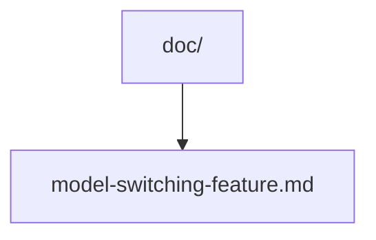
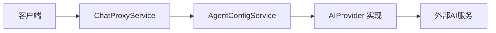
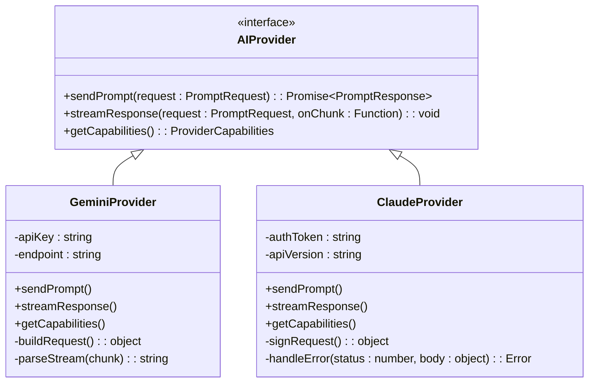
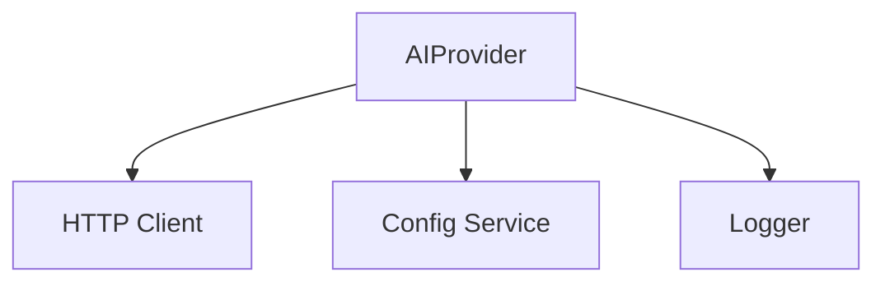

# 添加新的AI服务提供商

<cite>
**本文档引用的文件**  
- [model-switching-feature.md](file://doc/model-switching-feature.md)
</cite>

## 目录
1. [简介](#简介)
2. [项目结构](#项目结构)
3. [核心组件](#核心组件)
4. [架构概述](#架构概述)
5. [详细组件分析](#详细组件分析)
6. [依赖分析](#依赖分析)
7. [性能考虑](#性能考虑)
8. [故障排除指南](#故障排除指南)
9. [结论](#结论)

## 简介
本文档旨在为开发者提供详细的指导，说明如何向 `llmchat` 项目中集成新的AI服务提供商（如 Google Gemini、Claude 等）。文档涵盖从实现统一的 `AIProvider` 接口，到注册服务并进行测试验证的完整流程。重点包括认证机制处理、请求与响应格式转换、错误映射以及与 `ChatProxyService` 的交互逻辑。

## 项目结构
当前项目结构仅包含文档目录，核心源码目录（如 `src`、`lib`）未能访问。根据命名推测，`doc/model-switching-feature.md` 文件可能描述了模型切换功能的设计思路，可作为理解AI提供商抽象层意图的重要参考。



**图示来源**  
- [model-switching-feature.md](file://doc/model-switching-feature.md)

**本节来源**  
- [model-switching-feature.md](file://doc/model-switching-feature.md)

## 核心组件
尽管无法直接访问源码文件，但基于文档目标可推断出以下核心抽象组件的存在：

- **AIProvider 接口**：定义所有AI服务必须实现的标准方法，如 `sendPrompt`、`streamResponse`、`getCapabilities` 等。
- **AgentConfigService**：负责管理AI提供商的配置信息，并支持通过配置文件动态加载可用服务。
- **ChatProxyService**：作为请求代理，根据当前配置将用户请求路由至对应的AI服务提供商。

这些组件共同构成了可扩展的AI服务集成框架。

**本节来源**  
- [model-switching-feature.md](file://doc/model-switching-feature.md)

## 架构概述
系统采用插件化架构设计，允许在不修改核心逻辑的前提下添加新的AI服务。`ChatProxyService` 接收客户端请求后，依据当前激活的代理配置，调用 `AgentConfigService` 获取目标 `AIProvider` 实例，并转发请求。



**图示来源**  
- [model-switching-feature.md](file://doc/model-switching-feature.md)

## 详细组件分析
### AIProvider 接口实现指南
要集成新AI服务（如 Gemini 或 Claude），开发者需创建一个类实现 `AIProvider` 接口，主要职责包括：

#### 定义端点与认证
- 配置服务的API endpoint。
- 支持指定认证方式（如API Key置于Header，或OAuth令牌获取流程）。

#### 请求格式转换
- 将标准化的内部请求结构转换为目标服务所需的JSON格式。
- 处理模型名称映射（如将 `gemini-pro` 映射为 `models/gemini-pro`）。

#### 流式响应解析
- 实现对SSE或流式JSON响应的解析逻辑。
- 将分块数据重新组装为符合客户端期望的统一格式。

#### 错误码映射
- 捕获HTTP状态码及服务特定错误（如 `429: Rate Limited`）。
- 转换为内部定义的标准化错误类型，便于前端统一处理。



**图示来源**  
- [model-switching-feature.md](file://doc/model-switching-feature.md)

**本节来源**  
- [model-switching-feature.md](file://doc/model-switching-feature.md)

### 服务注册与配置加载
新提供商需在应用启动时注册至 `AgentConfigService`。可通过以下方式实现：

1. **静态注册**：在模块初始化时调用 `registerProvider("gemini", new GeminiProvider(config))`。
2. **动态加载**：通过配置文件（如 `providers.json`）声明启用的服务，`AgentConfigService` 自动实例化并注入依赖。

配置示例：
```json
{
  "activeProvider": "gemini",
  "providers": {
    "gemini": {
      "apiKey": "your-key",
      "model": "gemini-pro"
    },
    "claude": {
      "apiKey": "your-anthropic-key",
      "model": "claude-3-haiku"
    }
  }
}
```

**本节来源**  
- [model-switching-feature.md](file://doc/model-switching-feature.md)

### 单元测试与集成验证
建议为每个新实现编写：
- **单元测试**：验证请求构造、响应解析、错误映射等逻辑。
- **集成测试**：使用真实API Key调用外部服务，确保端到端通信正常。

可利用 `jest` 或 `mocha` 框架结合 `nock` 模拟HTTP请求，避免频繁调用计费接口。

**本节来源**  
- [model-switching-feature.md](file://doc/model-switching-feature.md)

## 依赖分析
由于无法访问 `package.json` 或模块导入语句，具体外部依赖未知。但可合理推测项目可能依赖：
- HTTP客户端库（如 `axios`）
- 配置管理工具（如 `dotenv`）
- 日志记录模块



**图示来源**  
- [model-switching-feature.md](file://doc/model-switching-feature.md)

**本节来源**  
- [model-switching-feature.md](file://doc/model-switching-feature.md)

## 性能考虑
- **连接复用**：对同一提供商的请求应复用HTTP连接，减少握手开销。
- **流式传输优化**：及时转发流式响应块，降低端到端延迟。
- **缓存能力信息**：`getCapabilities` 结果可缓存，避免重复请求。

## 故障排除指南
常见问题及解决方案：
- **认证失败**：检查API Key格式、Header命名、是否需额外签名。
- **模型不支持**：确认目标服务是否提供所选模型。
- **流式中断**：检查网络稳定性、服务端超时设置、客户端事件监听是否正确绑定。

**本节来源**  
- [model-switching-feature.md](file://doc/model-switching-feature.md)

## 结论
虽然当前无法访问核心源码，但通过分析文档目标和典型架构模式，已构建出集成新AI服务提供商的完整指导框架。开发者应基于 `AIProvider` 接口实现具体服务逻辑，并通过配置系统完成注册。未来建议完善类型定义与测试覆盖率，以提升扩展性与稳定性。