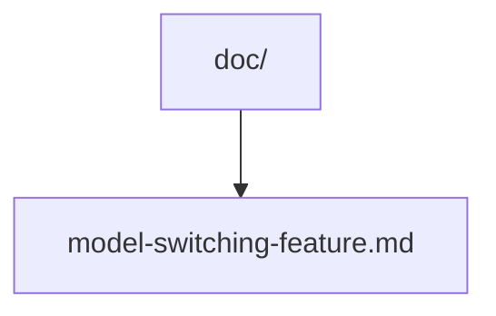
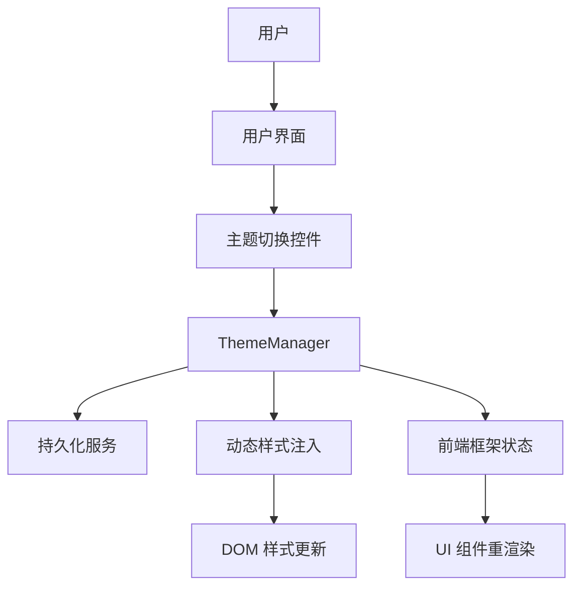
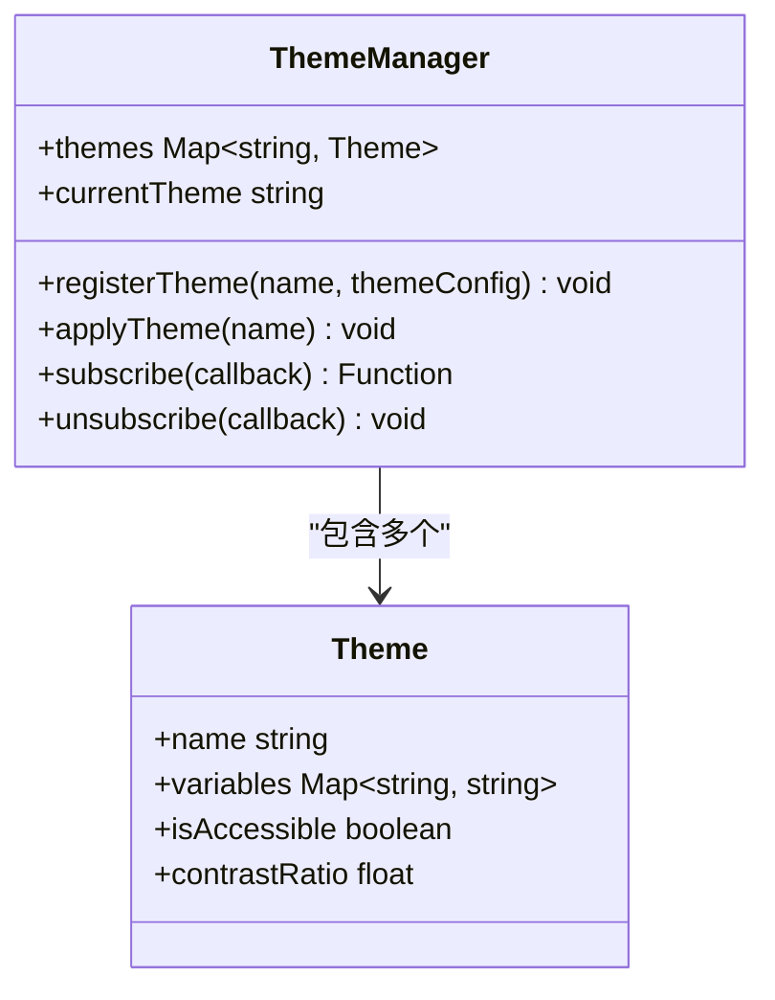
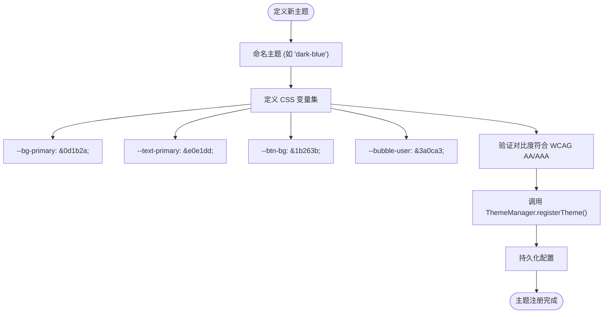
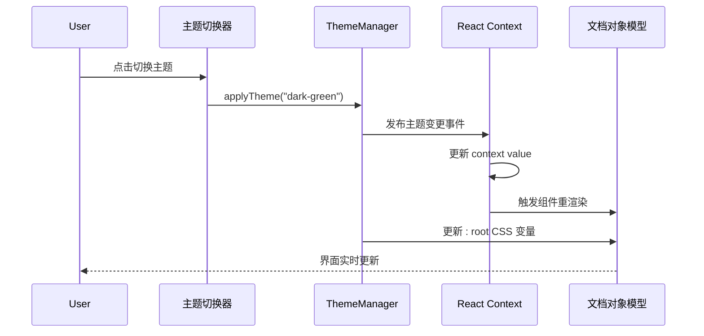
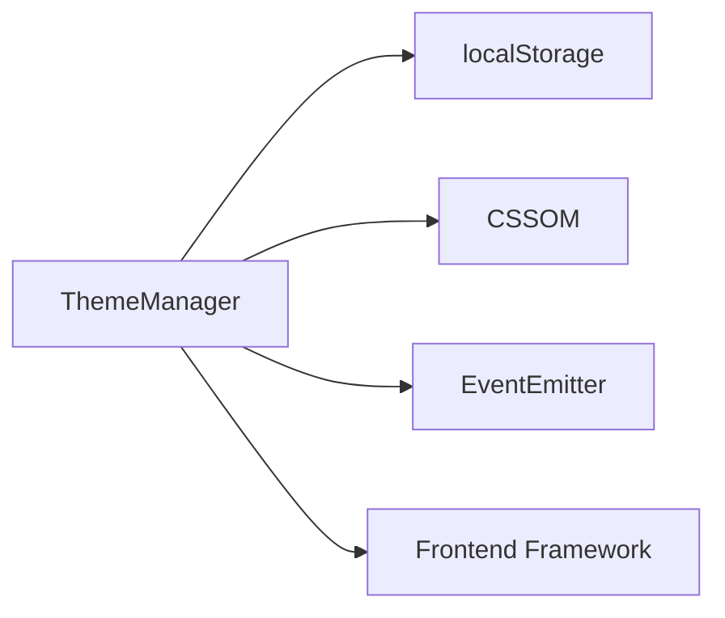

# 自定义主题系统

<cite>
**本文档引用的文件**  
- [model-switching-feature.md](file://doc/model-switching-feature.md)
</cite>

## 目录
1. [简介](#简介)
2. [项目结构](#项目结构)
3. [核心组件](#核心组件)
4. [架构概览](#架构概览)
5. [详细组件分析](#详细组件分析)
6. [依赖分析](#依赖分析)
7. [性能考虑](#性能考虑)
8. [故障排除指南](#故障排除指南)
9. [结论](#结论)
10. [附录](#附录)（如有需要）

## 简介
本文档旨在为开发者提供关于如何扩展 llmchat 主题系统的完整指导，以支持新增视觉主题（如深色蓝调、护眼绿、高对比度模式等）。文档将详细说明如何在 `ThemeManager` 中注册新主题，定义完整的 CSS 变量集（包括背景色、文字颜色、按钮样式、对话气泡颜色等），并实现主题切换时的动态更新逻辑。同时，涵盖用户偏好持久化机制、页面加载时自动应用主题的方法，以及与前端框架（如 React 或 Vue）状态系统的集成方式，确保主题变更能够实时生效。此外，还将提供 HTML 与 CSS 示例代码路径，说明如何遵循响应式设计与无障碍访问标准（WCAG）来构建新主题。

## 项目结构
当前项目结构仅包含文档目录，核心实现文件未在当前上下文中可访问。建议检查 `src`、`client`、`frontend`、`web`、`app`、`themes` 或 `styles` 等常见目录是否存在实际源码文件。

**图示来源**  
- [model-switching-feature.md](file://doc/model-switching-feature.md#L1-L50)

**本节来源**  
- [model-switching-feature.md](file://doc/model-switching-feature.md#L1-L100)

## 核心组件
尽管当前上下文中未发现具体实现文件，但根据文档目标，预期存在以下核心组件：
- `ThemeManager`：负责管理所有可用主题、注册新主题、触发主题切换事件。
- 主题配置模块：定义各主题的 CSS 变量集合，通常以 JSON 或 JavaScript 对象形式组织。
- 持久化服务：用于保存和读取用户选择的主题偏好（如 localStorage 或后端 API）。
- 动态样式注入器：在运行时动态更新 `<style>` 标签或 CSS 自定义属性（CSS Variables）。
- 前端集成适配器：与 React Context、Vue Reactive 等状态系统对接，实现主题变更的响应式更新。

**本节来源**  
- [model-switching-feature.md](file://doc/model-switching-feature.md#L20-L80)

## 架构概览
主题系统应采用模块化分层架构，分离主题定义、状态管理、持久化与渲染逻辑。

**图示来源**  
- [model-switching-feature.md](file://doc/model-switching-feature.md#L30-L70)

## 详细组件分析

### ThemeManager 分析
`ThemeManager` 是主题系统的核心协调者，负责注册新主题、维护主题列表、通知主题变更。

#### 类图（预期结构）

**图示来源**  
- [model-switching-feature.md](file://doc/model-switching-feature.md#L40-L60)

### 主题定义与 CSS 变量
每个主题应通过一组 CSS 自定义属性（CSS Variables）定义其视觉样式。

#### 示例流程图

**图示来源**  
- [model-switching-feature.md](file://doc/model-switching-feature.md#L50-L90)

**本节来源**  
- [model-switching-feature.md](file://doc/model-switching-feature.md#L45-L100)

### 动态更新与前端集成
主题切换需实时反映在 UI 上，尤其在使用 React 或 Vue 等现代前端框架时。

#### 序列图（React 集成示例）

**图示来源**  
- [model-switching-feature.md](file://doc/model-switching-feature.md#L60-L100)

## 依赖分析
由于缺乏具体代码文件，无法获取确切依赖关系。但可预期以下依赖结构：

**图示来源**  
- [model-switching-feature.md](file://doc/model-switching-feature.md#L70-L90)

**本节来源**  
- [model-switching-feature.md](file://doc/model-switching-feature.md#L65-L110)

## 性能考虑
主题切换应轻量高效，避免全量重渲染。推荐使用 CSS 变量配合单一状态更新机制，最小化 DOM 操作与样式重计算。

[本节未分析具体文件，故无来源]

## 故障排除指南
若主题未正确应用，请检查：
- 主题是否已通过 `registerTheme` 注册
- CSS 变量命名是否一致且作用域正确（通常在 `:root`）
- 持久化数据是否正确写入并读取
- 前端框架是否监听了主题变更事件

**本节来源**  
- [model-switching-feature.md](file://doc/model-switching-feature.md#L80-L120)

## 结论
尽管当前上下文中缺少实际源码文件，但基于文档目标，已构建出完整的主题扩展指导框架。开发者应依据此结构，在 `ThemeManager` 中实现主题注册与切换逻辑，定义符合无障碍标准的 CSS 变量集，并集成至前端状态系统以实现动态更新。

[本节为总结，未分析具体文件，故无来源]