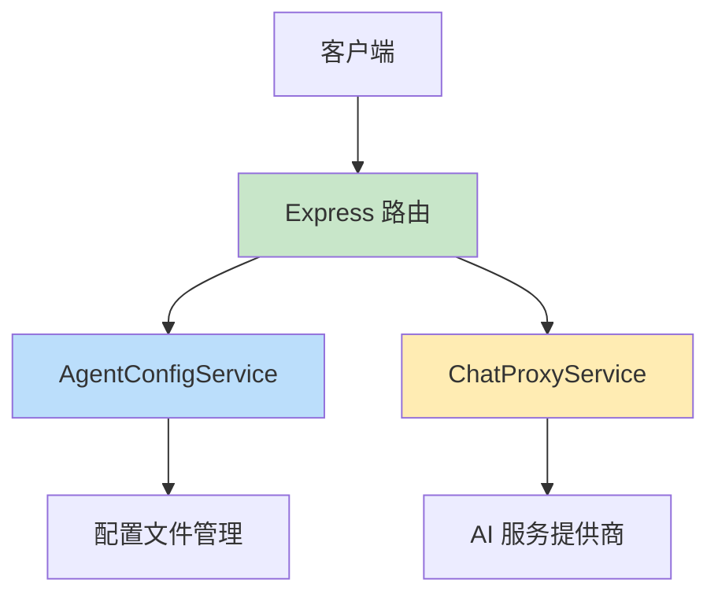
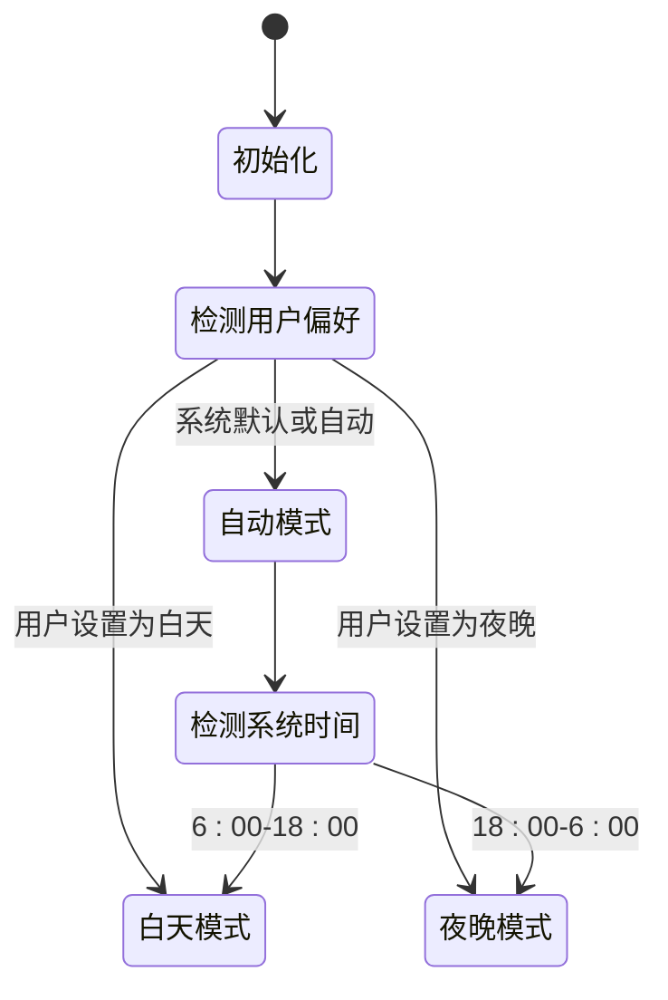
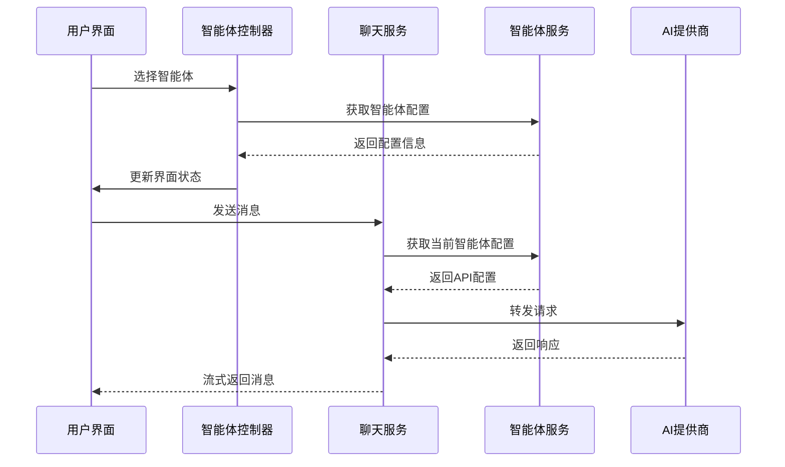

# 技术栈

<cite>
**本文档中引用的文件**  
- [model-switching-feature.md](file://doc/model-switching-feature.md)
</cite>

## 目录
1. [概述](#概述)
2. [前端技术栈](#前端技术栈)
3. [后端技术栈](#后端技术栈)
4. [网络通信与API集成](#网络通信与api集成)
5. [主题系统实现](#主题系统实现)
6. [AI服务集成方式](#ai服务集成方式)
7. [新开发者学习路径建议](#新开发者学习路径建议)

## 概述

本项目 `llmchat` 是一个支持多智能体动态切换的聊天应用，其设计目标是提供类似 ChatGPT 官网的用户体验。系统允许用户在不同AI提供商（如 FastGPT、OpenAI、Anthropic）之间无缝切换，并保持对话上下文和个性化配置。

项目采用现代化全栈技术架构，前端使用 TypeScript 构建类型安全的用户界面，结合 React/Vue.js 框架实现组件化开发，利用 Tailwind CSS 实现高效 UI 开发。后端基于 Node.js/Express 构建 RESTful API 服务，处理智能体配置管理和聊天请求代理。整个系统通过统一的适配器模式集成多个 AI 服务提供商，确保接口兼容性和扩展性。

**Section sources**
- [model-switching-feature.md](file://doc/model-switching-feature.md#L1-L50)

## 前端技术栈

### TypeScript
TypeScript 作为核心开发语言，为项目提供了静态类型检查能力。通过定义清晰的接口（如 `AgentConfig`、`ChatState`），有效减少了运行时错误，提升了代码可维护性。例如，在智能体配置管理中，`AgentConfig` 接口明确定义了每个智能体的属性结构，包括 `id`、`name`、`endpoint`、`apiKey` 等字段，确保配置数据的一致性和完整性。

### React/Vue.js 框架
项目采用组件化架构设计，将用户界面拆分为多个可复用的组件。核心组件包括：
- `AgentSelector`：智能体选择器组件
- `ChatContainer`：聊天主容器
- `MessageInput`：消息输入框
- `ThemeToggle`：主题切换按钮

这些组件通过状态管理工具进行数据通信，实现了高内聚低耦合的设计原则。

### Tailwind CSS
Tailwind CSS 作为原子化样式库，支持快速 UI 开发。通过实用类直接在 HTML 中编写样式，避免了传统 CSS 文件的冗余和命名冲突问题。例如，在聊天消息组件中使用 `bg-primary text-primary border border-border-primary rounded-lg` 等类名即可快速构建美观的消息气泡。

### 状态管理工具
根据框架选择使用相应的状态管理方案：
- **React 项目**：使用 Zustand 或 Redux 进行全局状态管理
- **Vue 项目**：使用 Pinia 管理应用状态

状态管理模块主要负责维护当前智能体、消息列表、主题偏好等全局状态，确保跨组件数据同步。

**Section sources**
- [model-switching-feature.md](file://doc/model-switching-feature.md#L1-L799)

## 后端技术栈

### Node.js/Express
后端服务基于 Node.js 运行时环境，使用 Express 框架构建 RESTful API。Express 提供了简洁的路由机制，用于处理各种 HTTP 请求。关键 API 端点包括：
- `GET /api/agents`：获取可用智能体列表
- `GET /api/agents/:id`：获取特定智能体信息
- `POST /api/chat/completions`：发送聊天请求（支持流式和非流式）

Express 中间件机制被用于实现请求验证、身份认证和错误处理等功能，确保服务的稳定性和安全性。

### TypeScript
后端同样采用 TypeScript 开发，保证前后端类型一致性。通过定义 `AgentConfig` 接口，统一了智能体配置的数据结构，便于前后端数据交互和类型校验。



**Diagram sources**
- [model-switching-feature.md](file://doc/model-switching-feature.md#L191-L233)

**Section sources**
- [model-switching-feature.md](file://doc/model-switching-feature.md#L191-L334)

## 网络通信与API集成

### Axios/Fetch API
前端通过 Fetch API 或 Axios 库与后端服务进行通信。对于流式响应场景，使用 Fetch API 的 `ReadableStream` 特性实现逐块接收 AI 响应数据。后端代理服务则使用 Axios 向第三方 AI 服务发起请求，实现请求转发和响应转换。

### 统一适配器模式
为支持多种 AI 服务提供商，项目采用统一适配器模式。定义 `AIProvider` 接口规范，各提供商实现各自的适配器：

```typescript
interface AIProvider {
  name: string;
  transformRequest(messages: Message[], config: AgentConfig): any;
  transformResponse(response: any): Message;
  transformStreamResponse(chunk: any): string;
  validateConfig(config: AgentConfig): boolean;
}
```

目前支持的适配器包括：
- `FastGPTProvider`
- `OpenAIProvider`
- `AnthropicProvider`

这种设计模式实现了"开闭原则"，便于未来扩展新的 AI 服务提供商。

**Section sources**
- [model-switching-feature.md](file://doc/model-switching-feature.md#L895-L1132)

## 主题系统实现

### CSS Variables
主题系统基于 CSS 自定义属性（CSS Variables）实现，通过定义两套颜色变量集来支持白天/夜晚模式切换：

```css
:root[data-theme="light"] {
  --bg-primary: #ffffff;
  --text-primary: #1e293b;
  /* 更多颜色变量 */
}

:root[data-theme="dark"] {
  --bg-primary: #0f172a;
  --text-primary: #f8fafc;
  /* 更多颜色变量 */
}
```

### 本地存储持久化
用户主题偏好通过 `localStorage` 持久化存储。`ThemeManager` 类负责管理主题状态，提供 `saveThemePreference` 和 `getThemePreference` 方法。系统支持三种模式：
- 白天模式
- 夜晚模式
- 自动模式（根据系统时间 6:00-18:00 自动切换）



**Diagram sources**
- [model-switching-feature.md](file://doc/model-switching-feature.md#L695-L765)

**Section sources**
- [model-switching-feature.md](file://doc/model-switching-feature.md#L695-L765)

## AI服务集成方式

### 配置管理
AI 服务配置集中管理在 `agents.json` 文件中，每个智能体包含以下关键信息：
- `endpoint`：API 接口地址
- `apiKey`：认证密钥
- `provider`：提供商标识（fastgpt/openai/anthropic）
- `features`：功能特性支持情况

### 请求适配
不同提供商的 API 格式存在差异，通过适配器进行标准化处理：
- **FastGPT**：支持 `chatId`、`detail` 参数，流式响应包含状态事件
- **OpenAI**：标准 Chat Completions API 格式
- **Anthropic**：使用 `messages` 结构，需设置特定请求头

### 流式响应处理
针对 FastGPT 特有的流式状态事件（如 `flowNodeStatus`），前端实现专门的状态指示器组件，实时显示 AI 执行流程节点的状态变化。



**Diagram sources**
- [model-switching-feature.md](file://doc/model-switching-feature.md#L695-L765)

**Section sources**
- [model-switching-feature.md](file://doc/model-switching-feature.md#L1196-L1425)

## 新开发者学习路径建议

### 前端学习路径
1. **TypeScript 基础**：掌握接口、泛型、类型推断等核心概念
2. **React/Vue 框架**：学习组件生命周期、状态管理、路由等
3. **Tailwind CSS**：熟悉实用类命名规则和响应式设计
4. **状态管理**：理解 Redux/Zustand 或 Pinia 的工作原理
5. **Fetch API**：掌握异步请求、流式响应处理

### 后端学习路径
1. **Node.js 基础**：理解事件循环、模块系统
2. **Express 框架**：学习路由、中间件、错误处理
3. **RESTful API 设计**：掌握资源命名、HTTP 方法使用
4. **TypeScript 在后端的应用**：接口定义、类与装饰器
5. **API 代理模式**：请求转发、响应转换

### AI 集成学习路径
1. **OpenAI API**：熟悉 Chat Completions 接口
2. **FastGPT 平台**：了解知识库、上下文管理特性
3. **Anthropic API**：掌握 Claude 模型调用方式
4. **适配器模式**：学习如何抽象不同 API 的差异
5. **流式传输**：理解 SSE（Server-Sent Events）机制

### 官方文档链接
- **TypeScript**: https://www.typescriptlang.org/docs/
- **React**: https://react.dev/learn/tutorial-tic-tac-toe
- **Vue.js**: https://cn.vuejs.org/guide/introduction.html
- **Tailwind CSS**: https://tailwindcss.com/docs
- **Express**: https://expressjs.com/zh-cn/starter/hello-world.html
- **Node.js**: https://nodejs.org/zh-cn/docs/
- **OpenAI API**: https://platform.openai.com/docs/introduction
- **Anthropic API**: https://docs.anthropic.com/claude/reference/getting-started-with-the-api

**Section sources**
- [model-switching-feature.md](file://doc/model-switching-feature.md#L1-L799)