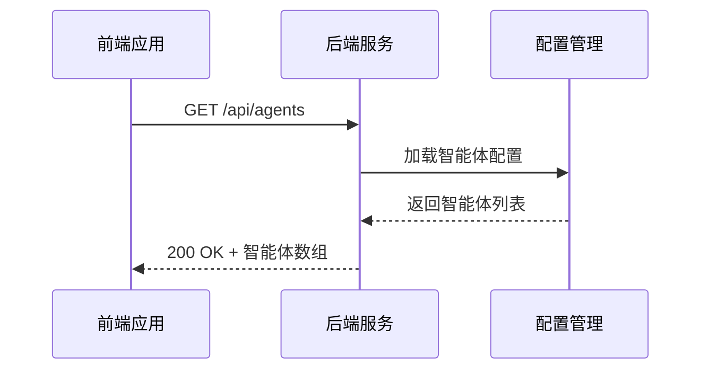
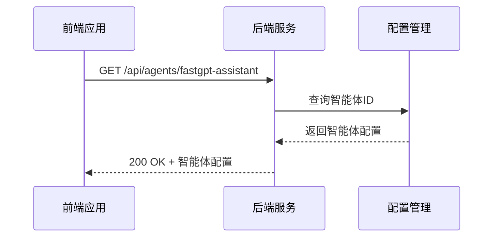
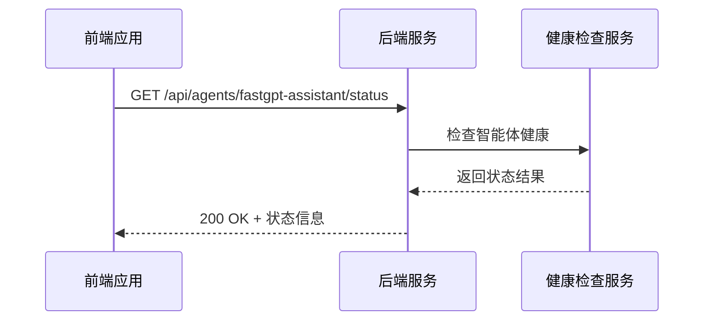
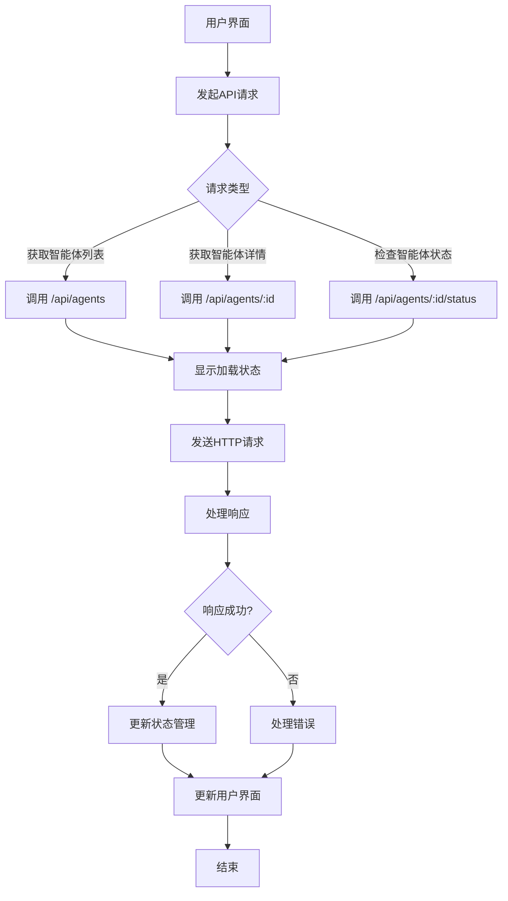
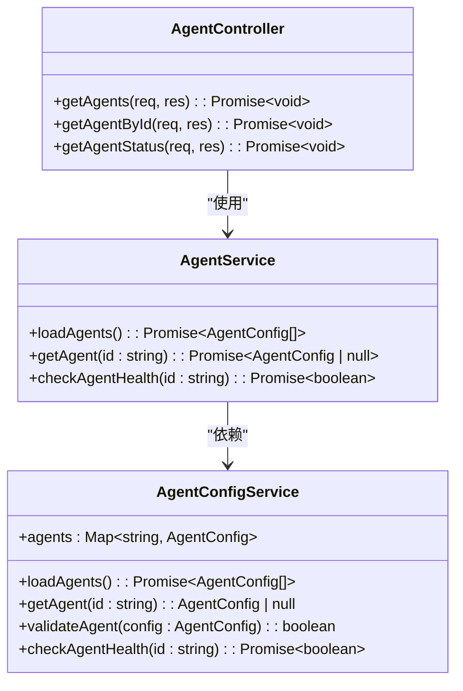
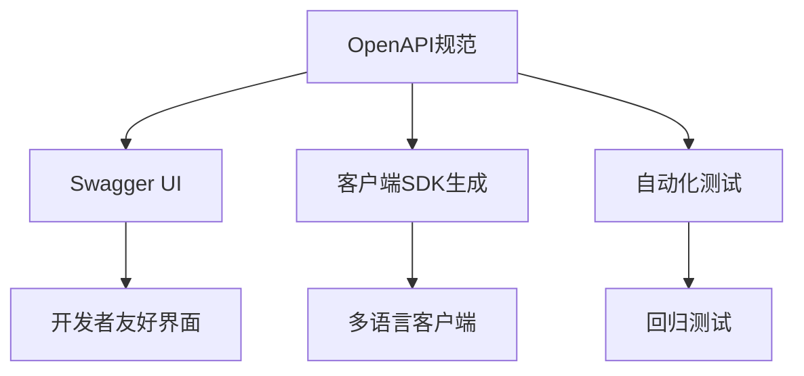

# API集成

<cite>
**本文档引用的文件**   
- [model-switching-feature.md](file://doc/model-switching-feature.md)
</cite>

## 目录
1. [简介](#简介)
2. [核心API端点详解](#核心api端点详解)
3. [前端调用实现](#前端调用实现)
4. [后端路由与控制器实现](#后端路由与控制器实现)
5. [API管理策略](#api管理策略)
6. [API可发现性与测试](#api可发现性与测试)

## 简介
本文档全面描述智能体切换功能的API集成部分，涵盖与智能体管理相关的三个核心API端点：获取智能体列表、获取特定智能体详情和检查智能体状态。文档详细说明了这些端点的HTTP方法、请求参数、响应结构和错误码定义，并提供前后端实现的最佳实践。

**Section sources**
- [model-switching-feature.md](file://doc/model-switching-feature.md#L1-L50)

## 核心API端点详解

### /api/agents（获取智能体列表）

该端点用于获取系统中所有可用智能体的列表信息。

- **HTTP方法**: GET
- **请求参数**: 无
- **成功响应**:
  - 状态码: 200 OK
  - 响应体: 包含智能体数组的JSON对象，每个智能体包含ID、名称、描述、模型、状态和能力等信息
- **错误响应**:
  - 500 Internal Server Error: 服务器内部错误，无法获取智能体配置

**Diagram sources**
- [model-switching-feature.md](file://doc/model-switching-feature.md#L150-L160)

### /api/agents/:id（获取特定智能体详情）

该端点用于获取指定ID的智能体详细配置信息。

- **HTTP方法**: GET
- **路径参数**: 
  - id: 智能体唯一标识符
- **成功响应**:
  - 状态码: 200 OK
  - 响应体: 智能体详细配置，包括端点地址、API密钥（后端隐藏）、模型参数、速率限制和提供商信息
- **错误响应**:
  - 404 Not Found: 指定ID的智能体不存在
  - 500 Internal Server Error: 服务器内部错误

**Diagram sources**
- [model-switching-feature.md](file://doc/model-switching-feature.md#L162-L170)

### /api/agents/:id/status（检查智能体状态）

该端点用于检查指定智能体的当前运行状态和健康状况。

- **HTTP方法**: GET
- **路径参数**: 
  - id: 智能体唯一标识符
- **成功响应**:
  - 状态码: 200 OK
  - 响应体: 智能体状态信息，包括活跃状态、连接状态和特定提供商的状态（如FastGPT的知识库就绪状态）
- **错误响应**:
  - 404 Not Found: 指定ID的智能体不存在
  - 503 Service Unavailable: 智能体服务不可用
  - 500 Internal Server Error: 服务器内部错误

**Diagram sources**
- [model-switching-feature.md](file://doc/model-switching-feature.md#L172-L180)

## 前端调用实现

### 使用Axios调用API

前端应用使用Axios库调用智能体管理API，实现异步请求处理和状态管理。

**Diagram sources**
- [model-switching-feature.md](file://doc/model-switching-feature.md#L200-L250)

### 异步响应与加载状态处理

前端实现加载状态管理，提升用户体验：

- 在请求发起时显示加载指示器
- 成功响应后更新智能体选择器界面
- 错误发生时显示适当的错误消息
- 实现请求取消机制防止内存泄漏

**Section sources**
- [model-switching-feature.md](file://doc/model-switching-feature.md#L251-L300)

## 后端路由与控制器实现

### Express路由配置示例

**Diagram sources**
- [model-switching-feature.md](file://doc/model-switching-feature.md#L301-L350)

### 请求验证与权限控制

后端实现请求验证和权限控制的最佳实践：

- 使用中间件验证请求参数
- 实现身份验证和授权检查
- 对敏感信息（如API密钥）进行过滤
- 记录API访问日志用于审计

**Section sources**
- [model-switching-feature.md](file://doc/model-switching-feature.md#L351-L400)

### 异常捕获与错误处理

统一的异常处理机制：

- 使用try-catch块捕获异步操作中的错误
- 实现全局错误处理中间件
- 返回标准化的错误响应格式
- 记录错误日志便于问题排查

## API管理策略

### API版本管理

采用URL路径版本控制策略：

- 所有API端点以`/api/v1/`为前缀
- 未来版本升级时创建新的版本路径（如`/api/v2/`）
- 旧版本API保持兼容性一段时间后弃用

### 速率限制机制

实现基于Redis的分布式速率限制：

- 按用户/IP地址进行请求计数
- 配置不同智能体的差异化速率限制
- 返回适当的HTTP状态码（429 Too Many Requests）

### CORS配置

安全的跨域资源共享配置：

- 仅允许受信任的前端域名访问
- 配置适当的HTTP方法和头部白名单
- 启用凭证支持（如需要）

**Section sources**
- [model-switching-feature.md](file://doc/model-switching-feature.md#L401-L450)

## API可发现性与测试

### Swagger/OpenAPI规范

使用Swagger/OpenAPI规范提升API可发现性和测试便利性：

- 定义完整的API文档，包括端点、参数、请求/响应模型
- 提供交互式API测试界面
- 生成客户端SDK代码
- 实现API变更的自动化测试

**Diagram sources**
- [model-switching-feature.md](file://doc/model-switching-feature.md#L451-L500)