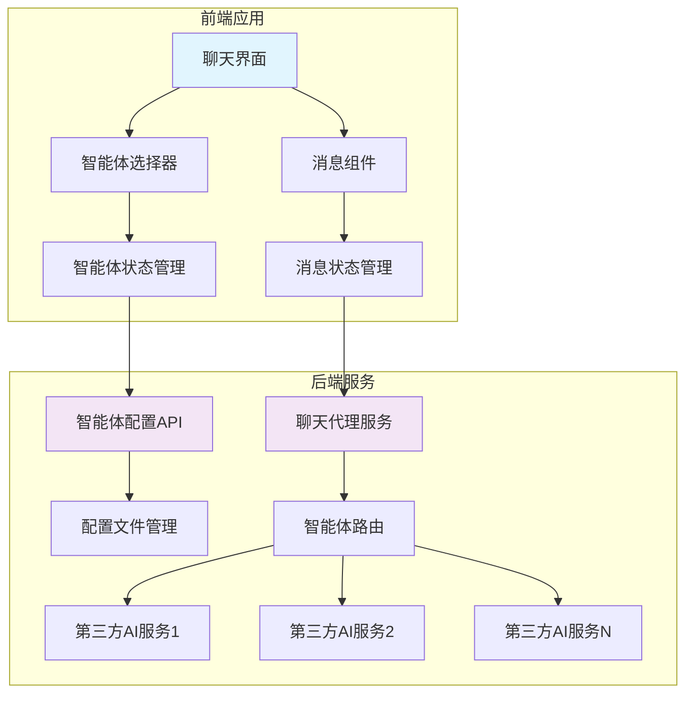
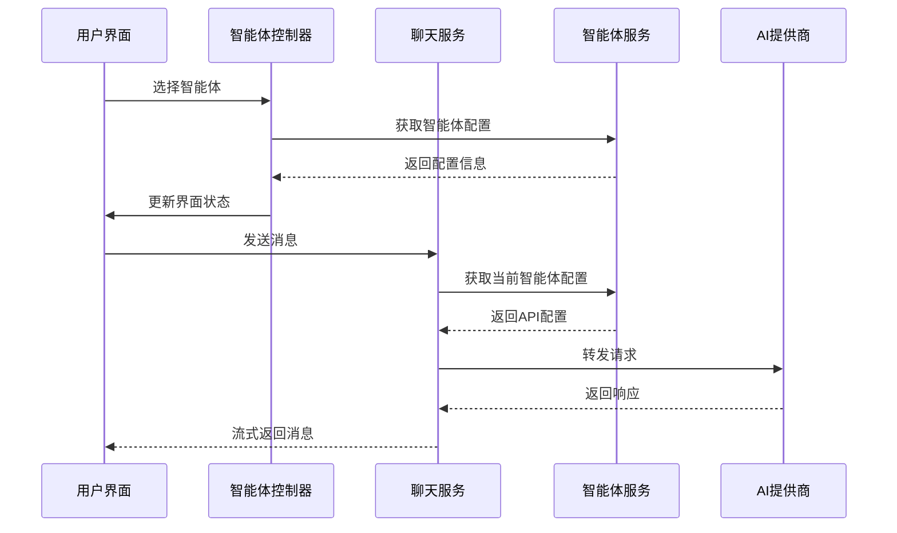
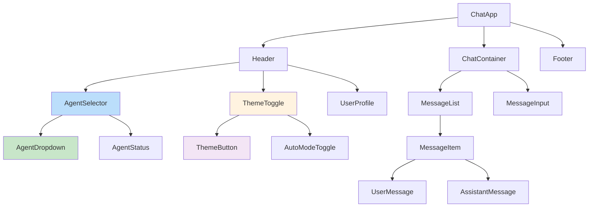
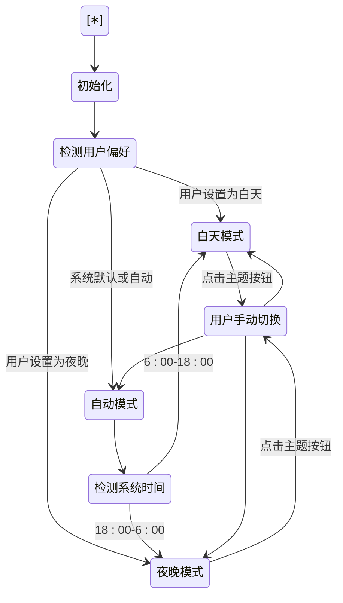
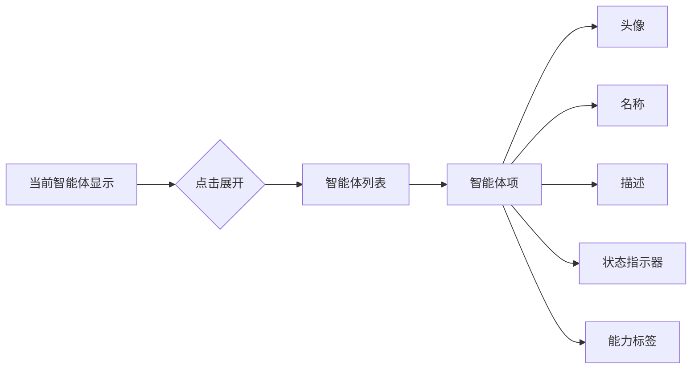
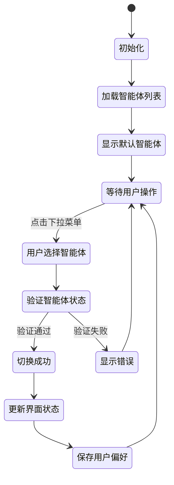

# 智能体切换功能

<cite>
**本文档引用的文件**
- [model-switching-feature.md](file://doc/model-switching-feature.md)
</cite>

## 目录
1. [概述](#概述)
2. [技术栈](#技术栈)
3. [架构设计](#架构设计)
4. [前端组件架构](#前端组件架构)
5. [后端服务设计](#后端服务设计)
6. [用户界面设计](#用户界面设计)
7. [API集成设计](#api集成设计)
8. [访问控制](#访问控制)
9. [监控和日志](#监控和日志)
10. [实现细节](#实现细节)

## 概述

本设计文档描述了一个仿照 ChatGPT 官网的智能体切换功能，使用 TypeScript 开发。该功能允许用户在聊天界面中动态切换不同的智能体，每个智能体都有独立的服务端配置，包括接口地址、API Key 和模型名称等信息。

### 核心目标
- 提供类似 ChatGPT 官网的用户体验
- 支持多智能体动态切换
- 服务端统一管理智能体配置
- 保持对话连续性和上下文管理

**Section sources**
- [model-switching-feature.md](file://doc/model-switching-feature.md#L1-L50)

## 技术栈

- **前端**: TypeScript, React/Vue.js, Tailwind CSS
- **后端**: Node.js/Express, TypeScript
- **API 标准**: 兼容 OpenAI Chat Completions API
- **状态管理**: Redux/Zustand (React) 或 Pinia (Vue)
- **网络请求**: Axios/Fetch API
- **主题系统**: CSS Variables, 本地存储持久化

**Section sources**
- [model-switching-feature.md](file://doc/model-switching-feature.md#L52-L65)

## 架构设计

### 系统架构图



**Diagram sources**
- [model-switching-feature.md](file://doc/model-switching-feature.md#L67-L95)

### 数据流设计



**Diagram sources**
- [model-switching-feature.md](file://doc/model-switching-feature.md#L97-L123)

## 前端组件架构

### 组件层次结构



**Diagram sources**
- [model-switching-feature.md](file://doc/model-switching-feature.md#L125-L157)

### 核心组件设计

#### AgentSelector 组件

```typescript
interface Agent {
  id: string;
  name: string;
  description: string;
  avatar?: string;
  model: string;
  status: 'active' | 'inactive' | 'error';
  capabilities: string[];
}

interface AgentSelectorProps {
  agents: Agent[];
  currentAgent: Agent;
  onAgentChange: (agent: Agent) => void;
  loading?: boolean;
}
```

**Section sources**
- [model-switching-feature.md](file://doc/model-switching-feature.md#L159-L187)

#### AgentDropdown 组件

```typescript
interface AgentDropdownProps {
  agents: Agent[];
  selectedAgent: Agent;
  onSelect: (agent: Agent) => void;
  open: boolean;
  onToggle: () => void;
}
```

**Section sources**
- [model-switching-feature.md](file://doc/model-switching-feature.md#L189-L200)

#### ThemeToggle 组件

```typescript
interface ThemeToggleProps {
  currentTheme: 'light' | 'dark';
  onThemeChange: (theme: 'light' | 'dark') => void;
  autoMode: boolean;
  onAutoModeToggle: () => void;
}

interface ThemeConfig {
  name: string;
  icon: string;
  colors: {
    primary: string;
    background: string;
    surface: string;
    text: string;
    border: string;
    accent: string;
  };
}
```

**Section sources**
- [model-switching-feature.md](file://doc/model-switching-feature.md#L202-L218)

#### 状态管理接口

```typescript
interface ChatState {
  currentAgent: Agent | null;
  availableAgents: Agent[];
  messages: Message[];
  loading: boolean;
  error: string | null;
  theme: 'light' | 'dark';
}

interface AgentState {
  agents: Agent[];
  currentAgentId: string | null;
  loading: boolean;
  error: string | null;
}

interface ThemeState {
  currentTheme: 'light' | 'dark';
  isAutoMode: boolean;
  userPreference: 'light' | 'dark' | 'auto';
}
```

**Section sources**
- [model-switching-feature.md](file://doc/model-switching-feature.md#L220-L233)

## 后端服务设计

### 智能体配置管理

#### 配置文件结构

```typescript
interface AgentConfig {
  id: string;
  name: string;
  description: string;
  endpoint: string;
  apiKey: string;
  model: string;
  maxTokens?: number;
  temperature?: number;
  systemPrompt?: string;
  capabilities: string[];
  rateLimit?: {
    requestsPerMinute: number;
    tokensPerMinute: number;
  };
  provider: 'fastgpt' | 'openai' | 'anthropic' | 'custom';
  isActive: boolean;
  features: {
    supportsChatId: boolean;
    supportsStream: boolean;
    supportsDetail: boolean;
    supportsFiles: boolean;
    supportsImages: boolean;
    streamingConfig: {
      enabled: boolean;
      endpoint: 'same' | 'different'; // 是否使用相同端点
      statusEvents: boolean; // 是否支持状态事件
      flowNodeStatus: boolean; // 是否支持流程节点状态
    };
  };
  createdAt: string;
  updatedAt: string;
}
```

**Section sources**
- [model-switching-feature.md](file://doc/model-switching-feature.md#L191-L233)

#### 配置文件示例 (agents.json)

```json
{
  "agents": [
    {
      "id": "fastgpt-assistant",
      "name": "FastGPT 智能助手",
      "description": "基于 FastGPT 的知识库问答助手",
      "endpoint": "http://localhost:3000/api/v1/chat/completions",
      "apiKey": "fastgpt-xxxxxx",
      "model": "FastAI-4k",
      "maxTokens": 4096,
      "temperature": 0.7,
      "systemPrompt": "你是一个基于知识库的智能助手。",
      "capabilities": ["knowledge_base", "context_memory", "file_upload"],
      "rateLimit": {
        "requestsPerMinute": 60,
        "tokensPerMinute": 40000
      },
      "provider": "fastgpt",
      "isActive": true,
      "features": {
        "supportsChatId": true,
        "supportsStream": true,
        "supportsDetail": true,
        "supportsFiles": true,
        "supportsImages": true,
        "streamingConfig": {
          "enabled": true,
          "endpoint": "same",
          "statusEvents": true,
          "flowNodeStatus": true
        }
      },
      "createdAt": "2024-01-01T00:00:00Z",
      "updatedAt": "2024-01-01T00:00:00Z"
    },
    {
      "id": "gpt-4-assistant",
      "name": "GPT-4 助手",
      "description": "基于 GPT-4 的通用智能助手",
      "endpoint": "https://api.openai.com/v1/chat/completions",
      "apiKey": "sk-xxxxxxxxxx",
      "model": "gpt-4-turbo-preview",
      "maxTokens": 4096,
      "temperature": 0.7,
      "systemPrompt": "你是一个有用的AI助手。",
      "capabilities": ["text", "analysis", "coding"],
      "rateLimit": {
        "requestsPerMinute": 60,
        "tokensPerMinute": 40000
      },
      "provider": "openai",
      "isActive": true,
      "features": {
        "supportsChatId": false,
        "supportsStream": true,
        "supportsDetail": false,
        "supportsFiles": false,
        "supportsImages": true,
        "streamingConfig": {
          "enabled": true,
          "endpoint": "same",
          "statusEvents": false,
          "flowNodeStatus": false
        }
      },
      "createdAt": "2024-01-01T00:00:00Z",
      "updatedAt": "2024-01-01T00:00:00Z"
    },
    {
      "id": "claude-assistant",
      "name": "Claude 助手",
      "description": "基于 Claude 的智能助手",
      "endpoint": "https://api.anthropic.com/v1/messages",
      "apiKey": "sk-ant-xxxxxxxxxx",
      "model": "claude-3-sonnet-20240229",
      "maxTokens": 4096,
      "temperature": 0.7,
      "capabilities": ["text", "analysis", "reasoning"],
      "provider": "anthropic",
      "isActive": true,
      "features": {
        "supportsChatId": false,
        "supportsStream": true,
        "supportsDetail": false,
        "supportsFiles": true,
        "supportsImages": true,
        "streamingConfig": {
          "enabled": true,
          "endpoint": "same",
          "statusEvents": false,
          "flowNodeStatus": false
        }
      },
      "createdAt": "2024-01-01T00:00:00Z",
      "updatedAt": "2024-01-01T00:00:00Z"
    }
  ]
}
```

**Section sources**
- [model-switching-feature.md](file://doc/model-switching-feature.md#L235-L368)

### API 端点设计

#### 智能体管理 API

| 端点 | 方法 | 描述 | 参数 |
|------|------|------|------|
| `/api/agents` | GET | 获取可用智能体列表 | - |
| `/api/agents/:id` | GET | 获取特定智能体信息 | id: 智能体ID |
| `/api/agents/:id/status` | GET | 检查智能体状态 | id: 智能体ID |

#### 聊天代理 API

| 端点 | 方法 | 描述 | 参数 |
|------|------|------|------|
| `/api/chat/completions` | POST | 发送聊天请求（支持流式和非流式） | agentId, messages, stream, options |

**Section sources**
- [model-switching-feature.md](file://doc/model-switching-feature.md#L369-L421)

### 服务层架构

#### AgentConfigService

```typescript
class AgentConfigService {
  private configPath: string;
  private agents: Map<string, AgentConfig>;

  async loadAgents(): Promise<AgentConfig[]>;
  async getAgent(id: string): Promise<AgentConfig | null>;
  async updateAgent(id: string, config: Partial<AgentConfig>): Promise<void>;
  async validateAgent(config: AgentConfig): Promise<boolean>;
  async checkAgentHealth(id: string): Promise<boolean>;
}
```

**Section sources**
- [model-switching-feature.md](file://doc/model-switching-feature.md#L369-L421)

#### ChatProxyService

```typescript
interface StreamStatus {
  type: 'flowNodeStatus' | 'progress' | 'error' | 'complete';
  status: 'running' | 'completed' | 'error';
  moduleName?: string;
  progress?: number;
  error?: string;
}
class ChatProxyService {
  private agentService: AgentConfigService;
  private httpClient: AxiosInstance;

  async sendMessage(
    agentId: string,
    messages: ChatMessage[],
    options?: ChatOptions
  ): Promise<ChatResponse> {
    const config = await this.agentService.getAgent(agentId);
    const stream = options?.stream ?? config.features.streamingConfig.enabled;
    
    const request = await this.transformRequest(config, messages, stream, options);
    
    const response = await this.httpClient.post(config.endpoint, request, {
      headers: this.buildHeaders(config)
    });
    
    return this.transformResponse(config, response.data);
  }

  async sendStreamMessage(
    agentId: string,
    messages: ChatMessage[],
    onChunk: (chunk: string) => void,
    onStatusChange?: (status: StreamStatus) => void,
    options?: ChatOptions
  ): Promise<ReadableStream>;

  private async transformRequest(
    config: AgentConfig,
    messages: ChatMessage[],
    stream: boolean,
    options?: ChatOptions
  ): Promise<any>;

  private async transformResponse(
    config: AgentConfig,
    response: any
  ): Promise<ChatResponse>;
}
```

**Section sources**
- [model-switching-feature.md](file://doc/model-switching-feature.md#L369-L421)

## 用户界面设计

### 主题设计系统

#### 颜色方案

##### 白天主题 (Light Theme)

```css
:root[data-theme="light"] {
  /* 背景色 */
  --bg-primary: #ffffff;
  --bg-secondary: #f8fafc;
  --bg-tertiary: #f1f5f9;
  --bg-overlay: rgba(255, 255, 255, 0.95);
  
  /* 文本颜色 */
  --text-primary: #1e293b;
  --text-secondary: #475569;
  --text-tertiary: #64748b;
  --text-inverse: #ffffff;
  
  /* 边框颜色 */
  --border-primary: #e2e8f0;
  --border-secondary: #cbd5e1;
  --border-focus: #3b82f6;
  
  /* 突出颜色 */
  --accent-primary: #3b82f6;
  --accent-secondary: #1d4ed8;
  --accent-success: #10b981;
  --accent-warning: #f59e0b;
  --accent-error: #ef4444;
  
  /* 阴影 */
  --shadow-sm: 0 1px 2px 0 rgba(0, 0, 0, 0.05);
  --shadow-md: 0 4px 6px -1px rgba(0, 0, 0, 0.1);
  --shadow-lg: 0 10px 15px -3px rgba(0, 0, 0, 0.1);
}
```

##### 夜晚主题 (Dark Theme)

```css
:root[data-theme="dark"] {
  /* 背景色 */
  --bg-primary: #0f172a;
  --bg-secondary: #1e293b;
  --bg-tertiary: #334155;
  --bg-overlay: rgba(15, 23, 42, 0.95);
  
  /* 文本颜色 */
  --text-primary: #f8fafc;
  --text-secondary: #e2e8f0;
  --text-tertiary: #cbd5e1;
  --text-inverse: #1e293b;
  
  /* 边框颜色 */
  --border-primary: #475569;
  --border-secondary: #64748b;
  --border-focus: #60a5fa;
  
  /* 突出颜色 */
  --accent-primary: #60a5fa;
  --accent-secondary: #3b82f6;
  --accent-success: #34d399;
  --accent-warning: #fbbf24;
  --accent-error: #f87171;
  
  /* 阴影 */
  --shadow-sm: 0 1px 2px 0 rgba(0, 0, 0, 0.3);
  --shadow-md: 0 4px 6px -1px rgba(0, 0, 0, 0.4);
  --shadow-lg: 0 10px 15px -3px rgba(0, 0, 0, 0.4);
}
```

**Section sources**
- [model-switching-feature.md](file://doc/model-switching-feature.md#L423-L505)

#### 主题切换机制



**Diagram sources**
- [model-switching-feature.md](file://doc/model-switching-feature.md#L507-L535)

### 主题组件设计

#### ThemeProvider 组件

```typescript
interface ThemeProviderProps {
  children: React.ReactNode;
  defaultTheme?: 'light' | 'dark' | 'auto';
  storageKey?: string;
}

const ThemeProvider: React.FC<ThemeProviderProps> = ({
  children,
  defaultTheme = 'auto',
  storageKey = 'chat-theme'
}) => {
  const [theme, setTheme] = useState<'light' | 'dark'>('light');
  const [userPreference, setUserPreference] = useState<'light' | 'dark' | 'auto'>(defaultTheme);
  
  useEffect(() => {
    const savedTheme = localStorage.getItem(storageKey);
    if (savedTheme) {
      setUserPreference(savedTheme as 'light' | 'dark' | 'auto');
    }
    
    updateTheme();
  }, [userPreference]);
  
  const updateTheme = () => {
    if (userPreference === 'auto') {
      const hour = new Date().getHours();
      setTheme(hour >= 6 && hour < 18 ? 'light' : 'dark');
    } else {
      setTheme(userPreference);
    }
  };
  
  const toggleTheme = () => {
    const themes = ['light', 'dark', 'auto'] as const;
    const currentIndex = themes.indexOf(userPreference);
    const nextTheme = themes[(currentIndex + 1) % themes.length];
    setUserPreference(nextTheme);
    localStorage.setItem(storageKey, nextTheme);
  };
  
  useEffect(() => {
    document.documentElement.setAttribute('data-theme', theme);
  }, [theme]);
  
  return (
    <ThemeContext.Provider value={{ theme, userPreference, toggleTheme, updateTheme }}>
      {children}
    </ThemeContext.Provider>
  );
};
```

**Section sources**
- [model-switching-feature.md](file://doc/model-switching-feature.md#L537-L587)

#### ThemeToggleButton 组件

```typescript
interface ThemeToggleButtonProps {
  size?: 'sm' | 'md' | 'lg';
  showLabel?: boolean;
  variant?: 'icon' | 'button';
}

const ThemeToggleButton: React.FC<ThemeToggleButtonProps> = ({
  size = 'md',
  showLabel = false,
  variant = 'icon'
}) => {
  const { theme, userPreference, toggleTheme } = useTheme();
  
  const getIcon = () => {
    switch (userPreference) {
      case 'light': return <SunIcon />;
      case 'dark': return <MoonIcon />;
      case 'auto': return <AutoIcon />;
    }
  };
  
  const getLabel = () => {
    switch (userPreference) {
      case 'light': return '白天模式';
      case 'dark': return '夜晚模式';
      case 'auto': return '自动模式';
    }
  };
  
  return (
    <button
      onClick={toggleTheme}
      className={cn(
        'flex items-center gap-2 rounded-lg transition-colors',
        'hover:bg-gray-100 dark:hover:bg-gray-800',
        'focus:outline-none focus:ring-2 focus:ring-blue-500',
        variant === 'icon' ? 'p-2' : 'px-3 py-2',
        size === 'sm' && 'text-sm',
        size === 'lg' && 'text-lg'
      )}
      title={getLabel()}
    >
      {getIcon()}
      {showLabel && <span>{getLabel()}</span>}
    </button>
  );
};
```

**Section sources**
- [model-switching-feature.md](file://doc/model-switching-feature.md#L589-L636)

### 智能体选择器界面

#### 下拉选择器设计



**Diagram sources**
- [model-switching-feature.md](file://doc/model-switching-feature.md#L638-L652)

#### 状态指示器增强

| 状态 | 颜色 | 图标 | 描述 | 适用于 |
|------|------|------|------|----------|
| active | 绿色 | ● | 智能体可用 | 所有提供商 |
| inactive | 灰色 | ○ | 智能体不可用 | 所有提供商 |
| error | 红色 | ⚠ | 智能体错误 | 所有提供商 |
| loading | 蓝色 | ⟳ | 检查状态中 | 所有提供商 |
| knowledge_ready | 橙色 | 📚 | 知识库就绪 | FastGPT |
| context_active | 紫色 | 💬 | 上下文激活 | FastGPT |

**Section sources**
- [model-switching-feature.md](file://doc/model-switching-feature.md#L654-L669)

#### Provider 标识设计

```typescript
interface ProviderBadge {
  provider: 'fastgpt' | 'openai' | 'anthropic' | 'custom';
  icon: string;
  color: string;
  label: string;
}

const providerBadges: Record<string, ProviderBadge> = {
  fastgpt: {
    provider: 'fastgpt',
    icon: '🚀',
    color: '#10b981',
    label: 'FastGPT'
  },
  openai: {
    provider: 'openai', 
    icon: '🤖',
    color: '#3b82f6',
    label: 'OpenAI'
  },
  anthropic: {
    provider: 'anthropic',
    icon: '🎨',
    color: '#8b5cf6', 
    label: 'Claude'
  },
  custom: {
    provider: 'custom',
    icon: '⚙️',
    color: '#6b7280',
    label: '自定义'
  }
};
```

**Section sources**
- [model-switching-feature.md](file://doc/model-switching-feature.md#L671-L705)

#### FastGPT 特有界面元素

```typescript
// FastGPT 智能体选择器的特有显示
const FastGPTAgentCard: React.FC<{ agent: AgentConfig }> = ({ agent }) => {
  const [contextStatus, setContextStatus] = useState<'active' | 'inactive'>('inactive');
  const [knowledgeStatus, setKnowledgeStatus] = useState<'ready' | 'loading'>('loading');
  
  useEffect(() => {
    // 检查 FastGPT 特有状态
    checkFastGPTStatus();
  }, [agent.id]);
  
  const checkFastGPTStatus = async () => {
    try {
      const response = await fetch(`${agent.endpoint}/status`, {
        headers: { 'Authorization': `Bearer ${agent.apiKey}` }
      });
      const status = await response.json();
      setContextStatus(status.contextActive ? 'active' : 'inactive');
      setKnowledgeStatus(status.knowledgeReady ? 'ready' : 'loading');
    } catch (error) {
      console.warn('Failed to check FastGPT status:', error);
    }
  };
  
  return (
    <div className="agent-card fastgpt-card">
      <div className="agent-header">
        <div className="agent-avatar">
          <span className="provider-icon">🚀</span>
        </div>
        <div className="agent-info">
          <h3 className="agent-name">{agent.name}</h3>
          <p className="agent-description">{agent.description}</p>
        </div>
        <div className="agent-status">
          <StatusIndicator status="active" />
        </div>
      </div>
      
      <div className="agent-features">
        <div className="feature-badges">
          {agent.capabilities.map(cap => (
            <span key={cap} className="capability-badge">{cap}</span>
          ))}
        </div>
        
        {/* FastGPT 特有状态 */}
        <div className="fastgpt-status">
          <div className={`status-item ${contextStatus}`}>
            <span className="status-icon">💬</span>
            <span className="status-text">上下文: {contextStatus === 'active' ? '激活' : '未激活'}</span>
          </div>
          <div className={`status-item ${knowledgeStatus}`}>
            <span className="status-icon">📚</span>
            <span className="status-text">知识库: {knowledgeStatus === 'ready' ? '就绪' : '加载中'}</span>
          </div>
        </div>
      </div>
      
      <div className="agent-model">
        <span className="model-badge">{agent.model}</span>
        <span className="provider-badge fastgpt">FastGPT</span>
      </div>
    </div>
  );
};
```

**Section sources**
- [model-switching-feature.md](file://doc/model-switching-feature.md#L707-L769)

### 聊天界面增强

#### FastGPT 特有消息显示

```typescript
// 显示 FastGPT 特有的详细响应信息
const FastGPTMessageDisplay: React.FC<{ message: DetailedMessage }> = ({ message }) => {
  const [showDetails, setShowDetails] = useState(false);
  
  return (
    <div className="message assistant fastgpt-message">
      <div className="message-header">
        <div className="agent-info">
          <span className="agent-icon">🚀</span>
          <span className="agent-name">FastGPT</span>
          <span className="model-name">{message.metadata?.model}</span>
        </div>
        <div className="message-actions">
          <button 
            onClick={() => setShowDetails(!showDetails)}
            className="details-toggle"
          >
            {showDetails ? '隐藏详情' : '查看详情'}
          </button>
        </div>
      </div>
      
      <div className="message-content">
        {message.content}
      </div>
      
      {showDetails && message.responseData && (
        <div className="fastgpt-details">
          <h4>执行详情</h4>
          {message.responseData.map((module, index) => (
            <div key={index} className="module-info">
              <div className="module-header">
```

**Section sources**
- [model-switching-feature.md](file://doc/model-switching-feature.md#L771-L812)

#### 消息来源标识

```typescript
interface AgentSwitchNotification {
  type: 'agent_switch';
  fromAgent: Agent;
  toAgent: Agent;
  timestamp: Date;
  message: string;
}
```

**Section sources**
- [model-switching-feature.md](file://doc/model-switching-feature.md#L813-L844)

#### ChatSession 接口

```typescript
interface ChatSession {
  id: string;
  title: string;
  agentId: string;
  messages: Message[];
  createdAt: Date;
  updatedAt: Date;
  metadata?: {
    totalTokens: number;
    messageCount: number;
  };
}
```

**Section sources**
- [model-switching-feature.md](file://doc/model-switching-feature.md#L874-L893)

### 状态持久化

#### 本地存储策略

```typescript
interface ChatStorage {
  currentSession: ChatSession | null;
  recentAgents: Agent[];
  userPreferences: {
    defaultAgentId?: string;
    theme: 'light' | 'dark' | 'auto';
    streamingEnabled: boolean;
    autoThemeSchedule: {
      enabled: boolean;
      lightModeStart: string; // "06:00"
      darkModeStart: string;  // "18:00"
    };
  };
}

class ThemeManager {
  private static readonly STORAGE_KEY = 'chat-theme-preferences';
  
  static saveThemePreference(preference: 'light' | 'dark' | 'auto'): void {
    const storage = this.getStorage();
    storage.userPreferences.theme = preference;
    localStorage.setItem(this.STORAGE_KEY, JSON.stringify(storage));
  }
  
  static getThemePreference(): 'light' | 'dark' | 'auto' {
    const storage = this.getStorage();
    return storage.userPreferences?.theme || 'auto';
  }
  
  static getCurrentTheme(): 'light' | 'dark' {
    const preference = this.getThemePreference();
    
    if (preference === 'auto') {
      const hour = new Date().getHours();
      const storage = this.getStorage();
      const schedule = storage.userPreferences?.autoThemeSchedule;
      
      if (schedule?.enabled) {
        const lightStart = parseInt(schedule.lightModeStart.split(':')[0]);
        const darkStart = parseInt(schedule.darkModeStart.split(':')[0]);
        return hour >= lightStart && hour < darkStart ? 'light' : 'dark';
      }
      
      return hour >= 6 && hour < 18 ? 'light' : 'dark';
    }
    
    return preference;
  }
  
  private static getStorage(): ChatStorage {
    const stored = localStorage.getItem(this.STORAGE_KEY);
    return stored ? JSON.parse(stored) : {
      currentSession: null,
      recentAgents: [],
      userPreferences: {
        theme: 'auto',
        streamingEnabled: true,
        autoThemeSchedule: {
          enabled: true,
          lightModeStart: '06:00',
          darkModeStart: '18:00'
        }
      }
    };
  }
}
```

**Section sources**
- [model-switching-feature.md](file://doc/model-switching-feature.md#L895-L1132)

## API集成设计

### 统一适配器模式

```typescript
interface AIProvider {
  name: string;
  transformRequest(messages: Message[], config: AgentConfig): any;
  transformResponse(response: any): Message;
  transformStreamResponse(chunk: any): string;
  validateConfig(config: AgentConfig): boolean;
}

// FastGPT 提供商适配器
class FastGPTProvider implements AIProvider {
  name = 'FastGPT';
  
  transformRequest(messages: Message[], config: AgentConfig, stream: boolean = false) {
    return {
      chatId: this.generateChatId(),
      stream: stream && config.features.streamingConfig.enabled,
      detail: config.features.supportsDetail,
      variables: {},
      messages: messages.map(msg => ({
        role: msg.role,
        content: msg.content
      }))
    };
  }
  
  transformResponse(response: any): Message {
    return {
      id: response.id || generateId(),
      role: 'assistant',
      content: response.choices[0].message.content,
      timestamp: new Date(),
      metadata: {
        model: response.model,
        tokens: response.usage?.total_tokens,
        responseData: response.responseData // FastGPT 特有的详细信息
      }
    };
  }
  
  transformStreamResponse(chunk: any): string {
    if (chunk.choices && chunk.choices[0]?.delta?.content) {
      return chunk.choices[0].delta.content;
    }
    return '';
  }
  
  validateConfig(config: AgentConfig): boolean {
    return (
      config.endpoint.includes('fastgpt') &&
      config.apiKey.startsWith('fastgpt-') &&
      config.provider === 'fastgpt'
    );
  }
  
  private generateChatId(): string {
    return `fastgpt_${Date.now()}_${Math.random().toString(36).substr(2, 9)}`;
  }
  
  // FastGPT 特有功能支持
  async uploadFile(file: File, config: AgentConfig): Promise<string> {
    const formData = new FormData();
    formData.append('file', file);
    
    const response = await fetch(`${config.endpoint.replace('/chat/completions', '/upload')}`, {
      method: 'POST',
      headers: {
        'Authorization': `Bearer ${config.apiKey}`
      },
      body: formData
    });
    
    const result = await response.json();
    return result.url;
  }
}

class OpenAIProvider implements AIProvider {
  name = 'OpenAI';
  
  transformRequest(messages: Message[], config: AgentConfig, stream: boolean = false) {
    return {
      model: config.model,
      messages: messages.map(msg => ({
        role: msg.role,
        content: msg.content
      })),
      max_tokens: config.maxTokens,
      temperature: config.temperature,
      stream: stream && config.features.streamingConfig.enabled
    };
  }
  
  transformResponse(response: any): Message {
    return {
      id: generateId(),
      role: 'assistant',
      content: response.choices[0].message.content,
      timestamp: new Date(),
      metadata: {
        model: response.model,
        tokens: response.usage?.total_tokens
      }
    };
  }
  
  transformStreamResponse(chunk: any): string {
    if (chunk.choices && chunk.choices[0]?.delta?.content) {
      return chunk.choices[0].delta.content;
    }
    return '';
  }
  
  validateConfig(config: AgentConfig): boolean {
    return (
      config.endpoint.includes('openai.com') &&
      config.apiKey.startsWith('sk-') &&
      config.provider === 'openai'
    );
  }
}

class AnthropicProvider implements AIProvider {
  name = 'Anthropic';
  
  transformRequest(messages: Message[], config: AgentConfig, stream: boolean = false) {
    return {
      model: config.model,
      max_tokens: config.maxTokens,
      messages: messages.map(msg => ({
        role: msg.role,
        content: msg.content
      })),
      stream: stream && config.features.streamingConfig.enabled
    };
  }
  
  transformResponse(response: any): Message {
    return {
      id: generateId(),
      role: 'assistant',
      content: response.content[0].text,
      timestamp: new Date(),
      metadata: {
        model: response.model,
        tokens: response.usage?.output_tokens
      }
    };
  }
  
  transformStreamResponse(chunk: any): string {
    if (chunk.type === 'content_block_delta') {
      return chunk.delta.text || '';
    }
    return '';
  }
  
  validateConfig(config: AgentConfig): boolean {
    return (
      config.endpoint.includes('anthropic.com') &&
      config.apiKey.startsWith('sk-ant-') &&
      config.provider === 'anthropic'
    );
  }
}
```

**Section sources**
- [model-switching-feature.md](file://doc/model-switching-feature.md#L1133-L1428)

## 访问控制

```typescript
interface UserPermissions {
  allowedAgents: string[];
  rateLimit: {
    requestsPerHour: number;
    maxConcurrentRequests: number;
  };
  features: {
    canSwitchAgents: boolean;
    canViewAgentDetails: boolean;
  };
}

class AccessController {
  async checkAgentAccess(userId: string, agentId: string): Promise<boolean> {
    const permissions = await this.getUserPermissions(userId);
    return permissions.allowedAgents.includes(agentId);
  }

  async checkRateLimit(userId: string): Promise<boolean> {
    const usage = await this.getUserUsage(userId);
    const permissions = await this.getUserPermissions(userId);
    return usage.requestsInLastHour < permissions.rateLimit.requestsPerHour;
  }
}
```

**Section sources**
- [model-switching-feature.md](file://doc/model-switching-feature.md#L2089-L2148)

## 监控和日志

### 使用情况跟踪

```typescript
interface AgentUsageMetrics {
  agentId: string;
  requestCount: number;
  totalTokens: number;
  averageResponseTime: number;
  errorRate: number;
  lastUsed: Date;
}

class UsageTracker {
  async trackRequest(agentId: string, tokens: number, responseTime: number): Promise<void> {
    await this.database.agents_usage.upsert({
      agent_id: agentId,
      date: new Date().toDateString(),
      request_count: { increment: 1 },
      total_tokens: { increment: tokens },
      total_response_time: { increment: responseTime }
    });
  }

  async getAgentMetrics(agentId: string, period: 'day' | 'week' | 'month'): Promise<AgentUsageMetrics> {
    // 实现指标查询逻辑
  }
}
```

**Section sources**
- [model-switching-feature.md](file://doc/model-switching-feature.md#L2089-L2148)

### 错误日志

```typescript
class ErrorLogger {
  async logError(error: APIError, context: any): Promise<void> {
    const logEntry = {
      timestamp: new Date(),
      level: 'error',
      agentId: error.agentId,
      errorCode: error.code,
      message: error.message,
      context: JSON.stringify(context),
      stackTrace: error.stack
    };

    await this.writeLog(logEntry);
    
    if (this.isCriticalError(error)) {
      await this.sendAlert(logEntry);
    }
  }

  private isCriticalError(error: APIError): boolean {
    const criticalCodes = ['AGENT_UNAVAILABLE', 'INVALID_API_KEY', 'QUOTA_EXCEEDED'];
    return criticalCodes.includes(error.code);
  }
}
```

**Section sources**
- [model-switching-feature.md](file://doc/model-switching-feature.md#L2149-L2176)

## 实现细节

### 智能体切换流程



**Diagram sources**
- [model-switching-feature.md](file://doc/model-switching-feature.md#L1133-L1194)

### 消息路由机制

```typescript
const ChatInterface: React.FC = () => {
  const [messages, setMessages] = useState<Message[]>([]);
  const [isStreaming, setIsStreaming] = useState(false);
  const [streamStatus, setStreamStatus] = useState<StreamStatus | null>(null);
  const [currentAgent, setCurrentAgent] = useState<AgentConfig | null>(null);
  const messageRouter = new MessageRouter();
  
  const sendMessage = async (content: string) => {
    const userMessage: Message = {
      id: generateId(),
      role: 'user',
      content,
      timestamp: new Date()
    };
    
    setMessages(prev => [...prev, userMessage]);
    setIsStreaming(true);
    setStreamStatus(null);
    
    let assistantContent = '';
    const assistantMessage: Message = {
      id: generateId(),
      role: 'assistant',
      content: '',
      timestamp: new Date(),
      agentId: currentAgent?.id
    };
    
    setMessages(prev => [...prev, assistantMessage]);
    
    try {
      await messageRouter.routeStreamMessage(
        userMessage,
        (chunk: string) => {
          assistantContent += chunk;
          setMessages(prev => 
            prev.map(msg => 
              msg.id === assistantMessage.id 
                ? { ...msg, content: assistantContent }
                : msg
            )
          );
        },
        (status: StreamStatus) => {
          // 更新流式状态
          setStreamStatus(status);
        }
      );
    } catch (error) {
      console.error('Stream error:', error);
    } finally {
      setIsStreaming(false);
      setStreamStatus(null);
    }
  };
  
  return (
    <div className="chat-interface">
      {/* 智能体选择器 */}
      <AgentSelector 
        currentAgent={currentAgent}
        onAgentChange={setCurrentAgent}
      />
      
      {/* 消息列表 */}
      <div className="messages-container">
        {messages.map(message => (
          <MessageComponent key={message.id} message={message} />
        ))}
        
        {/* FastGPT 流式状态显示 */}
        <StreamingStatusIndicator 
          isStreaming={isStreaming}
          currentStatus={streamStatus}
          agent={currentAgent}
        />
      </div>
      
      {/* 输入框 */}
      <MessageInput 
        onSend={sendMessage}
        disabled={isStreaming}
      />
    </div>
  );
};
```

**Section sources**
- [model-switching-feature.md](file://doc/model-switching-feature.md#L1429-L1516)

#### FastGPT 流式事件处理

```typescript
const ChatContainer = styled.div<{ theme: 'light' | 'dark' }>`
  background: var(--bg-primary);
  color: var(--text-primary);
  border: 1px solid var(--border-primary);
  transition: all 0.3s ease;
  
  /* 聊天消息样式 */
  .message-user {
    background: ${props => props.theme === 'light' ? '#3b82f6' : '#60a5fa'};
    color: var(--text-inverse);
    border-radius: 18px 18px 4px 18px;
  }
  
  .message-assistant {
    background: var(--bg-secondary);
    color: var(--text-primary);
    border: 1px solid var(--border-primary);
    border-radius: 18px 18px 18px 4px;
  }
  
  /* 智能体选择器样式 */
  .agent-selector {
    background: var(--bg-tertiary);
    border: 1px solid var(--border-primary);
    border-radius: 12px;
    
    &:hover {
      border-color: var(--border-focus);
    }
    
    &:focus-within {
      box-shadow: 0 0 0 3px rgba(59, 130, 246, 0.1);
    }
  }
  
  /* 主题切换按钮样式 */
  .theme-toggle {
    background: var(--bg-secondary);
    border: 1px solid var(--border-primary);
    border-radius: 8px;
    padding: 8px;
    
    &:hover {
      background: var(--bg-tertiary);
    }
    
    .icon {
      color: var(--text-secondary);
      transition: color 0.2s ease;
    }
  }
`;

#### 智能体状态缓存

```typescript
class AgentStatusCache {
  private cache: Map<string, { status: string; timestamp: Date }>;
  private readonly CACHE_TTL = 5 * 60 * 1000; // 5分钟

  async getStatus(agentId: string): Promise<string> {
    const cached = this.cache.get(agentId);
    
    if (cached && Date.now() - cached.timestamp.getTime() < this.CACHE_TTL) {
      return cached.status;
    }

    const status = await this.checkAgentStatus(agentId);
    this.cache.set(agentId, { status, timestamp: new Date() });
    return status;
  }

  private async checkAgentStatus(agentId: string): Promise<string> {
    // 实现状态检查逻辑
    try {
      const config = await this.agentService.getAgent(agentId);
      const response = await fetch(config.endpoint, {
        method: 'OPTIONS',
        timeout: 5000
      });
      return response.ok ? 'active' : 'error';
    } catch {
      return 'error';
    }
  }
}
```

#### 预加载机制

```typescript
class AgentPreloader {
  async preloadPopularAgents(): Promise<void> {
    const popularAgents = await this.getPopularAgents();
    
    const preloadPromises = popularAgents.map(async (agent) => {
      try {
        await this.warmupAgent(agent.id);
      } catch (error) {
        console.warn(`Failed to preload agent ${agent.id}:`, error);
      }
    });

    await Promise.allSettled(preloadPromises);
  }

  private async warmupAgent(agentId: string): Promise<void> {
    const testMessage = { role: 'user', content: 'Hello' };
    await this.messageRouter.routeMessage(testMessage);
  }
}
```

**Section sources**
- [model-switching-feature.md](file://doc/model-switching-feature.md#L1853-L1969)

### 错误处理机制

```typescript
interface APIError {
  code: string;
  message: string;
  agentId: string;
  timestamp: Date;
  details?: any;
}

class ErrorHandler {
  static handleAgentError(error: APIError): UserFriendlyError {
    switch (error.code) {
      case 'AGENT_UNAVAILABLE':
        return {
          message: '智能体暂时不可用，请选择其他智能体',
          suggestion: '尝试切换到其他可用的智能体'
        };
      case 'API_QUOTA_EXCEEDED':
        return {
          message: '智能体使用量已达上限',
          suggestion: '请稍后再试或联系管理员'
        };
      case 'INVALID_API_KEY':
        return {
          message: '智能体配置错误',
          suggestion: '请联系管理员检查配置'
        };
      default:
        return {
          message: '发生未知错误',
          suggestion: '请刷新页面重试'
        };
    }
  }
}
```

**Section sources**
- [model-switching-feature.md](file://doc/model-switching-feature.md#L1133-L1194)