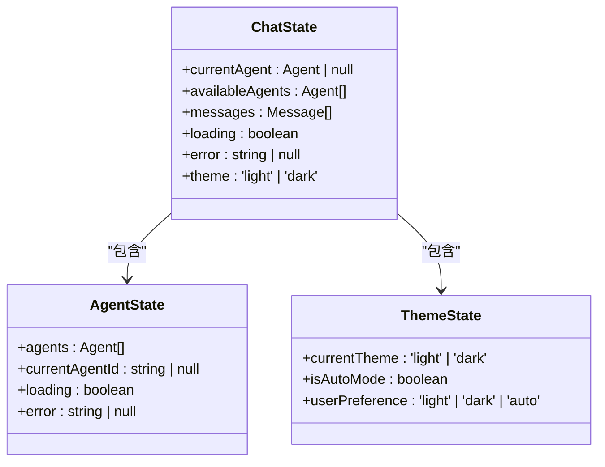
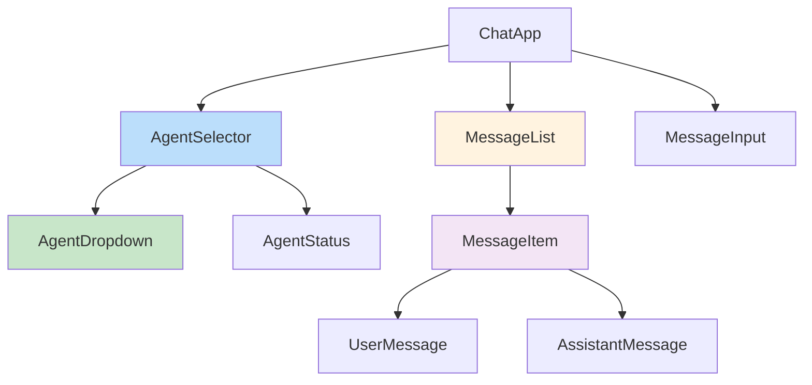
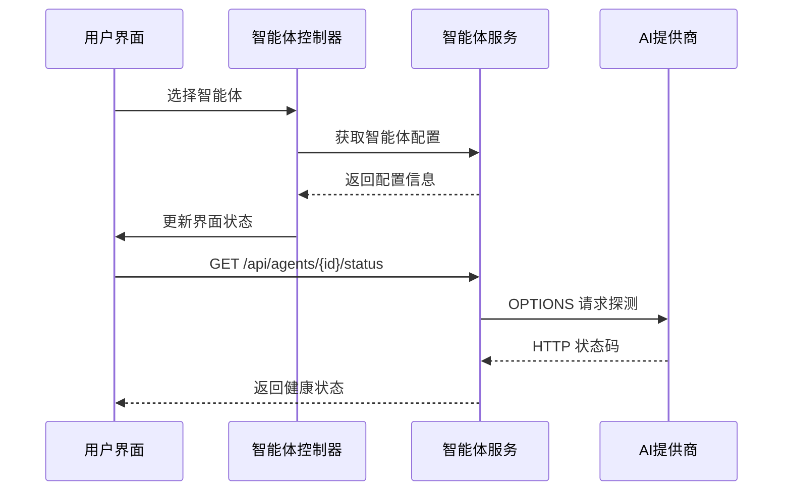
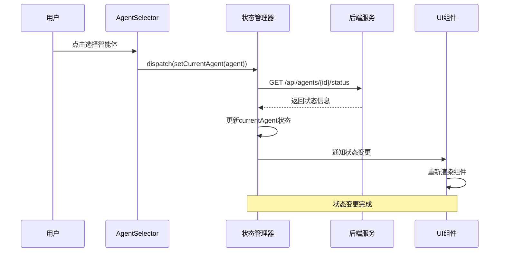
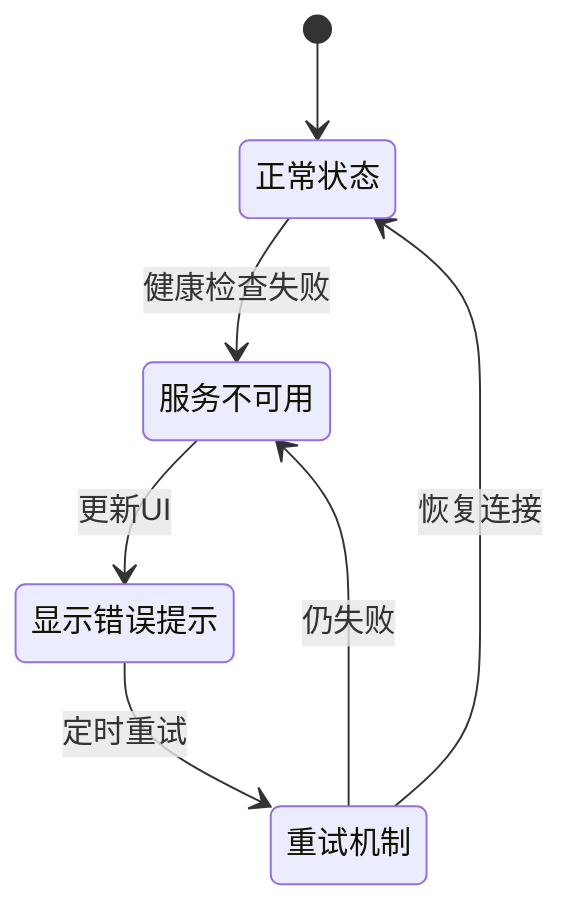

# 智能体状态管理

<cite>
**本文档中引用的文件**   
- [model-switching-feature.md](file://doc/model-switching-feature.md)
</cite>

## 目录
1. [概述](#概述)
2. [前端状态管理](#前端状态管理)
3. [后端状态同步机制](#后端状态同步机制)
4. [状态变更事件流](#状态变更事件流)
5. [状态持久化策略](#状态持久化策略)
6. [异常处理与恢复机制](#异常处理与恢复机制)

## 概述

本文档详细阐述了智能体状态管理功能的设计与实现，涵盖前端与后端的状态同步机制。系统通过状态管理库维护当前激活的智能体状态（currentAgent）、对话历史与用户偏好，确保用户在不同智能体间切换时获得无缝体验。

**Section sources**
- [model-switching-feature.md](file://doc/model-switching-feature.md#L1-L50)

## 前端状态管理

### 状态管理架构

系统采用集中式状态管理方案，通过Zustand或Pinia等状态管理库维护全局状态。核心状态包括当前智能体、可用智能体列表、消息历史和用户主题偏好。



**Diagram sources **
- [model-switching-feature.md](file://doc/model-switching-feature.md#L141-L190)

### 组件订阅机制

前端组件通过订阅状态变化实现响应式更新。ChatApp组件作为根组件，订阅智能体状态变化并传递给子组件。



**Diagram sources **
- [model-switching-feature.md](file://doc/model-switching-feature.md#L100-L140)

**Section sources**
- [model-switching-feature.md](file://doc/model-switching-feature.md#L100-L200)

## 后端状态同步机制

### API端点实现

后端提供`/api/agents/:id/status`端点用于检查智能体状态，实现健康检查、服务可用性探测与延迟监控。



**Diagram sources **
- [model-switching-feature.md](file://doc/model-switching-feature.md#L50-L100)

### 健康检查逻辑

智能体状态缓存机制实现5分钟TTL的缓存策略，减少对后端服务的频繁探测。

```typescript
class AgentStatusCache {
  private cache: Map<string, { status: string; timestamp: Date }>;
  private readonly CACHE_TTL = 5 * 60 * 1000; // 5分钟
  
  async getStatus(agentId: string): Promise<string> {
    const cached = this.cache.get(agentId);
    
    if (cached && Date.now() - cached.timestamp.getTime() < this.CACHE_TTL) {
      return cached.status;
    }

    const status = await this.checkAgentStatus(agentId);
    this.cache.set(agentId, { status, timestamp: new Date() });
    return status;
  }
}
```

**Section sources**
- [model-switching-feature.md](file://doc/model-switching-feature.md#L1853-L1969)

## 状态变更事件流

### 完整数据流

从用户选择智能体到状态更新的完整数据流如下：



**Diagram sources **
- [model-switching-feature.md](file://doc/model-switching-feature.md#L50-L100)

**Section sources**
- [model-switching-feature.md](file://doc/model-switching-feature.md#L50-L150)

## 状态持久化策略

### 本地存储方案

系统采用localStorage实现状态持久化，保存用户偏好设置和最近使用的智能体。

```typescript
interface ChatStorage {
  currentSession: ChatSession | null;
  recentAgents: Agent[];
  userPreferences: {
    defaultAgentId?: string;
    theme: 'light' | 'dark' | 'auto';
    streamingEnabled: boolean;
    autoThemeSchedule: {
      enabled: boolean;
      lightModeStart: string;
      darkModeStart: string;
    };
  };
}
```

**Section sources**
- [model-switching-feature.md](file://doc/model-switching-feature.md#L874-L937)

### 多标签页同步

通过StorageEvent事件实现多标签页间的状态同步：

```typescript
window.addEventListener('storage', (event) => {
  if (event.key === 'chat-theme-preferences') {
    // 通知状态管理器更新主题
    store.dispatch('theme/updateFromStorage');
  }
});
```

**Section sources**
- [model-switching-feature.md](file://doc/model-switching-feature.md#L895-L937)

## 异常处理与恢复机制

### 服务不可用处理

当智能体服务不可用时，系统提供明确的用户提示并尝试自动恢复：



**Diagram sources **
- [model-switching-feature.md](file://doc/model-switching-feature.md#L1853-L1969)

### 自动恢复策略

系统实现指数退避重试机制，逐步增加重试间隔：

```typescript
class HealthChecker {
  private retryCount = 0;
  private readonly MAX_RETRY = 5;
  
  async checkWithRetry(agentId: string): Promise<boolean> {
    try {
      return await this.checkAgentStatus(agentId);
    } catch (error) {
      if (this.retryCount < this.MAX_RETRY) {
        const delay = Math.pow(2, this.retryCount) * 1000;
        this.retryCount++;
        await this.delay(delay);
        return this.checkWithRetry(agentId);
      }
      throw error;
    }
  }
}
```

**Section sources**
- [model-switching-feature.md](file://doc/model-switching-feature.md#L1853-L1969)