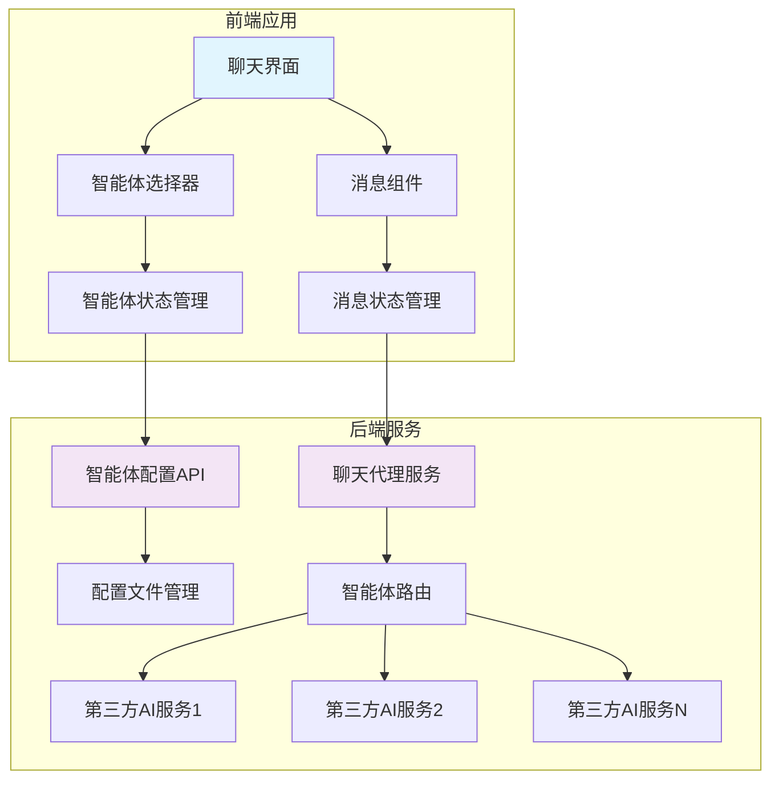
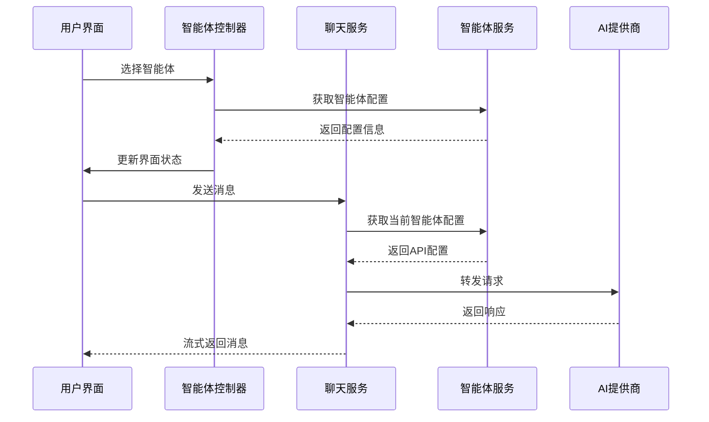
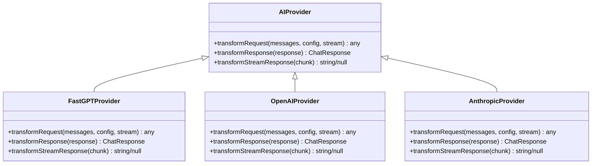

# 智能体路由机制

<cite>
**本文档引用文件**   
- [model-switching-feature.md](file://doc/model-switching-feature.md)
</cite>

## 目录
1. [概述](#概述)
2. [核心组件分析](#核心组件分析)
3. [路由决策逻辑](#路由决策逻辑)
4. [适配器模式应用](#适配器模式应用)
5. [性能与错误处理](#性能与错误处理)
6. [扩展功能](#扩展功能)

## 概述

本文档深入阐述智能体路由机制的实现原理，重点描述系统如何根据当前选定的智能体将聊天请求动态路由至对应的AI服务提供商。通过适配器模式封装不同AI提供商API的差异，实现统一的接口调用方式。系统支持多智能体动态切换，每个智能体都有独立的服务端配置，包括接口地址、API Key和模型名称等信息，确保了灵活的AI服务集成能力。

## 核心组件分析

智能体路由机制的核心组件包括`MessageRouter`、`ChatProxyService`和各类AI提供商适配器。`MessageRouter`负责根据当前智能体配置选择合适的提供商适配器，并将消息路由到相应的AI服务。`ChatProxyService`作为聊天代理服务，处理请求的转发和响应的转换。各类AI提供商适配器（如`FastGPTProvider`、`OpenAIProvider`、`AnthropicProvider`）实现了统一的`AIProvider`接口，封装了不同提供商的API差异。



**图示来源**
- [model-switching-feature.md](file://doc/model-switching-feature.md#L369-L421)

**本节来源**
- [model-switching-feature.md](file://doc/model-switching-feature.md#L369-L421)

## 路由决策逻辑

路由决策逻辑基于智能体ID的映射机制，通过`MessageRouter`的`getProvider`方法实现。系统维护一个提供商映射表，将智能体配置中的`provider`字段与具体的提供商适配器关联。当收到聊天请求时，系统首先获取当前智能体的配置，然后根据配置中的`provider`字段查找对应的适配器实例。



**图示来源**
- [model-switching-feature.md](file://doc/model-switching-feature.md#L369-L421)

**本节来源**
- [model-switching-feature.md](file://doc/model-switching-feature.md#L1196-L1425)

## 适配器模式应用

适配器模式在智能体路由机制中发挥着关键作用，用于封装不同AI提供商API的差异。系统定义了统一的`AIProvider`接口，所有具体提供商适配器都实现该接口。适配器负责请求格式转换、认证头注入与响应标准化处理，确保上层服务可以以统一的方式调用不同的AI服务。

### AIProvider接口定义

```typescript
interface AIProvider {
  transformRequest(messages: ChatMessage[], config: AgentConfig, stream?: boolean): any;
  transformResponse(response: any): ChatResponse;
  transformStreamResponse(chunk: any): string | null;
}
```

### 具体实现类

系统实现了多个具体适配器类，包括`FastGPTProvider`、`OpenAIProvider`和`AnthropicProvider`。这些适配器根据各自提供商的API规范，实现了请求和响应的转换逻辑。例如，`AnthropicProvider`需要在请求头中添加`x-api-key`和`anthropic-version`字段，而`OpenAIProvider`则使用标准的`Authorization: Bearer`认证方式。



**图示来源**
- [model-switching-feature.md](file://doc/model-switching-feature.md#L1196-L1425)

**本节来源**
- [model-switching-feature.md](file://doc/model-switching-feature.md#L1196-L1425)

## 性能与错误处理

智能体路由机制在性能开销、超时控制与错误传播方面进行了精心设计。系统通过异步非阻塞的方式处理请求，确保高并发场景下的响应性能。对于超时控制，系统设置了合理的请求超时时间，并在超时发生时及时中断请求，避免资源浪费。

### 错误处理机制

系统实现了完善的错误处理机制，通过`APIError`接口统一错误信息格式。错误处理包括错误码、错误消息、智能体ID和时间戳等信息，便于问题追踪和分析。`ErrorHandler`类提供了静态方法`handleAgentError`，根据不同的错误码返回用户友好的错误提示和建议。

```typescript
interface APIError {
  code: string;
  message: string;
  agentId: string;
  timestamp: Date;
  details?: any;
}
```

**本节来源**
- [model-switching-feature.md](file://doc/model-switching-feature.md#L1133-L1194)

## 扩展功能

智能体路由机制支持通过中间件扩展路由功能，如日志记录、计费统计等。系统设计了灵活的中间件架构，允许在请求处理的各个阶段插入自定义逻辑。例如，可以在请求转发前记录日志，在响应返回后进行计费统计。

### 监控和日志

系统实现了详细的监控和日志功能，`ErrorLogger`类负责记录错误日志，并根据错误的严重程度决定是否发送告警。日志条目包含时间戳、日志级别、智能体ID、错误码、错误消息、上下文信息和堆栈跟踪等，为系统维护和问题排查提供了有力支持。

```typescript
class ErrorLogger {
  async logError(error: APIError, context: any): Promise<void>;
  private isCriticalError(error: APIError): boolean;
}
```

**本节来源**
- [model-switching-feature.md](file://doc/model-switching-feature.md#L2149-L2176)