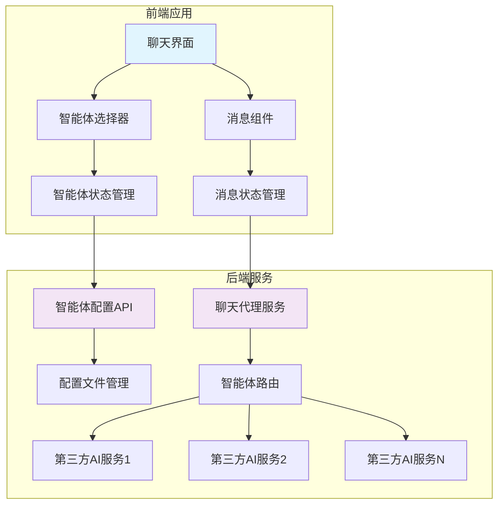
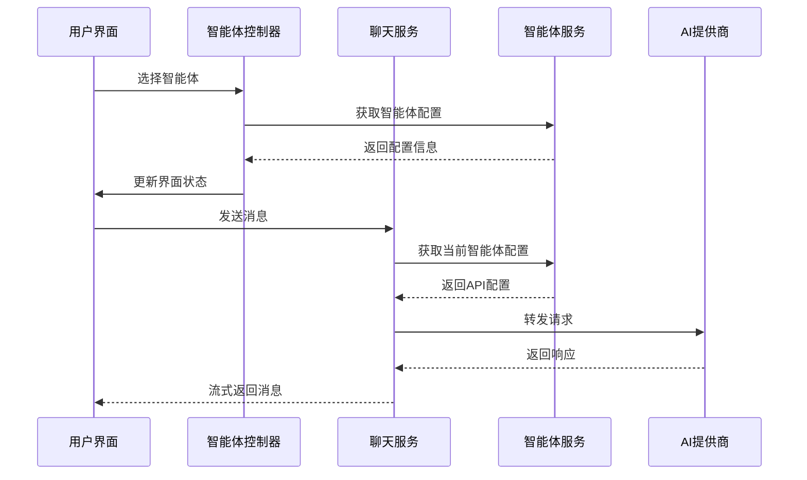

# 智能体配置管理

<cite>
**本文档引用文件**   
- [model-switching-feature.md](file://doc/model-switching-feature.md)
</cite>

## 目录
1. [概述](#概述)
2. [核心目标](#核心目标)
3. [技术栈](#技术栈)
4. [架构设计](#架构设计)
5. [后端服务设计](#后端服务设计)
6. [智能体配置管理](#智能体配置管理)
7. [API端点设计](#api端点设计)
8. [服务层架构](#服务层架构)
9. [统一适配器模式](#统一适配器模式)
10. [智能体状态缓存](#智能体状态缓存)
11. [预加载机制](#预加载机制)
12. [访问控制](#访问控制)
13. [监控和日志](#监控和日志)

## 概述

本文档描述了一个仿照 ChatGPT 官网的智能体切换功能，使用 TypeScript 开发。该功能允许用户在聊天界面中动态切换不同的智能体，每个智能体都有独立的服务端配置，包括接口地址、API Key 和模型名称等信息。

## 核心目标

- 提供类似 ChatGPT 官网的用户体验
- 支持多智能体动态切换
- 服务端统一管理智能体配置
- 保持对话连续性和上下文管理

## 技术栈

- **前端**: TypeScript, React/Vue.js, Tailwind CSS
- **后端**: Node.js/Express, TypeScript
- **API 标准**: 兼容 OpenAI Chat Completions API
- **状态管理**: Redux/Zustand (React) 或 Pinia (Vue)
- **网络请求**: Axios/Fetch API
- **主题系统**: CSS Variables, 本地存储持久化

## 架构设计

### 系统架构图



### 数据流设计



## 后端服务设计

### 智能体配置管理

#### 配置文件结构

```typescript
interface AgentConfig {
  id: string;
  name: string;
  description: string;
  endpoint: string;
  apiKey: string;
  model: string;
  maxTokens?: number;
  temperature?: number;
  systemPrompt?: string;
  capabilities: string[];
  rateLimit?: {
    requestsPerMinute: number;
    tokensPerMinute: number;
  };
  provider: 'fastgpt' | 'openai' | 'anthropic' | 'custom';
  isActive: boolean;
  features: {
    supportsChatId: boolean;
    supportsStream: boolean;
    supportsDetail: boolean;
    supportsFiles: boolean;
    supportsImages: boolean;
    streamingConfig: {
      enabled: boolean;
      endpoint: 'same' | 'different'; // 是否使用相同端点
      statusEvents: boolean; // 是否支持状态事件
      flowNodeStatus: boolean; // 是否支持流程节点状态
    };
  };
  createdAt: string;
  updatedAt: string;
}
```

#### 配置文件示例 (agents.json)

```json
{
  "agents": [
    {
      "id": "fastgpt-assistant",
      "name": "FastGPT 智能助手",
      "description": "基于 FastGPT 的知识库问答助手",
      "endpoint": "http://localhost:3000/api/v1/chat/completions",
      "apiKey": "fastgpt-xxxxxx",
      "model": "FastAI-4k",
      "maxTokens": 4096,
      "temperature": 0.7,
      "systemPrompt": "你是一个基于知识库的智能助手。",
      "capabilities": ["knowledge_base", "context_memory", "file_upload"],
      "rateLimit": {
        "requestsPerMinute": 60,
        "tokensPerMinute": 40000
      },
      "provider": "fastgpt",
      "isActive": true,
      "features": {
        "supportsChatId": true,
        "supportsStream": true,
        "supportsDetail": true,
        "supportsFiles": true,
        "supportsImages": true,
        "streamingConfig": {
          "enabled": true,
          "endpoint": "same",
          "statusEvents": true,
          "flowNodeStatus": true
        }
      },
      "createdAt": "2024-01-01T00:00:00Z",
      "updatedAt": "2024-01-01T00:00:00Z"
    },
    {
      "id": "gpt-4-assistant",
      "name": "GPT-4 助手",
      "description": "基于 GPT-4 的通用智能助手",
      "endpoint": "https://api.openai.com/v1/chat/completions",
      "apiKey": "sk-xxxxxxxxxx",
      "model": "gpt-4-turbo-preview",
      "maxTokens": 4096,
      "temperature": 0.7,
      "systemPrompt": "你是一个有用的AI助手。",
      "capabilities": ["text", "analysis", "coding"],
      "rateLimit": {
        "requestsPerMinute": 60,
        "tokensPerMinute": 40000
      },
      "provider": "openai",
      "isActive": true,
      "features": {
        "supportsChatId": false,
        "supportsStream": true,
        "supportsDetail": false,
        "supportsFiles": false,
        "supportsImages": true,
        "streamingConfig": {
          "enabled": true,
          "endpoint": "same",
          "statusEvents": false,
          "flowNodeStatus": false
        }
      },
      "createdAt": "2024-01-01T00:00:00Z",
      "updatedAt": "2024-01-01T00:00:00Z"
    },
    {
      "id": "claude-assistant",
      "name": "Claude 助手",
      "description": "基于 Claude 的智能助手",
      "endpoint": "https://api.anthropic.com/v1/messages",
      "apiKey": "sk-ant-xxxxxxxxxx",
      "model": "claude-3-sonnet-20240229",
      "maxTokens": 4096,
      "temperature": 0.7,
      "capabilities": ["text", "analysis", "reasoning"],
      "provider": "anthropic",
      "isActive": true,
      "features": {
        "supportsChatId": false,
        "supportsStream": true,
        "supportsDetail": false,
        "supportsFiles": true,
        "supportsImages": true,
        "streamingConfig": {
          "enabled": true,
          "endpoint": "same",
          "statusEvents": false,
          "flowNodeStatus": false
        }
      },
      "createdAt": "2024-01-01T00:00:00Z",
      "updatedAt": "2024-01-01T00:00:00Z"
    }
  ]
}
```

**Section sources**
- [model-switching-feature.md](file://doc/model-switching-feature.md#L191-L368)

## API端点设计

### 智能体管理 API

| 端点 | 方法 | 描述 | 参数 |
|------|------|------|------|
| `/api/agents` | GET | 获取可用智能体列表 | - |
| `/api/agents/:id` | GET | 获取特定智能体信息 | id: 智能体ID |
| `/api/agents/:id/status` | GET | 检查智能体状态 | id: 智能体ID |

### 聊天代理 API

| 端点 | 方法 | 描述 | 参数 |
|------|------|------|------|
| `/api/chat/completions` | POST | 发送聊天请求（支持流式和非流式） | agentId, messages, stream, options |

## 服务层架构

### AgentConfigService

```typescript
class AgentConfigService {
  private configPath: string;
  private agents: Map<string, AgentConfig>;

  async loadAgents(): Promise<AgentConfig[]>;
  async getAgent(id: string): Promise<AgentConfig | null>;
  async updateAgent(id: string, config: Partial<AgentConfig>): Promise<void>;
  async validateAgent(config: AgentConfig): Promise<boolean>;
  async checkAgentHealth(id: string): Promise<boolean>;
}
```

**Section sources**
- [model-switching-feature.md](file://doc/model-switching-feature.md#L369-L421)

### ChatProxyService

```typescript
interface StreamStatus {
  type: 'flowNodeStatus' | 'progress' | 'error' | 'complete';
  status: 'running' | 'completed' | 'error';
  moduleName?: string;
  progress?: number;
  error?: string;
}
class ChatProxyService {
  private agentService: AgentConfigService;
  private httpClient: AxiosInstance;

  async sendMessage(
    agentId: string,
    messages: ChatMessage[],
    options?: ChatOptions
  ): Promise<ChatResponse> {
    const config = await this.agentService.getAgent(agentId);
    const stream = options?.stream ?? config.features.streamingConfig.enabled;
    
    const request = await this.transformRequest(config, messages, stream, options);
    
    const response = await this.httpClient.post(config.endpoint, request, {
      headers: this.buildHeaders(config)
    });
    
    return this.transformResponse(config, response.data);
  }

  async sendStreamMessage(
    agentId: string,
    messages: ChatMessage[],
    onChunk: (chunk: string) => void,
    onStatusChange?: (status: StreamStatus) => void,
    options?: ChatOptions
  ): Promise<ReadableStream>;

  private async transformRequest(
    config: AgentConfig,
    messages: ChatMessage[],
    stream: boolean,
    options?: ChatOptions
  ): Promise<any>;

  private async transformResponse(
    config: AgentConfig,
    response: any
  ): Promise<ChatResponse>;
}
```

**Section sources**
- [model-switching-feature.md](file://doc/model-switching-feature.md#L369-L421)

## 统一适配器模式

```typescript
interface AIProvider {
  name: string;
  transformRequest(messages: Message[], config: AgentConfig): any;
  transformResponse(response: any): Message;
  transformStreamResponse(chunk: any): string;
  validateConfig(config: AgentConfig): boolean;
}

// FastGPT 提供商适配器
class FastGPTProvider implements AIProvider {
  name = 'FastGPT';
  
  transformRequest(messages: Message[], config: AgentConfig, stream: boolean = false) {
    return {
      chatId: this.generateChatId(),
      stream: stream && config.features.streamingConfig.enabled,
      detail: config.features.supportsDetail,
      variables: {},
      messages: messages.map(msg => ({
        role: msg.role,
        content: msg.content
      }))
    };
  }
  
  transformResponse(response: any): Message {
    return {
      id: response.id || generateId(),
      role: 'assistant',
      content: response.choices[0].message.content,
      timestamp: new Date(),
      metadata: {
        model: response.model,
        tokens: response.usage?.total_tokens,
        responseData: response.responseData // FastGPT 特有的详细信息
      }
    };
  }
  
  transformStreamResponse(chunk: any): string {
    if (chunk.choices && chunk.choices[0]?.delta?.content) {
      return chunk.choices[0].delta.content;
    }
    return '';
  }
  
  validateConfig(config: AgentConfig): boolean {
    return (
      config.endpoint.includes('fastgpt') &&
      config.apiKey.startsWith('fastgpt-') &&
      config.provider === 'fastgpt'
    );
  }
  
  private generateChatId(): string {
    return `fastgpt_${Date.now()}_${Math.random().toString(36).substr(2, 9)}`;
  }
  
  // FastGPT 特有功能支持
  async uploadFile(file: File, config: AgentConfig): Promise<string> {
    const formData = new FormData();
    formData.append('file', file);
    
    const response = await fetch(`${config.endpoint.replace('/chat/completions', '/upload')}`, {
      method: 'POST',
      headers: {
        'Authorization': `Bearer ${config.apiKey}`
      },
      body: formData
    });
    
    const result = await response.json();
    return result.url;
  }
}

class OpenAIProvider implements AIProvider {
  name = 'OpenAI';
  
  transformRequest(messages: Message[], config: AgentConfig, stream: boolean = false) {
    return {
      model: config.model,
      messages: messages.map(msg => ({
        role: msg.role,
        content: msg.content
      })),
      max_tokens: config.maxTokens,
      temperature: config.temperature,
      stream: stream && config.features.streamingConfig.enabled
    };
  }
  
  transformResponse(response: any): Message {
    return {
      id: generateId(),
      role: 'assistant',
      content: response.choices[0].message.content,
      timestamp: new Date(),
      metadata: {
        model: response.model,
        tokens: response.usage?.total_tokens
      }
    };
  }
  
  transformStreamResponse(chunk: any): string {
    if (chunk.choices && chunk.choices[0]?.delta?.content) {
      return chunk.choices[0].delta.content;
    }
    return '';
  }
  
  validateConfig(config: AgentConfig): boolean {
    return (
      config.endpoint.includes('openai.com') &&
      config.apiKey.startsWith('sk-') &&
      config.provider === 'openai'
    );
  }
}

class AnthropicProvider implements AIProvider {
  name = 'Anthropic';
  
  transformRequest(messages: Message[], config: AgentConfig, stream: boolean = false) {
    return {
      model: config.model,
      max_tokens: config.maxTokens,
      messages: messages.map(msg => ({
        role: msg.role,
        content: msg.content
      })),
      stream: stream && config.features.streamingConfig.enabled
    };
  }
  
  transformResponse(response: any): Message {
    return {
      id: generateId(),
      role: 'assistant',
      content: response.content[0].text,
      timestamp: new Date(),
      metadata: {
        model: response.model,
        tokens: response.usage?.output_tokens
      }
    };
  }
  
  transformStreamResponse(chunk: any): string {
    if (chunk.type === 'content_block_delta') {
      return chunk.delta.text || '';
    }
    return '';
  }
  
  validateConfig(config: AgentConfig): boolean {
    return (
      config.endpoint.includes('anthropic.com') &&
      config.apiKey.startsWith('sk-ant-') &&
      config.provider === 'anthropic'
    );
  }
}
```

**Section sources**
- [model-switching-feature.md](file://doc/model-switching-feature.md#L895-L1132)

## 智能体状态缓存

```typescript
class AgentStatusCache {
  private cache: Map<string, { status: string; timestamp: Date }>;
  private readonly CACHE_TTL = 5 * 60 * 1000; // 5分钟

  async getStatus(agentId: string): Promise<string> {
    const cached = this.cache.get(agentId);
    
    if (cached && Date.now() - cached.timestamp.getTime() < this.CACHE_TTL) {
      return cached.status;
    }

    const status = await this.checkAgentStatus(agentId);
    this.cache.set(agentId, { status, timestamp: new Date() });
    return status;
  }

  private async checkAgentStatus(agentId: string): Promise<string> {
    // 实现状态检查逻辑
    try {
      const config = await this.agentService.getAgent(agentId);
      const response = await fetch(config.endpoint, {
        method: 'OPTIONS',
        timeout: 5000
      });
      return response.ok ? 'active' : 'error';
    } catch {
      return 'error';
    }
  }
}
```

**Section sources**
- [model-switching-feature.md](file://doc/model-switching-feature.md#L1853-L1969)

## 预加载机制

```typescript
class AgentPreloader {
  async preloadPopularAgents(): Promise<void> {
    const popularAgents = await this.getPopularAgents();
    
    const preloadPromises = popularAgents.map(async (agent) => {
      try {
        await this.warmupAgent(agent.id);
      } catch (error) {
        console.warn(`Failed to preload agent ${agent.id}:`, error);
      }
    });

    await Promise.allSettled(preloadPromises);
  }

  private async warmupAgent(agentId: string): Promise<void> {
    const testMessage = { role: 'user', content: 'Hello' };
    await this.messageRouter.routeMessage(testMessage);
  }
}
```

**Section sources**
- [model-switching-feature.md](file://doc/model-switching-feature.md#L1853-L1969)

## 访问控制

```typescript
interface UserPermissions {
  allowedAgents: string[];
  rateLimit: {
    requestsPerHour: number;
    maxConcurrentRequests: number;
  };
  features: {
    canSwitchAgents: boolean;
    canViewAgentDetails: boolean;
  };
}

class AccessController {
  async checkAgentAccess(userId: string, agentId: string): Promise<boolean> {
    const permissions = await this.getUserPermissions(userId);
    return permissions.allowedAgents.includes(agentId);
  }

  async checkRateLimit(userId: string): Promise<boolean> {
    const usage = await this.getUserUsage(userId);
    const permissions = await this.getUserPermissions(userId);
    return usage.requestsInLastHour < permissions.rateLimit.requestsPerHour;
  }
}
```

**Section sources**
- [model-switching-feature.md](file://doc/model-switching-feature.md#L2089-L2148)

## 监控和日志

### 使用情况跟踪

```typescript
interface AgentUsageMetrics {
  agentId: string;
  requestCount: number;
  totalTokens: number;
  averageResponseTime: number;
  errorRate: number;
  lastUsed: Date;
}

class UsageTracker {
  async trackRequest(agentId: string, tokens: number, responseTime: number): Promise<void> {
    await this.database.agents_usage.upsert({
      agent_id: agentId,
      date: new Date().toDateString(),
      request_count: { increment: 1 },
      total_tokens: { increment: tokens },
      total_response_time: { increment: responseTime }
    });
  }

  async getAgentMetrics(agentId: string, period: 'day' | 'week' | 'month'): Promise<AgentUsageMetrics> {
    // 实现指标查询逻辑
  }
}
```

### 错误日志

```typescript
class ErrorLogger {
  async logError(error: APIError, context: any): Promise<void> {
    const logEntry = {
      timestamp: new Date(),
      level: 'error',
      agentId: error.agentId,
      errorCode: error.code,
      message: error.message,
      context: JSON.stringify(context),
      stackTrace: error.stack
    };

    await this.writeLog(logEntry);
    
    if (this.isCriticalError(error)) {
      await this.sendAlert(logEntry);
    }
  }

  private isCriticalError(error: APIError): boolean {
    const criticalCodes = ['AGENT_UNAVAILABLE', 'INVALID_API_KEY', 'QUOTA_EXCEEDED'];
    return criticalCodes.includes(error.code);
  }
}
```

**Section sources**
- [model-switching-feature.md](file://doc/model-switching-feature.md#L2089-L2176)