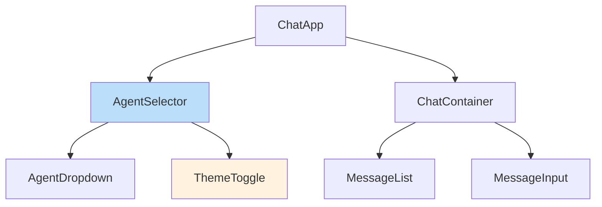
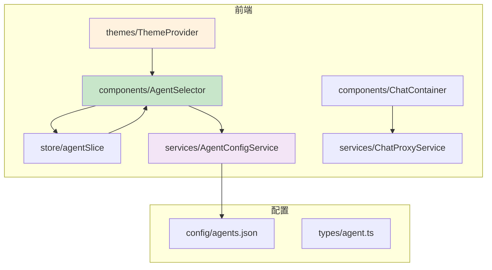

# 目录结构说明

<cite>
**本文档引用的文件**  
- [model-switching-feature.md](file://doc/model-switching-feature.md)
</cite>

## 目录结构

当前项目结构较为简化，仅包含文档目录，具体结构如下：

```
.
└── doc
    └── model-switching-feature.md
```

该结构表明项目目前处于设计或初期开发阶段，核心功能文档已存在，但源码尚未实现。

**Section sources**
- [model-switching-feature.md](file://doc/model-switching-feature.md#L1-L2177)

## doc/ 目录说明

`doc/` 目录用于存放项目设计文档，当前包含 `model-switching-feature.md`，该文件详细描述了智能体切换功能的设计与实现方案。

### model-switching-feature.md 文档作用

该文档是智能体切换功能的核心设计说明，涵盖以下内容：
- 功能概述与核心目标
- 前后端技术栈选型
- 系统架构与数据流设计
- 前端组件与状态管理接口定义
- 后端服务层设计（AgentConfigService、ChatProxyService）
- API 端点与配置文件结构
- 主题管理系统设计与用户界面交互逻辑

该文档为后续开发提供了完整的实现蓝图。

**Section sources**
- [model-switching-feature.md](file://doc/model-switching-feature.md#L1-L2177)

## 推断的 src/ 目录结构

根据设计文档，`src/` 目录应包含以下模块，用于实现智能体切换功能：

### 前端组件模块



**Diagram sources**
- [model-switching-feature.md](file://doc/model-switching-feature.md#L150-L170)

**Section sources**
- [model-switching-feature.md](file://doc/model-switching-feature.md#L150-L200)

### 服务层模块

推断存在以下服务类：
- `AgentConfigService`: 负责加载和管理智能体配置
- `ChatProxyService`: 负责代理聊天请求，根据当前智能体转发至对应AI服务

**Section sources**
- [model-switching-feature.md](file://doc/model-switching-feature.md#L350-L400)

### 主题管理模块

包含：
- `ThemeProvider`: 主题上下文提供者，管理主题状态
- `ThemeToggleButton`: 主题切换按钮组件
- CSS Variables 定义白天/夜晚主题颜色方案

**Section sources**
- [model-switching-feature.md](file://doc/model-switching-feature.md#L500-L600)

## 配置文件与模块存放位置推断

| 模块/文件 | 推断存放路径 | 说明 |
|----------|-------------|------|
| 智能体配置文件 | `config/agents.json` | 存放各智能体的API配置信息 |
| API 客户端 | `services/apiClient.ts` | 封装 Axios/Fetch 请求逻辑 |
| 状态管理模块 | `store/` 或 `state/` | Redux/Zustand 或 Pinia 状态管理 |
| 类型定义 | `types/` 或 `interfaces/` | Agent、ThemeConfig 等接口定义 |
| 工具函数 | `utils/` | 配置加载、状态持久化等工具 |

**Section sources**
- [model-switching-feature.md](file://doc/model-switching-feature.md#L300-L400)

## 开发者导航指引

为帮助开发者理解模块分布与逻辑关系，建议按以下路径组织代码：



**Diagram sources**
- [model-switching-feature.md](file://doc/model-switching-feature.md#L100-L130)

**Section sources**
- [model-switching-feature.md](file://doc/model-switching-feature.md#L100-L600)

## 项目结构现状与建议

当前项目仅包含设计文档，缺少实际源码目录。建议补充以下目录结构以支持开发：

```
src/
├── components/        # 前端UI组件
├── services/          # 业务服务层
├── store/             # 状态管理
├── themes/            # 主题管理
├── types/             # 类型定义
├── config/            # 配置文件
└── utils/             # 工具函数
```

**Section sources**
- [model-switching-feature.md](file://doc/model-switching-feature.md#L1-L2177)