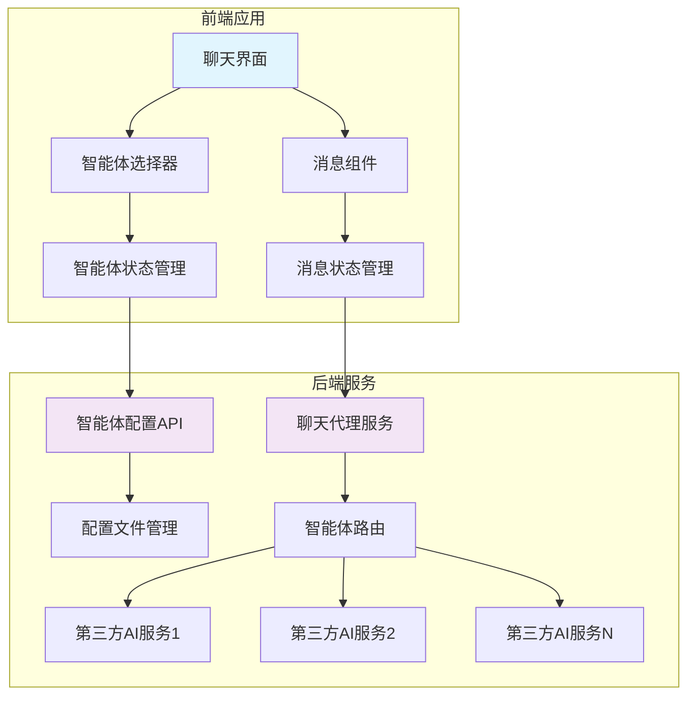
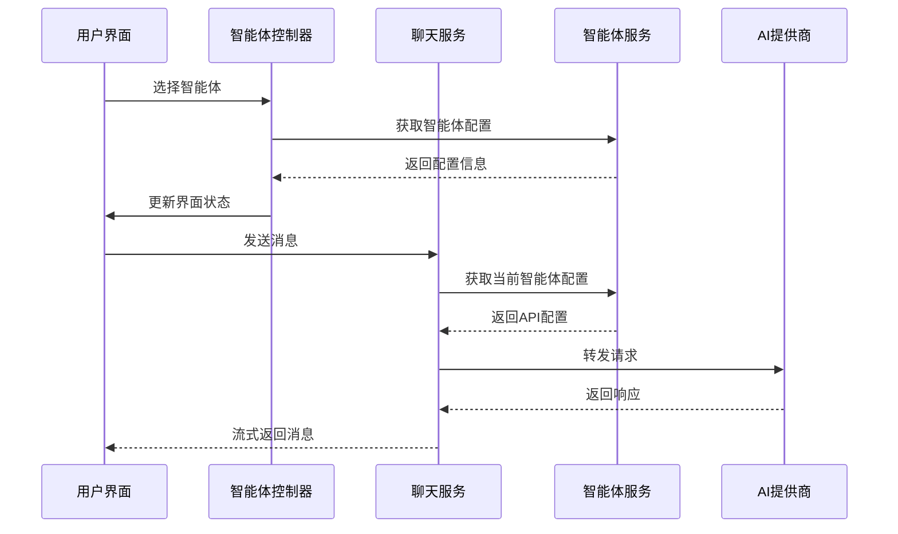
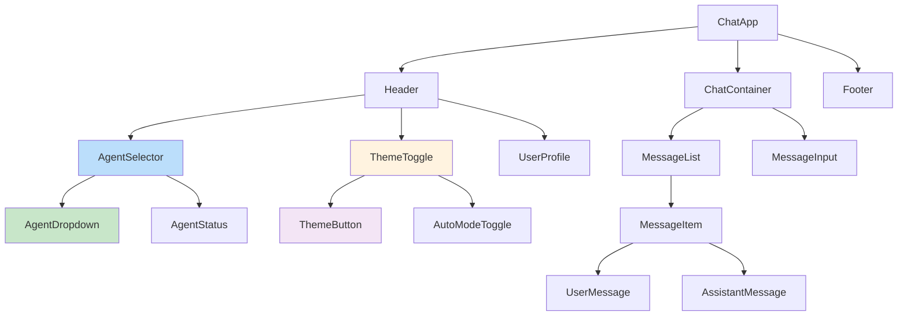

# 系统概述

<cite>
**本文档引用文件**  
- [model-switching-feature.md](file://doc/model-switching-feature.md)
</cite>

## 目录
1. [简介](#简介)
2. [项目结构](#项目结构)
3. [核心组件](#核心组件)
4. [架构概览](#架构概览)
5. [详细组件分析](#详细组件分析)
6. [依赖分析](#依赖分析)
7. [性能考虑](#性能考虑)
8. [故障排除指南](#故障排除指南)
9. [结论](#结论)

## 简介
本文档全面介绍 llmchat 项目的系统设计，重点阐述智能体切换功能的核心目标与架构实现。系统支持用户在多个 AI 模型（如 FastGPT、OpenAI、Anthropic）之间动态切换，并保持对话上下文的连续性。前后端采用分离架构：前端使用 TypeScript 与 React/Vue 框架构建交互界面，后端基于 Node.js/Express 提供统一 API 服务。系统还集成了主题模式（白天/夜晚/自动）和流式响应处理机制，提升用户体验。文档为初学者提供概念引导，同时为高级开发者深入解析适配器模式、状态管理方案（Redux/Zustand 或 Pinia）及服务端配置管理机制。

## 项目结构
llmchat 项目采用模块化结构，主要包含文档目录与功能说明文件。核心设计文档位于 `doc/` 目录下，详细描述了智能体切换功能的技术实现与架构设计。

**Section sources**
- [model-switching-feature.md](file://doc/model-switching-feature.md#L1-L50)

## 核心组件
系统核心组件包括智能体选择器、主题切换器、聊天代理服务和配置管理服务。前端通过状态管理维护当前智能体与主题设置，后端通过代理服务将请求路由至对应的 AI 服务提供商。适配器模式被用于统一不同 AI 服务的接口差异，确保系统可扩展性。

**Section sources**
- [model-switching-feature.md](file://doc/model-switching-feature.md#L100-L200)

## 架构概览

### 系统架构图



**Diagram sources**
- [model-switching-feature.md](file://doc/model-switching-feature.md#L70-L90)

### 数据流设计



**Diagram sources**
- [model-switching-feature.md](file://doc/model-switching-feature.md#L95-L115)

## 详细组件分析

### 前端组件架构

#### 组件层次结构



**Diagram sources**
- [model-switching-feature.md](file://doc/model-switching-feature.md#L120-L145)

### 后端服务设计

#### 智能体配置管理接口

```typescript
interface AgentConfig {
  id: string;
  name: string;
  description: string;
  endpoint: string;
  apiKey: string;
  model: string;
  maxTokens?: number;
  temperature?: number;
  systemPrompt?: string;
  capabilities: string[];
  rateLimit?: {
    requestsPerMinute: number;
    tokensPerMinute: number;
  };
  provider: 'fastgpt' | 'openai' | 'anthropic' | 'custom';
  isActive: boolean;
  features: {
    supportsChatId: boolean;
    supportsStream: boolean;
    supportsDetail: boolean;
    supportsFiles: boolean;
    supportsImages: boolean;
    streamingConfig: {
      enabled: boolean;
      endpoint: 'same' | 'different';
      statusEvents: boolean;
      flowNodeStatus: boolean;
    };
  };
  createdAt: string;
  updatedAt: string;
}
```

**Section sources**
- [model-switching-feature.md](file://doc/model-switching-feature.md#L250-L300)

#### 聊天代理服务类

```typescript
class ChatProxyService {
  private agentService: AgentConfigService;
  private httpClient: AxiosInstance;

  async sendMessage(
    agentId: string,
    messages: ChatMessage[],
    options?: ChatOptions
  ): Promise<ChatResponse>;

  async sendStreamMessage(
    agentId: string,
    messages: ChatMessage[],
    onChunk: (chunk: string) => void,
    onStatusChange?: (status: StreamStatus) => void,
    options?: ChatOptions
  ): Promise<ReadableStream>;
}
```

**Section sources**
- [model-switching-feature.md](file://doc/model-switching-feature.md#L400-L430)

## 依赖分析

### API 端点设计

| 端点 | 方法 | 描述 | 参数 |
|------|------|------|------|
| `/api/agents` | GET | 获取可用智能体列表 | - |
| `/api/agents/:id` | GET | 获取特定智能体信息 | id: 智能体ID |
| `/api/agents/:id/status` | GET | 检查智能体状态 | id: 智能体ID |
| `/api/chat/completions` | POST | 发送聊天请求（支持流式和非流式） | agentId, messages, stream, options |

**Diagram sources**
- [model-switching-feature.md](file://doc/model-switching-feature.md#L350-L370)

## 性能考虑
系统通过流式响应机制减少用户等待时间，提升交互体验。后端采用连接池与缓存策略优化高频请求。智能体状态预加载与懒加载结合，平衡启动性能与资源消耗。建议生产环境配置负载均衡与服务健康检查。

## 故障排除指南
当智能体无法响应时，首先检查配置文件中的 API Key 与端点是否正确。确认网络连通性及第三方服务状态。查看日志中的错误码：401 表示认证失败，429 表示超出速率限制，502 表示代理转发失败。前端可通过开发者工具监控请求负载与响应内容。

**Section sources**
- [model-switching-feature.md](file://doc/model-switching-feature.md#L500-L550)

## 结论
llmchat 项目通过清晰的前后端分离架构与适配器模式，实现了多 AI 模型的灵活切换与统一管理。系统设计兼顾用户体验与可维护性，支持主题切换与流式响应等现代 Web 功能。未来可扩展支持更多 AI 提供商，并引入对话记忆持久化与多会话管理功能。