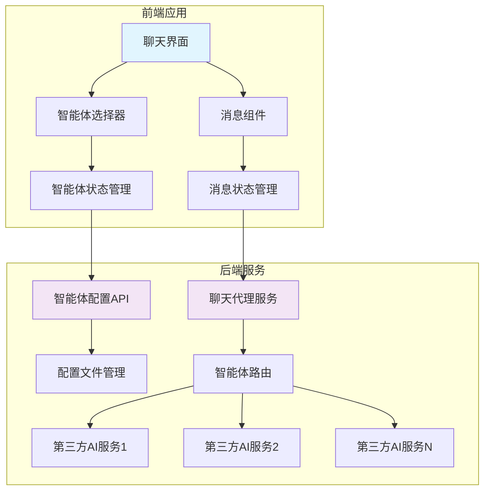
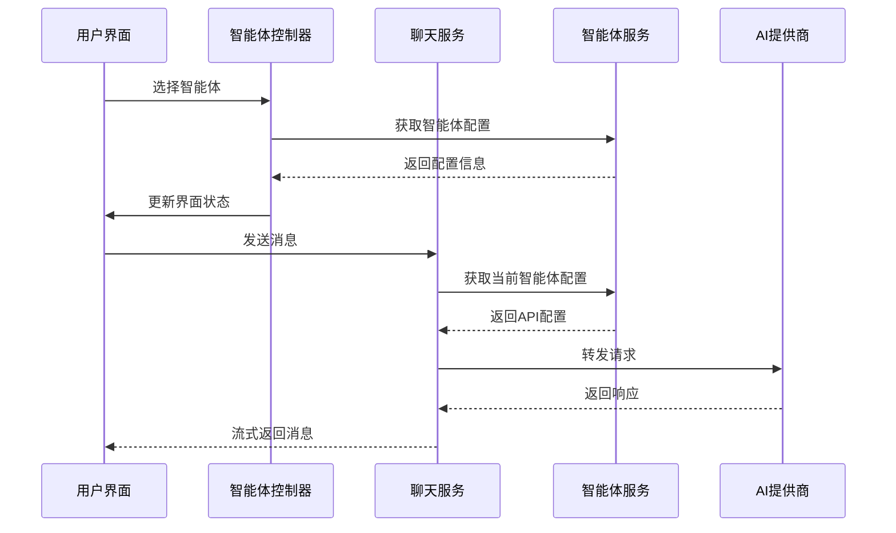
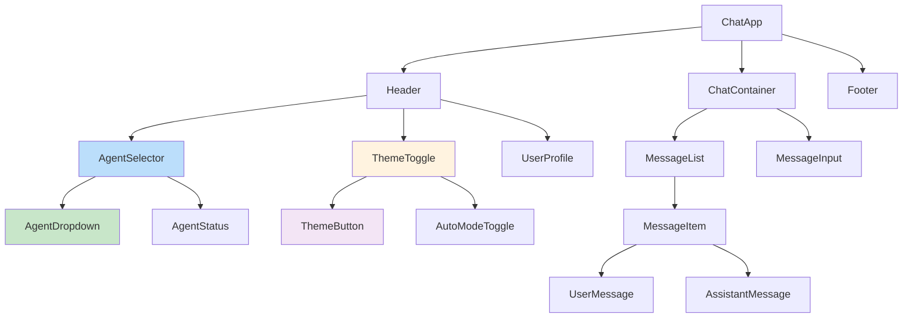
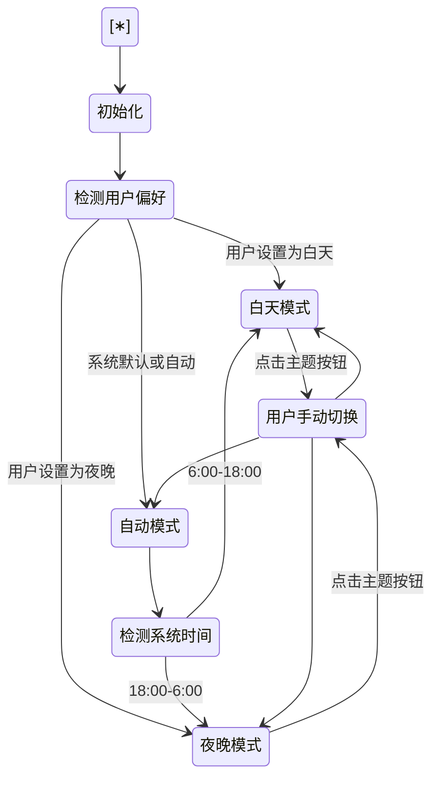
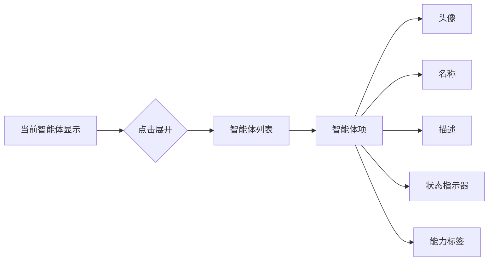
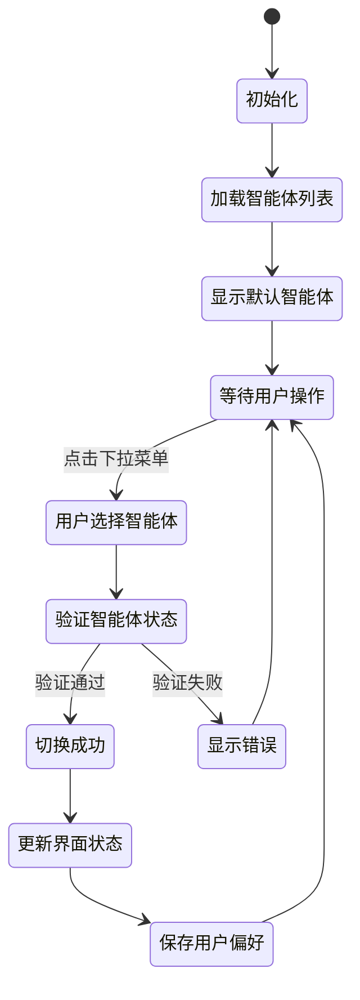

# 智能体切换功能设计文档

## 概述

本设计文档描述了一个仿照 ChatGPT 官网的智能体切换功能，使用 TypeScript 开发。该功能允许用户在聊天界面中动态切换不同的智能体，每个智能体都有独立的服务端配置，包括接口地址、API Key 和模型名称等信息。

### 核心目标
- 提供类似 ChatGPT 官网的用户体验
- 支持多智能体动态切换
- 服务端统一管理智能体配置
- 保持对话连续性和上下文管理

## 技术栈

- **前端**: TypeScript, React/Vue.js, Tailwind CSS
- **后端**: Node.js/Express, TypeScript
- **API 标准**: 兼容 OpenAI Chat Completions API
- **状态管理**: Redux/Zustand (React) 或 Pinia (Vue)
- **网络请求**: Axios/Fetch API
- **主题系统**: CSS Variables, 本地存储持久化

## 架构设计

### 系统架构图



### 数据流设计



## 前端组件架构

### 组件层次结构



### 核心组件设计

#### AgentSelector 组件

```typescript
interface Agent {
  id: string;
  name: string;
  description: string;
  avatar?: string;
  model: string;
  status: 'active' | 'inactive' | 'error';
  capabilities: string[];
}

interface AgentSelectorProps {
  agents: Agent[];
  currentAgent: Agent;
  onAgentChange: (agent: Agent) => void;
  loading?: boolean;
}
```

#### AgentDropdown 组件

```typescript
interface AgentDropdownProps {
  agents: Agent[];
  selectedAgent: Agent;
  onSelect: (agent: Agent) => void;
  open: boolean;
  onToggle: () => void;
}
```

#### ThemeToggle 组件

```typescript
interface ThemeToggleProps {
  currentTheme: 'light' | 'dark';
  onThemeChange: (theme: 'light' | 'dark') => void;
  autoMode: boolean;
  onAutoModeToggle: () => void;
}

interface ThemeConfig {
  name: string;
  icon: string;
  colors: {
    primary: string;
    background: string;
    surface: string;
    text: string;
    border: string;
    accent: string;
  };
}
```

#### 状态管理接口

```typescript
interface ChatState {
  currentAgent: Agent | null;
  availableAgents: Agent[];
  messages: Message[];
  loading: boolean;
  error: string | null;
  theme: 'light' | 'dark';
}

interface AgentState {
  agents: Agent[];
  currentAgentId: string | null;
  loading: boolean;
  error: string | null;
}

interface ThemeState {
  currentTheme: 'light' | 'dark';
  isAutoMode: boolean;
  userPreference: 'light' | 'dark' | 'auto';
}
```

## 后端服务设计

### 智能体配置管理

#### 配置文件结构

```typescript
interface AgentConfig {
  id: string;
  name: string;
  description: string;
  endpoint: string;
  apiKey: string;
  model: string;
  maxTokens?: number;
  temperature?: number;
  systemPrompt?: string;
  capabilities: string[];
  rateLimit?: {
    requestsPerMinute: number;
    tokensPerMinute: number;
  };
  provider: 'fastgpt' | 'openai' | 'anthropic' | 'custom';
  isActive: boolean;
  features: {
    supportsChatId: boolean;
    supportsStream: boolean;
    supportsDetail: boolean;
    supportsFiles: boolean;
    supportsImages: boolean;
    streamingConfig: {
      enabled: boolean;
      endpoint: 'same' | 'different'; // 是否使用相同端点
      statusEvents: boolean; // 是否支持状态事件
      flowNodeStatus: boolean; // 是否支持流程节点状态
    };
  };
  createdAt: string;
  updatedAt: string;
}
```

#### 配置文件示例 (agents.json)

```json
{
  "agents": [
    {
      "id": "fastgpt-assistant",
      "name": "FastGPT 智能助手",
      "description": "基于 FastGPT 的知识库问答助手",
      "endpoint": "http://localhost:3000/api/v1/chat/completions",
      "apiKey": "fastgpt-xxxxxx",
      "model": "FastAI-4k",
      "maxTokens": 4096,
      "temperature": 0.7,
      "systemPrompt": "你是一个基于知识库的智能助手。",
      "capabilities": ["knowledge_base", "context_memory", "file_upload"],
      "rateLimit": {
        "requestsPerMinute": 60,
        "tokensPerMinute": 40000
      },
      "provider": "fastgpt",
      "isActive": true,
      "features": {
        "supportsChatId": true,
        "supportsStream": true,
        "supportsDetail": true,
        "supportsFiles": true,
        "supportsImages": true,
        "streamingConfig": {
          "enabled": true,
          "endpoint": "same",
          "statusEvents": true,
          "flowNodeStatus": true
        }
      },
      "createdAt": "2024-01-01T00:00:00Z",
      "updatedAt": "2024-01-01T00:00:00Z"
    },
    {
      "id": "gpt-4-assistant",
      "name": "GPT-4 助手",
      "description": "基于 GPT-4 的通用智能助手",
      "endpoint": "https://api.openai.com/v1/chat/completions",
      "apiKey": "sk-xxxxxxxxxx",
      "model": "gpt-4-turbo-preview",
      "maxTokens": 4096,
      "temperature": 0.7,
      "systemPrompt": "你是一个有用的AI助手。",
      "capabilities": ["text", "analysis", "coding"],
      "rateLimit": {
        "requestsPerMinute": 60,
        "tokensPerMinute": 40000
      },
      "provider": "openai",
      "isActive": true,
      "features": {
        "supportsChatId": false,
        "supportsStream": true,
        "supportsDetail": false,
        "supportsFiles": false,
        "supportsImages": true,
        "streamingConfig": {
          "enabled": true,
          "endpoint": "same",
          "statusEvents": false,
          "flowNodeStatus": false
        }
      },
      "createdAt": "2024-01-01T00:00:00Z",
      "updatedAt": "2024-01-01T00:00:00Z"
    },
    {
      "id": "claude-assistant",
      "name": "Claude 助手",
      "description": "基于 Claude 的智能助手",
      "endpoint": "https://api.anthropic.com/v1/messages",
      "apiKey": "sk-ant-xxxxxxxxxx",
      "model": "claude-3-sonnet-20240229",
      "maxTokens": 4096,
      "temperature": 0.7,
      "capabilities": ["text", "analysis", "reasoning"],
      "provider": "anthropic",
      "isActive": true,
      "features": {
        "supportsChatId": false,
        "supportsStream": true,
        "supportsDetail": false,
        "supportsFiles": true,
        "supportsImages": true,
        "streamingConfig": {
          "enabled": true,
          "endpoint": "same",
          "statusEvents": false,
          "flowNodeStatus": false
        }
      },
      "createdAt": "2024-01-01T00:00:00Z",
      "updatedAt": "2024-01-01T00:00:00Z"
    }
  ]
}
```

### API 端点设计

#### 智能体管理 API

| 端点 | 方法 | 描述 | 参数 |
|------|------|------|------|
| `/api/agents` | GET | 获取可用智能体列表 | - |
| `/api/agents/:id` | GET | 获取特定智能体信息 | id: 智能体ID |
| `/api/agents/:id/status` | GET | 检查智能体状态 | id: 智能体ID |

#### 聊天代理 API

| 端点 | 方法 | 描述 | 参数 |
|------|------|------|------|
| `/api/chat/completions` | POST | 发送聊天请求（支持流式和非流式） | agentId, messages, stream, options |

### 服务层架构

#### AgentConfigService

```typescript
class AgentConfigService {
  private configPath: string;
  private agents: Map<string, AgentConfig>;

  async loadAgents(): Promise<AgentConfig[]>;
  async getAgent(id: string): Promise<AgentConfig | null>;
  async updateAgent(id: string, config: Partial<AgentConfig>): Promise<void>;
  async validateAgent(config: AgentConfig): Promise<boolean>;
  async checkAgentHealth(id: string): Promise<boolean>;
}
```

#### ChatProxyService

```typescript
interface StreamStatus {
  type: 'flowNodeStatus' | 'progress' | 'error' | 'complete';
  status: 'running' | 'completed' | 'error';
  moduleName?: string;
  progress?: number;
  error?: string;
}
class ChatProxyService {
  private agentService: AgentConfigService;
  private httpClient: AxiosInstance;

  async sendMessage(
    agentId: string,
    messages: ChatMessage[],
    options?: ChatOptions
  ): Promise<ChatResponse> {
    const config = await this.agentService.getAgent(agentId);
    const stream = options?.stream ?? config.features.streamingConfig.enabled;
    
    const request = await this.transformRequest(config, messages, stream, options);
    
    const response = await this.httpClient.post(config.endpoint, request, {
      headers: this.buildHeaders(config)
    });
    
    return this.transformResponse(config, response.data);
  }

  async sendStreamMessage(
    agentId: string,
    messages: ChatMessage[],
    onChunk: (chunk: string) => void,
    onStatusChange?: (status: StreamStatus) => void,
    options?: ChatOptions
  ): Promise<ReadableStream>;

  private async transformRequest(
    config: AgentConfig,
    messages: ChatMessage[],
    stream: boolean,
    options?: ChatOptions
  ): Promise<any>;

  private async transformResponse(
    config: AgentConfig,
    response: any
  ): Promise<ChatResponse>;
}
```

## 用户界面设计

### 主题设计系统

#### 颜色方案

##### 白天主题 (Light Theme)

```css
:root[data-theme="light"] {
  /* 背景色 */
  --bg-primary: #ffffff;
  --bg-secondary: #f8fafc;
  --bg-tertiary: #f1f5f9;
  --bg-overlay: rgba(255, 255, 255, 0.95);
  
  /* 文本颜色 */
  --text-primary: #1e293b;
  --text-secondary: #475569;
  --text-tertiary: #64748b;
  --text-inverse: #ffffff;
  
  /* 边框颜色 */
  --border-primary: #e2e8f0;
  --border-secondary: #cbd5e1;
  --border-focus: #3b82f6;
  
  /* 突出颜色 */
  --accent-primary: #3b82f6;
  --accent-secondary: #1d4ed8;
  --accent-success: #10b981;
  --accent-warning: #f59e0b;
  --accent-error: #ef4444;
  
  /* 阴影 */
  --shadow-sm: 0 1px 2px 0 rgba(0, 0, 0, 0.05);
  --shadow-md: 0 4px 6px -1px rgba(0, 0, 0, 0.1);
  --shadow-lg: 0 10px 15px -3px rgba(0, 0, 0, 0.1);
}
```

##### 夜晚主题 (Dark Theme)

```css
:root[data-theme="dark"] {
  /* 背景色 */
  --bg-primary: #0f172a;
  --bg-secondary: #1e293b;
  --bg-tertiary: #334155;
  --bg-overlay: rgba(15, 23, 42, 0.95);
  
  /* 文本颜色 */
  --text-primary: #f8fafc;
  --text-secondary: #e2e8f0;
  --text-tertiary: #cbd5e1;
  --text-inverse: #1e293b;
  
  /* 边框颜色 */
  --border-primary: #475569;
  --border-secondary: #64748b;
  --border-focus: #60a5fa;
  
  /* 突出颜色 */
  --accent-primary: #60a5fa;
  --accent-secondary: #3b82f6;
  --accent-success: #34d399;
  --accent-warning: #fbbf24;
  --accent-error: #f87171;
  
  /* 阴影 */
  --shadow-sm: 0 1px 2px 0 rgba(0, 0, 0, 0.3);
  --shadow-md: 0 4px 6px -1px rgba(0, 0, 0, 0.4);
  --shadow-lg: 0 10px 15px -3px rgba(0, 0, 0, 0.4);
}
```

#### 主题切换机制



### 主题组件设计

#### ThemeProvider 组件

```typescript
interface ThemeProviderProps {
  children: React.ReactNode;
  defaultTheme?: 'light' | 'dark' | 'auto';
  storageKey?: string;
}

const ThemeProvider: React.FC<ThemeProviderProps> = ({
  children,
  defaultTheme = 'auto',
  storageKey = 'chat-theme'
}) => {
  const [theme, setTheme] = useState<'light' | 'dark'>('light');
  const [userPreference, setUserPreference] = useState<'light' | 'dark' | 'auto'>(defaultTheme);
  
  useEffect(() => {
    const savedTheme = localStorage.getItem(storageKey);
    if (savedTheme) {
      setUserPreference(savedTheme as 'light' | 'dark' | 'auto');
    }
    
    updateTheme();
  }, [userPreference]);
  
  const updateTheme = () => {
    if (userPreference === 'auto') {
      const hour = new Date().getHours();
      setTheme(hour >= 6 && hour < 18 ? 'light' : 'dark');
    } else {
      setTheme(userPreference);
    }
  };
  
  const toggleTheme = () => {
    const themes = ['light', 'dark', 'auto'] as const;
    const currentIndex = themes.indexOf(userPreference);
    const nextTheme = themes[(currentIndex + 1) % themes.length];
    setUserPreference(nextTheme);
    localStorage.setItem(storageKey, nextTheme);
  };
  
  useEffect(() => {
    document.documentElement.setAttribute('data-theme', theme);
  }, [theme]);
  
  return (
    <ThemeContext.Provider value={{ theme, userPreference, toggleTheme, updateTheme }}>
      {children}
    </ThemeContext.Provider>
  );
};
```

#### ThemeToggleButton 组件

```typescript
interface ThemeToggleButtonProps {
  size?: 'sm' | 'md' | 'lg';
  showLabel?: boolean;
  variant?: 'icon' | 'button';
}

const ThemeToggleButton: React.FC<ThemeToggleButtonProps> = ({
  size = 'md',
  showLabel = false,
  variant = 'icon'
}) => {
  const { theme, userPreference, toggleTheme } = useTheme();
  
  const getIcon = () => {
    switch (userPreference) {
      case 'light': return <SunIcon />;
      case 'dark': return <MoonIcon />;
      case 'auto': return <AutoIcon />;
    }
  };
  
  const getLabel = () => {
    switch (userPreference) {
      case 'light': return '白天模式';
      case 'dark': return '夜晚模式';
      case 'auto': return '自动模式';
    }
  };
  
  return (
    <button
      onClick={toggleTheme}
      className={cn(
        'flex items-center gap-2 rounded-lg transition-colors',
        'hover:bg-gray-100 dark:hover:bg-gray-800',
        'focus:outline-none focus:ring-2 focus:ring-blue-500',
        variant === 'icon' ? 'p-2' : 'px-3 py-2',
        size === 'sm' && 'text-sm',
        size === 'lg' && 'text-lg'
      )}
      title={getLabel()}
    >
      {getIcon()}
      {showLabel && <span>{getLabel()}</span>}
    </button>
  );
};
```

### 智能体选择器界面

#### 下拉选择器设计



#### 状态指示器增强

| 状态 | 颜色 | 图标 | 描述 | 适用于 |
|------|------|------|------|----------|
| active | 绿色 | ● | 智能体可用 | 所有提供商 |
| inactive | 灰色 | ○ | 智能体不可用 | 所有提供商 |
| error | 红色 | ⚠ | 智能体错误 | 所有提供商 |
| loading | 蓝色 | ⟳ | 检查状态中 | 所有提供商 |
| knowledge_ready | 橙色 | 📚 | 知识库就绪 | FastGPT |
| context_active | 紫色 | 💬 | 上下文激活 | FastGPT |

#### Provider 标识设计

```typescript
interface ProviderBadge {
  provider: 'fastgpt' | 'openai' | 'anthropic' | 'custom';
  icon: string;
  color: string;
  label: string;
}

const providerBadges: Record<string, ProviderBadge> = {
  fastgpt: {
    provider: 'fastgpt',
    icon: '🚀',
    color: '#10b981',
    label: 'FastGPT'
  },
  openai: {
    provider: 'openai', 
    icon: '🤖',
    color: '#3b82f6',
    label: 'OpenAI'
  },
  anthropic: {
    provider: 'anthropic',
    icon: '🎨',
    color: '#8b5cf6', 
    label: 'Claude'
  },
  custom: {
    provider: 'custom',
    icon: '⚙️',
    color: '#6b7280',
    label: '自定义'
  }
};
```

#### FastGPT 特有界面元素

```typescript
// FastGPT 智能体选择器的特有显示
const FastGPTAgentCard: React.FC<{ agent: AgentConfig }> = ({ agent }) => {
  const [contextStatus, setContextStatus] = useState<'active' | 'inactive'>('inactive');
  const [knowledgeStatus, setKnowledgeStatus] = useState<'ready' | 'loading'>('loading');
  
  useEffect(() => {
    // 检查 FastGPT 特有状态
    checkFastGPTStatus();
  }, [agent.id]);
  
  const checkFastGPTStatus = async () => {
    try {
      const response = await fetch(`${agent.endpoint}/status`, {
        headers: { 'Authorization': `Bearer ${agent.apiKey}` }
      });
      const status = await response.json();
      setContextStatus(status.contextActive ? 'active' : 'inactive');
      setKnowledgeStatus(status.knowledgeReady ? 'ready' : 'loading');
    } catch (error) {
      console.warn('Failed to check FastGPT status:', error);
    }
  };
  
  return (
    <div className="agent-card fastgpt-card">
      <div className="agent-header">
        <div className="agent-avatar">
          <span className="provider-icon">🚀</span>
        </div>
        <div className="agent-info">
          <h3 className="agent-name">{agent.name}</h3>
          <p className="agent-description">{agent.description}</p>
        </div>
        <div className="agent-status">
          <StatusIndicator status="active" />
        </div>
      </div>
      
      <div className="agent-features">
        <div className="feature-badges">
          {agent.capabilities.map(cap => (
            <span key={cap} className="capability-badge">{cap}</span>
          ))}
        </div>
        
        {/* FastGPT 特有状态 */}
        <div className="fastgpt-status">
          <div className={`status-item ${contextStatus}`}>
            <span className="status-icon">💬</span>
            <span className="status-text">上下文: {contextStatus === 'active' ? '激活' : '未激活'}</span>
          </div>
          <div className={`status-item ${knowledgeStatus}`}>
            <span className="status-icon">📚</span>
            <span className="status-text">知识库: {knowledgeStatus === 'ready' ? '就绪' : '加载中'}</span>
          </div>
        </div>
      </div>
      
      <div className="agent-model">
        <span className="model-badge">{agent.model}</span>
        <span className="provider-badge fastgpt">FastGPT</span>
      </div>
    </div>
  );
};
```

### 聊天界面增强

#### FastGPT 特有消息显示

```typescript
// 显示 FastGPT 特有的详细响应信息
const FastGPTMessageDisplay: React.FC<{ message: DetailedMessage }> = ({ message }) => {
  const [showDetails, setShowDetails] = useState(false);
  
  return (
    <div className="message assistant fastgpt-message">
      <div className="message-header">
        <div className="agent-info">
          <span className="agent-icon">🚀</span>
          <span className="agent-name">FastGPT</span>
          <span className="model-name">{message.metadata?.model}</span>
        </div>
        <div className="message-actions">
          <button 
            onClick={() => setShowDetails(!showDetails)}
            className="details-toggle"
          >
            {showDetails ? '隐藏详情' : '查看详情'}
          </button>
        </div>
      </div>
      
      <div className="message-content">
        {message.content}
      </div>
      
      {showDetails && message.responseData && (
        <div className="fastgpt-details">
          <h4>执行详情</h4>
          {message.responseData.map((module, index) => (
            <div key={index} className="module-info">
              <div className="module-header">
                <span className="module-name">{module.moduleName}</span>
                <span className="module-cost">消耗: {module.price} 分</span>
                <span className="module-tokens">{module.tokens} tokens</span>
              </div>
              
              {module.quoteList && module.quoteList.length > 0 && (
                <div className="knowledge-quotes">
                  <h5>知识库引用</h5>
                  {module.quoteList.map((quote, qIndex) => (
                    <div key={qIndex} className="quote-item">
                      <div className="quote-question">{quote.q}</div>
                      <div className="quote-answer">{quote.a}</div>
                      <div className="quote-source">来源: {quote.source}</div>
                    </div>
                  ))}
                </div>
              )}
            </div>
          ))}
        </div>
      )}
      
      <div className="message-footer">
        <span className="timestamp">{message.timestamp.toLocaleTimeString()}</span>
        {message.metadata?.chatId && (
          <span className="chat-id">ID: {message.metadata.chatId.slice(-8)}</span>
        )}
      </div>
    </div>
  );
};
```

```typescript
interface AgentSwitchNotification {
  type: 'agent_switch';
  fromAgent: Agent;
  toAgent: Agent;
  timestamp: Date;
  message: string;
}
```

#### 消息来源标识

```typescript
interface MessageWithAgent extends Message {
  agentId: string;
  agentName: string;
  agentAvatar?: string;
}
```

## 数据模型

### 核心数据结构

#### Message 接口

```typescript
interface Message {
  id: string;
  role: 'user' | 'assistant' | 'system';
  content: string;
  agentId?: string;
  timestamp: Date;
  metadata?: {
    model?: string;
    tokens?: number;
    duration?: number;
  };
}
```

#### ChatSession 接口

```typescript
interface ChatSession {
  id: string;
  title: string;
  agentId: string;
  messages: Message[];
  createdAt: Date;
  updatedAt: Date;
  metadata?: {
    totalTokens: number;
    messageCount: number;
  };
}
```

### 状态持久化

#### 本地存储策略

```typescript
interface ChatStorage {
  currentSession: ChatSession | null;
  recentAgents: Agent[];
  userPreferences: {
    defaultAgentId?: string;
    theme: 'light' | 'dark' | 'auto';
    streamingEnabled: boolean;
    autoThemeSchedule: {
      enabled: boolean;
      lightModeStart: string; // "06:00"
      darkModeStart: string;  // "18:00"
    };
  };
}

class ThemeManager {
  private static readonly STORAGE_KEY = 'chat-theme-preferences';
  
  static saveThemePreference(preference: 'light' | 'dark' | 'auto'): void {
    const storage = this.getStorage();
    storage.userPreferences.theme = preference;
    localStorage.setItem(this.STORAGE_KEY, JSON.stringify(storage));
  }
  
  static getThemePreference(): 'light' | 'dark' | 'auto' {
    const storage = this.getStorage();
    return storage.userPreferences?.theme || 'auto';
  }
  
  static getCurrentTheme(): 'light' | 'dark' {
    const preference = this.getThemePreference();
    
    if (preference === 'auto') {
      const hour = new Date().getHours();
      const storage = this.getStorage();
      const schedule = storage.userPreferences?.autoThemeSchedule;
      
      if (schedule?.enabled) {
        const lightStart = parseInt(schedule.lightModeStart.split(':')[0]);
        const darkStart = parseInt(schedule.darkModeStart.split(':')[0]);
        return hour >= lightStart && hour < darkStart ? 'light' : 'dark';
      }
      
      return hour >= 6 && hour < 18 ? 'light' : 'dark';
    }
    
    return preference;
  }
  
  private static getStorage(): ChatStorage {
    const stored = localStorage.getItem(this.STORAGE_KEY);
    return stored ? JSON.parse(stored) : {
      currentSession: null,
      recentAgents: [],
      userPreferences: {
        theme: 'auto',
        streamingEnabled: true,
        autoThemeSchedule: {
          enabled: true,
          lightModeStart: '06:00',
          darkModeStart: '18:00'
        }
      }
    };
  }
}

## API 集成设计

### 统一适配器模式

```typescript
interface AIProvider {
  name: string;
  transformRequest(messages: Message[], config: AgentConfig): any;
  transformResponse(response: any): Message;
  transformStreamResponse(chunk: any): string;
  validateConfig(config: AgentConfig): boolean;
}

// FastGPT 提供商适配器
class FastGPTProvider implements AIProvider {
  name = 'FastGPT';
  
  transformRequest(messages: Message[], config: AgentConfig, stream: boolean = false) {
    return {
      chatId: this.generateChatId(),
      stream: stream && config.features.streamingConfig.enabled,
      detail: config.features.supportsDetail,
      variables: {},
      messages: messages.map(msg => ({
        role: msg.role,
        content: msg.content
      }))
    };
  }
  
  transformResponse(response: any): Message {
    return {
      id: response.id || generateId(),
      role: 'assistant',
      content: response.choices[0].message.content,
      timestamp: new Date(),
      metadata: {
        model: response.model,
        tokens: response.usage?.total_tokens,
        responseData: response.responseData // FastGPT 特有的详细信息
      }
    };
  }
  
  transformStreamResponse(chunk: any): string {
    if (chunk.choices && chunk.choices[0]?.delta?.content) {
      return chunk.choices[0].delta.content;
    }
    return '';
  }
  
  validateConfig(config: AgentConfig): boolean {
    return (
      config.endpoint.includes('fastgpt') &&
      config.apiKey.startsWith('fastgpt-') &&
      config.provider === 'fastgpt'
    );
  }
  
  private generateChatId(): string {
    return `fastgpt_${Date.now()}_${Math.random().toString(36).substr(2, 9)}`;
  }
  
  // FastGPT 特有功能支持
  async uploadFile(file: File, config: AgentConfig): Promise<string> {
    const formData = new FormData();
    formData.append('file', file);
    
    const response = await fetch(`${config.endpoint.replace('/chat/completions', '/upload')}`, {
      method: 'POST',
      headers: {
        'Authorization': `Bearer ${config.apiKey}`
      },
      body: formData
    });
    
    const result = await response.json();
    return result.url;
  }
}

class OpenAIProvider implements AIProvider {
  name = 'OpenAI';
  
  transformRequest(messages: Message[], config: AgentConfig, stream: boolean = false) {
    return {
      model: config.model,
      messages: messages.map(msg => ({
        role: msg.role,
        content: msg.content
      })),
      max_tokens: config.maxTokens,
      temperature: config.temperature,
      stream: stream && config.features.streamingConfig.enabled
    };
  }
  
  transformResponse(response: any): Message {
    return {
      id: generateId(),
      role: 'assistant',
      content: response.choices[0].message.content,
      timestamp: new Date(),
      metadata: {
        model: response.model,
        tokens: response.usage?.total_tokens
      }
    };
  }
  
  transformStreamResponse(chunk: any): string {
    if (chunk.choices && chunk.choices[0]?.delta?.content) {
      return chunk.choices[0].delta.content;
    }
    return '';
  }
  
  validateConfig(config: AgentConfig): boolean {
    return (
      config.endpoint.includes('openai.com') &&
      config.apiKey.startsWith('sk-') &&
      config.provider === 'openai'
    );
  }
}

class AnthropicProvider implements AIProvider {
  name = 'Anthropic';
  
  transformRequest(messages: Message[], config: AgentConfig, stream: boolean = false) {
    return {
      model: config.model,
      max_tokens: config.maxTokens,
      messages: messages.map(msg => ({
        role: msg.role,
        content: msg.content
      })),
      stream: stream && config.features.streamingConfig.enabled
    };
  }
  
  transformResponse(response: any): Message {
    return {
      id: generateId(),
      role: 'assistant',
      content: response.content[0].text,
      timestamp: new Date(),
      metadata: {
        model: response.model,
        tokens: response.usage?.output_tokens
      }
    };
  }
  
  transformStreamResponse(chunk: any): string {
    if (chunk.type === 'content_block_delta') {
      return chunk.delta.text || '';
    }
    return '';
  }
  
  validateConfig(config: AgentConfig): boolean {
    return (
      config.endpoint.includes('anthropic.com') &&
      config.apiKey.startsWith('sk-ant-') &&
      config.provider === 'anthropic'
    );
  }
}
```

### 错误处理机制

```typescript
interface APIError {
  code: string;
  message: string;
  agentId: string;
  timestamp: Date;
  details?: any;
}

class ErrorHandler {
  static handleAgentError(error: APIError): UserFriendlyError {
    switch (error.code) {
      case 'AGENT_UNAVAILABLE':
        return {
          message: '智能体暂时不可用，请选择其他智能体',
          suggestion: '尝试切换到其他可用的智能体'
        };
      case 'API_QUOTA_EXCEEDED':
        return {
          message: '智能体使用量已达上限',
          suggestion: '请稍后再试或联系管理员'
        };
      case 'INVALID_API_KEY':
        return {
          message: '智能体配置错误',
          suggestion: '请联系管理员检查配置'
        };
      default:
        return {
          message: '发生未知错误',
          suggestion: '请刷新页面重试'
        };
    }
  }
}
```

## 实现细节

### 智能体切换流程



### 消息路由机制

```typescript
class MessageRouter {
  private currentAgent: AgentConfig;
  private providers: Map<string, AIProvider>;

  constructor() {
    this.providers = new Map([
      ['fastgpt', new FastGPTProvider()],
      ['openai', new OpenAIProvider()],
      ['anthropic', new AnthropicProvider()]
    ]);
  }

  async routeMessage(message: Message, options?: ChatOptions): Promise<Message> {
    const provider = this.getProvider(this.currentAgent);
    const request = provider.transformRequest([message], this.currentAgent);
    
    try {
      const headers = this.buildHeaders(this.currentAgent);
      const response = await this.sendRequest(this.currentAgent.endpoint, request, headers);
      
      return provider.transformResponse(response);
    } catch (error) {
      throw new APIError({
        code: 'REQUEST_FAILED',
        message: error.message,
        agentId: this.currentAgent.id,
        timestamp: new Date()
      });
    }
  }
  
  async routeStreamMessage(
    message: Message, 
    onChunk: (chunk: string) => void,
    onStatusChange?: (status: StreamStatus) => void,
    options?: ChatOptions
  ): Promise<void> {
    const provider = this.getProvider(this.currentAgent);
    const request = provider.transformRequest([message], this.currentAgent, true);
    
    try {
      const headers = this.buildHeaders(this.currentAgent);
      const response = await fetch(this.currentAgent.endpoint, {
        method: 'POST',
        headers,
        body: JSON.stringify(request)
      });
      
      if (!response.ok) {
        throw new Error(`HTTP ${response.status}: ${response.statusText}`);
      }
      
      const reader = response.body?.getReader();
      if (!reader) throw new Error('Response body is null');
      
      const decoder = new TextDecoder();
      
      while (true) {
        const { done, value } = await reader.read();
        if (done) break;
        
        const chunk = decoder.decode(value);
        const lines = chunk.split('\n');
        
        for (const line of lines) {
          if (line.startsWith('data: ')) {
            const data = line.slice(6);
            if (data === '[DONE]') return;
            
            try {
              const parsed = JSON.parse(data);
              
              // 处理 FastGPT 流式状态事件
              if (line.startsWith('event: ')) {
                const eventType = line.slice(7);
                const eventData = JSON.parse(lines[lines.indexOf(line) + 1]?.slice(6) || '{}');
                
                if (eventType === 'flowNodeStatus' && onStatusChange) {
                  onStatusChange({
                    type: 'flowNodeStatus',
                    status: eventData.status,
                    moduleName: eventData.name
                  });
                } else if (eventType === 'answer') {
                  const content = provider.transformStreamResponse(eventData);
                  if (content) onChunk(content);
                }
              } else {
                // 处理标准流式响应
                const content = provider.transformStreamResponse(parsed);
                if (content) onChunk(content);
              }
            } catch (e) {
              // 忽略解析错误
            }
          }
        }
      }
    } catch (error) {
      throw new APIError({
        code: 'STREAM_FAILED',
        message: error.message,
        agentId: this.currentAgent.id,
        timestamp: new Date()
      });
    }
  }

  private getProvider(config: AgentConfig): AIProvider {
    const provider = this.providers.get(config.provider);
    if (!provider) {
      throw new Error(`Unsupported provider: ${config.provider}`);
    }
    return provider;
  }
  
  private buildHeaders(config: AgentConfig): Record<string, string> {
    const baseHeaders = {
      'Content-Type': 'application/json'
    };
    
    switch (config.provider) {
      case 'fastgpt':
      case 'openai':
        return {
          ...baseHeaders,
          'Authorization': `Bearer ${config.apiKey}`
        };
      case 'anthropic':
        return {
          ...baseHeaders,
          'x-api-key': config.apiKey,
          'anthropic-version': '2023-06-01'
        };
      default:
        return {
          ...baseHeaders,
          'Authorization': `Bearer ${config.apiKey}`
        };
    }
  }
  
  private async sendRequest(url: string, data: any, headers: Record<string, string>): Promise<any> {
    const response = await fetch(url, {
      method: 'POST',
      headers,
      body: JSON.stringify(data)
    });
    
    if (!response.ok) {
      throw new Error(`HTTP ${response.status}: ${response.statusText}`);
    }
    
    return response.json();
  }
}

### FastGPT 流式状态管理界面设计

#### 流式状态指示器组件

```typescript
interface StreamingStatusProps {
  isStreaming: boolean;
  currentStatus?: StreamStatus;
  agent: AgentConfig;
}

const StreamingStatusIndicator: React.FC<StreamingStatusProps> = ({
  isStreaming,
  currentStatus,
  agent
}) => {
  const [moduleHistory, setModuleHistory] = useState<StreamStatus[]>([]);
  
  useEffect(() => {
    if (currentStatus && currentStatus.type === 'flowNodeStatus') {
      setModuleHistory(prev => [...prev, currentStatus]);
    }
  }, [currentStatus]);
  
  // FastGPT 特有的流式状态显示
  if (agent.provider === 'fastgpt' && agent.features.streamingConfig.flowNodeStatus) {
    return (
      <div className="streaming-status fastgpt-streaming">
        {isStreaming && (
          <div className="current-module">
            <div className="status-indicator running">
              <span className="loading-spinner"></span>
              <span className="status-text">
                {currentStatus?.moduleName || '准备中...'}
              </span>
            </div>
          </div>
        )}
        
        {moduleHistory.length > 0 && (
          <div className="module-history">
            <div className="history-title">执行历史</div>
            {moduleHistory.map((status, index) => (
              <div key={index} className={`module-step ${status.status}`}>
                <span className="step-icon">
                  {status.status === 'completed' ? '✓' : 
                   status.status === 'error' ? '✗' : '○'}
                </span>
                <span className="step-name">{status.moduleName}</span>
              </div>
            ))}
          </div>
        )}
      </div>
    );
  }
  
  // 其他提供商的简单状态显示
  return (
    <div className="streaming-status simple">
      {isStreaming && (
        <div className="typing-indicator">
          <span className="dot"></span>
          <span className="dot"></span>
          <span className="dot"></span>
          <span className="status-text">AI 正在思考...</span>
        </div>
      )}
    </div>
  );
};
```

#### 对话界面中的状态集成

```typescript
const ChatInterface: React.FC = () => {
  const [messages, setMessages] = useState<Message[]>([]);
  const [isStreaming, setIsStreaming] = useState(false);
  const [streamStatus, setStreamStatus] = useState<StreamStatus | null>(null);
  const [currentAgent, setCurrentAgent] = useState<AgentConfig | null>(null);
  const messageRouter = new MessageRouter();
  
  const sendMessage = async (content: string) => {
    const userMessage: Message = {
      id: generateId(),
      role: 'user',
      content,
      timestamp: new Date()
    };
    
    setMessages(prev => [...prev, userMessage]);
    setIsStreaming(true);
    setStreamStatus(null);
    
    let assistantContent = '';
    const assistantMessage: Message = {
      id: generateId(),
      role: 'assistant',
      content: '',
      timestamp: new Date(),
      agentId: currentAgent?.id
    };
    
    setMessages(prev => [...prev, assistantMessage]);
    
    try {
      await messageRouter.routeStreamMessage(
        userMessage,
        (chunk: string) => {
          assistantContent += chunk;
          setMessages(prev => 
            prev.map(msg => 
              msg.id === assistantMessage.id 
                ? { ...msg, content: assistantContent }
                : msg
            )
          );
        },
        (status: StreamStatus) => {
          // 更新流式状态
          setStreamStatus(status);
        }
      );
    } catch (error) {
      console.error('Stream error:', error);
    } finally {
      setIsStreaming(false);
      setStreamStatus(null);
    }
  };
  
  return (
    <div className="chat-interface">
      {/* 智能体选择器 */}
      <AgentSelector 
        currentAgent={currentAgent}
        onAgentChange={setCurrentAgent}
      />
      
      {/* 消息列表 */}
      <div className="messages-container">
        {messages.map(message => (
          <MessageComponent key={message.id} message={message} />
        ))}
        
        {/* FastGPT 流式状态显示 */}
        <StreamingStatusIndicator 
          isStreaming={isStreaming}
          currentStatus={streamStatus}
          agent={currentAgent}
        />
      </div>
      
      {/* 输入框 */}
      <MessageInput 
        onSend={sendMessage}
        disabled={isStreaming}
      />
    </div>
  );
};
```

#### FastGPT 流式事件处理

```typescript
class FastGPTStreamHandler {
  private statusCallbacks: ((status: StreamStatus) => void)[] = [];
  private chunkCallbacks: ((chunk: string) => void)[] = [];
  private lastEventType: string = '';
  
  onStatusChange(callback: (status: StreamStatus) => void) {
    this.statusCallbacks.push(callback);
  }
  
  onChunk(callback: (chunk: string) => void) {
    this.chunkCallbacks.push(callback);
  }
  
  parseStreamLine(line: string): void {
    if (line.startsWith('event: ')) {
      this.lastEventType = line.slice(7);
    } else if (line.startsWith('data: ')) {
      try {
        const data = JSON.parse(line.slice(6));
        
        // 根据前面的 event 类型处理数据
        switch (this.lastEventType) {
          case 'flowNodeStatus':
            this.notifyStatusChange({
              type: 'flowNodeStatus',
              status: data.status,
              moduleName: data.name
            });
            break;
          case 'answer':
            if (data.choices?.[0]?.delta?.content) {
              this.notifyChunk(data.choices[0].delta.content);
            }
            break;
          case 'flowResponses':
            // 处理流程响应数据
            break;
        }
      } catch (error) {
        console.warn('Failed to parse stream data:', error);
      }
    }
  }
  
  private notifyStatusChange(status: StreamStatus) {
    this.statusCallbacks.forEach(callback => callback(status));
  }
  
  private notifyChunk(chunk: string) {
    this.chunkCallbacks.forEach(callback => callback(chunk));
  }
}

### 流式输出的 Rust 后端实现考虑

考虑到您的 Rust 开发偏好，在后端服务中可以使用 Rust 实现高性能的流式代理服务：

```rust
// Cargo.toml 依赖
[dependencies]
tokio = { version = "1.0", features = ["full"] }
axum = "0.6"
serde = { version = "1.0", features = ["derive"] }
reqwest = { version = "0.11", features = ["stream"] }
tokio-stream = "0.1"
futures = "0.3"

// src/models.rs
use serde::{Deserialize, Serialize};

#[derive(Debug, Clone, Deserialize, Serialize)]
pub struct AgentConfig {
    pub id: String,
    pub name: String,
    pub endpoint: String,
    pub api_key: String,
    pub provider: String,
    pub streaming_config: StreamingConfig,
}

#[derive(Debug, Clone, Deserialize, Serialize)]
pub struct StreamingConfig {
    pub enabled: bool,
    pub endpoint: String, // "same" or "different"
    pub status_events: bool,
    pub flow_node_status: bool,
}

#[derive(Debug, Deserialize, Serialize)]
pub struct ChatRequest {
    pub agent_id: String,
    pub messages: Vec<Message>,
    pub stream: Option<bool>,
    pub options: Option<ChatOptions>,
}

// src/stream_handler.rs
use axum::response::sse::{Event, KeepAlive, Sse};
use futures::stream::{self, Stream};
use std::time::Duration;
use tokio_stream::StreamExt;

pub struct StreamHandler {
    client: reqwest::Client,
}

impl StreamHandler {
    pub fn new() -> Self {
        Self {
            client: reqwest::Client::new(),
        }
    }
    
    pub async fn handle_stream_request(
        &self,
        agent: &AgentConfig,
        request: ChatRequest,
    ) -> Result<impl Stream<Item = Result<Event, axum::Error>>, Box<dyn std::error::Error>> {
        let stream_enabled = request.stream
            .unwrap_or(agent.streaming_config.enabled);
        
        if !stream_enabled {
            return self.handle_non_stream_request(agent, request).await;
        }
        
        let response = self.client
            .post(&agent.endpoint)
            .header("Authorization", format!("Bearer {}", agent.api_key))
            .header("Content-Type", "application/json")
            .json(&self.transform_request(agent, request)?)
            .send()
            .await?;
        
        let stream = response.bytes_stream()
            .map(|result| {
                match result {
                    Ok(bytes) => {
                        let text = String::from_utf8_lossy(&bytes);
                        self.parse_stream_chunk(agent, &text)
                    },
                    Err(e) => Event::default().data(format!("Error: {}", e)),
                }
            });
        
        Ok(stream)
    }
    
    fn parse_stream_chunk(&self, agent: &AgentConfig, chunk: &str) -> Event {
        for line in chunk.lines() {
            if line.starts_with("event: ") {
                let event_type = &line[7..];
                return self.handle_event_type(agent, event_type);
            } else if line.starts_with("data: ") {
                let data = &line[6..];
                return self.handle_event_data(agent, data);
            }
        }
        Event::default()
    }
    
    fn handle_event_type(&self, agent: &AgentConfig, event_type: &str) -> Event {
        match event_type {
            "flowNodeStatus" if agent.streaming_config.flow_node_status => {
                Event::default()
                    .event("flowNodeStatus")
                    .data("{}")
            },
            "answer" => {
                Event::default()
                    .event("answer")
                    .data("{}")
            },
            _ => Event::default()
        }
    }
    
    fn handle_event_data(&self, agent: &AgentConfig, data: &str) -> Event {
        // 处理不同提供商的数据格式
        match agent.provider.as_str() {
            "fastgpt" => self.handle_fastgpt_data(data),
            "openai" => self.handle_openai_data(data),
            "anthropic" => self.handle_anthropic_data(data),
            _ => Event::default().data(data)
        }
    }
    
    fn handle_fastgpt_data(&self, data: &str) -> Event {
        // FastGPT 特有的数据处理逻辑
        Event::default().data(data)
    }
}

// src/main.rs
use axum::{
    extract::Query,
    http::StatusCode,
    response::sse::{Event, Sse},
    routing::{get, post},
    Json, Router,
};

#[tokio::main]
async fn main() {
    let app = Router::new()
        .route("/api/chat/completions", post(chat_completions))
        .route("/api/agents", get(get_agents));
    
    axum::Server::bind(&"0.0.0.0:3000".parse().unwrap())
        .serve(app.into_make_service())
        .await
        .unwrap();
}

async fn chat_completions(
    Json(request): Json<ChatRequest>,
) -> Result<Sse<impl Stream<Item = Result<Event, axum::Error>>>, StatusCode> {
    let agent_service = AgentConfigService::new();
    let agent = agent_service.get_agent(&request.agent_id)
        .await
        .map_err(|_| StatusCode::NOT_FOUND)?;
    
    let stream_handler = StreamHandler::new();
    let stream = stream_handler.handle_stream_request(&agent, request)
        .await
        .map_err(|_| StatusCode::INTERNAL_SERVER_ERROR)?;
    
    Ok(Sse::new(stream).keep_alive(KeepAlive::default()))
}
```
```

### 性能优化策略

#### 主题切换优化

```typescript
class ThemeOptimizer {
  private transitionTimeout: number | null = null;
  
  enableSmoothTransition(): void {
    // 添加过渡动画
    document.documentElement.style.setProperty(
      'transition', 
      'background-color 0.3s ease, color 0.3s ease'
    );
    
    // 清除过渡效果防止影响性能
    if (this.transitionTimeout) {
      clearTimeout(this.transitionTimeout);
    }
    
    this.transitionTimeout = window.setTimeout(() => {
      document.documentElement.style.removeProperty('transition');
    }, 300);
  }
  
  preloadThemeAssets(): void {
    // 预加载主题相关资源
    const themes = ['light', 'dark'];
    themes.forEach(theme => {
      const link = document.createElement('link');
      link.rel = 'preload';
      link.as = 'style';
      link.href = `/themes/${theme}.css`;
      document.head.appendChild(link);
    });
  }
  
  optimizeForSystemTheme(): void {
    // 监听系统主题变化
    const mediaQuery = window.matchMedia('(prefers-color-scheme: dark)');
    mediaQuery.addEventListener('change', (e) => {
      if (ThemeManager.getThemePreference() === 'auto') {
        const newTheme = e.matches ? 'dark' : 'light';
        this.applyTheme(newTheme);
      }
    });
  }
  
  private applyTheme(theme: 'light' | 'dark'): void {
    this.enableSmoothTransition();
    document.documentElement.setAttribute('data-theme', theme);
  }
}
```

### 响应式设计适配

#### 移动端主题适配

```css
/* 移动端主题调整 */
@media (max-width: 768px) {
  :root[data-theme="light"] {
    --bg-primary: #ffffff;
    --bg-secondary: #f8fafc;
    /* 移动端增加对比度 */
    --text-primary: #1a202c;
  }
  
  :root[data-theme="dark"] {
    --bg-primary: #1a202c;
    --bg-secondary: #2d3748;
    /* 移动端降低亮度防止眼疲劳 */
    --text-primary: #e2e8f0;
  }
}

/* 高对比度模式支持 */
@media (prefers-contrast: high) {
  :root[data-theme="light"] {
    --text-primary: #000000;
    --border-primary: #000000;
  }
  
  :root[data-theme="dark"] {
    --text-primary: #ffffff;
    --border-primary: #ffffff;
  }
}

/* 减少动画模式支持 */
@media (prefers-reduced-motion: reduce) {
  * {
    transition: none !important;
    animation: none !important;
  }
}
```

#### 主题自适应组件样式

```typescript
const ChatContainer = styled.div<{ theme: 'light' | 'dark' }>`
  background: var(--bg-primary);
  color: var(--text-primary);
  border: 1px solid var(--border-primary);
  transition: all 0.3s ease;
  
  /* 聊天消息样式 */
  .message-user {
    background: ${props => props.theme === 'light' ? '#3b82f6' : '#60a5fa'};
    color: var(--text-inverse);
    border-radius: 18px 18px 4px 18px;
  }
  
  .message-assistant {
    background: var(--bg-secondary);
    color: var(--text-primary);
    border: 1px solid var(--border-primary);
    border-radius: 18px 18px 18px 4px;
  }
  
  /* 智能体选择器样式 */
  .agent-selector {
    background: var(--bg-tertiary);
    border: 1px solid var(--border-primary);
    border-radius: 12px;
    
    &:hover {
      border-color: var(--border-focus);
    }
    
    &:focus-within {
      box-shadow: 0 0 0 3px rgba(59, 130, 246, 0.1);
    }
  }
  
  /* 主题切换按钮样式 */
  .theme-toggle {
    background: var(--bg-secondary);
    border: 1px solid var(--border-primary);
    border-radius: 8px;
    padding: 8px;
    
    &:hover {
      background: var(--bg-tertiary);
    }
    
    .icon {
      color: var(--text-secondary);
      transition: color 0.2s ease;
    }
  }
`;

#### 智能体状态缓存

```typescript
class AgentStatusCache {
  private cache: Map<string, { status: string; timestamp: Date }>;
  private readonly CACHE_TTL = 5 * 60 * 1000; // 5分钟

  async getStatus(agentId: string): Promise<string> {
    const cached = this.cache.get(agentId);
    
    if (cached && Date.now() - cached.timestamp.getTime() < this.CACHE_TTL) {
      return cached.status;
    }

    const status = await this.checkAgentStatus(agentId);
    this.cache.set(agentId, { status, timestamp: new Date() });
    return status;
  }

  private async checkAgentStatus(agentId: string): Promise<string> {
    // 实现状态检查逻辑
    try {
      const config = await this.agentService.getAgent(agentId);
      const response = await fetch(config.endpoint, {
        method: 'OPTIONS',
        timeout: 5000
      });
      return response.ok ? 'active' : 'error';
    } catch {
      return 'error';
    }
  }
}
```

#### 预加载机制

```typescript
class AgentPreloader {
  async preloadPopularAgents(): Promise<void> {
    const popularAgents = await this.getPopularAgents();
    
    const preloadPromises = popularAgents.map(async (agent) => {
      try {
        await this.warmupAgent(agent.id);
      } catch (error) {
        console.warn(`Failed to preload agent ${agent.id}:`, error);
      }
    });

    await Promise.allSettled(preloadPromises);
  }

  private async warmupAgent(agentId: string): Promise<void> {
    const testMessage = { role: 'user', content: 'Hello' };
    await this.messageRouter.routeMessage(testMessage);
  }
}
```

## 监控和日志

### 主题使用情况跟踪

```typescript
interface ThemeUsageMetrics {
  userId: string;
  themePreference: 'light' | 'dark' | 'auto';
  switchCount: number;
  timeInLightMode: number; // 毫秒
  timeInDarkMode: number;
  autoModeUsage: boolean;
  lastSwitched: Date;
}

class ThemeAnalytics {
  private startTime: number = Date.now();
  private currentTheme: 'light' | 'dark' = 'light';
  private themeStartTime: number = Date.now();
  
  trackThemeSwitch(newTheme: 'light' | 'dark', userTriggered: boolean): void {
    const now = Date.now();
    const duration = now - this.themeStartTime;
    
    // 记录主题使用时间
    this.updateThemeUsageTime(this.currentTheme, duration);
    
    // 记录切换事件
    this.logThemeEvent({
      type: 'theme_switch',
      fromTheme: this.currentTheme,
      toTheme: newTheme,
      userTriggered,
      timestamp: new Date(),
      sessionDuration: now - this.startTime
    });
    
    this.currentTheme = newTheme;
    this.themeStartTime = now;
  }
  
  private updateThemeUsageTime(theme: 'light' | 'dark', duration: number): void {
    const metrics = this.getStoredMetrics();
    if (theme === 'light') {
      metrics.timeInLightMode += duration;
    } else {
      metrics.timeInDarkMode += duration;
    }
    this.saveMetrics(metrics);
  }
  
  generateThemeReport(): ThemeUsageReport {
    const metrics = this.getStoredMetrics();
    const totalTime = metrics.timeInLightMode + metrics.timeInDarkMode;
    
    return {
      totalUsageTime: totalTime,
      lightModePercentage: (metrics.timeInLightMode / totalTime) * 100,
      darkModePercentage: (metrics.timeInDarkMode / totalTime) * 100,
      averageSwitchesPerDay: this.calculateDailySwitches(metrics),
      preferredTheme: metrics.timeInLightMode > metrics.timeInDarkMode ? 'light' : 'dark',
      autoModeEffectiveness: this.calculateAutoModeScore(metrics)
    };
  }
}
```

### 使用情况跟踪

```typescript
interface AgentUsageMetrics {
  agentId: string;
  requestCount: number;
  totalTokens: number;
  averageResponseTime: number;
  errorRate: number;
  lastUsed: Date;
  themeUsageDistribution: {
    lightMode: number;
    darkMode: number;
  };
}

class UsageTracker {
  async trackRequest(agentId: string, tokens: number, responseTime: number, theme: 'light' | 'dark'): Promise<void> {
    await this.database.agents_usage.upsert({
      agent_id: agentId,
      date: new Date().toDateString(),
      request_count: { increment: 1 },
      total_tokens: { increment: tokens },
      total_response_time: { increment: responseTime },
      [`${theme}_mode_usage`]: { increment: 1 }
    });
  }

  async getAgentMetrics(agentId: string, period: 'day' | 'week' | 'month'): Promise<AgentUsageMetrics> {
    // 实现指标查询逻辑
  }
}

## 安全考虑

### API Key 保护

```typescript
class SecureConfigManager {
  private encryptionKey: string;

  encryptApiKey(apiKey: string): string {
    return crypto.encrypt(apiKey, this.encryptionKey);
  }

  decryptApiKey(encryptedKey: string): string {
    return crypto.decrypt(encryptedKey, this.encryptionKey);
  }

  maskApiKey(apiKey: string): string {
    return apiKey.substring(0, 8) + '***' + apiKey.substring(apiKey.length - 4);
  }
}
```

### 访问控制

```typescript
interface UserPermissions {
  allowedAgents: string[];
  rateLimit: {
    requestsPerHour: number;
    maxConcurrentRequests: number;
  };
  features: {
    canSwitchAgents: boolean;
    canViewAgentDetails: boolean;
  };
}

class AccessController {
  async checkAgentAccess(userId: string, agentId: string): Promise<boolean> {
    const permissions = await this.getUserPermissions(userId);
    return permissions.allowedAgents.includes(agentId);
  }

  async checkRateLimit(userId: string): Promise<boolean> {
    const usage = await this.getUserUsage(userId);
    const permissions = await this.getUserPermissions(userId);
    return usage.requestsInLastHour < permissions.rateLimit.requestsPerHour;
  }
}
```

## 监控和日志

### 使用情况跟踪

```typescript
interface AgentUsageMetrics {
  agentId: string;
  requestCount: number;
  totalTokens: number;
  averageResponseTime: number;
  errorRate: number;
  lastUsed: Date;
}

class UsageTracker {
  async trackRequest(agentId: string, tokens: number, responseTime: number): Promise<void> {
    await this.database.agents_usage.upsert({
      agent_id: agentId,
      date: new Date().toDateString(),
      request_count: { increment: 1 },
      total_tokens: { increment: tokens },
      total_response_time: { increment: responseTime }
    });
  }

  async getAgentMetrics(agentId: string, period: 'day' | 'week' | 'month'): Promise<AgentUsageMetrics> {
    // 实现指标查询逻辑
  }
}
```

### 错误日志

```typescript
class ErrorLogger {
  async logError(error: APIError, context: any): Promise<void> {
    const logEntry = {
      timestamp: new Date(),
      level: 'error',
      agentId: error.agentId,
      errorCode: error.code,
      message: error.message,
      context: JSON.stringify(context),
      stackTrace: error.stack
    };

    await this.writeLog(logEntry);
    
    if (this.isCriticalError(error)) {
      await this.sendAlert(logEntry);
    }
  }

  private isCriticalError(error: APIError): boolean {
    const criticalCodes = ['AGENT_UNAVAILABLE', 'INVALID_API_KEY', 'QUOTA_EXCEEDED'];
    return criticalCodes.includes(error.code);
  }
}
```